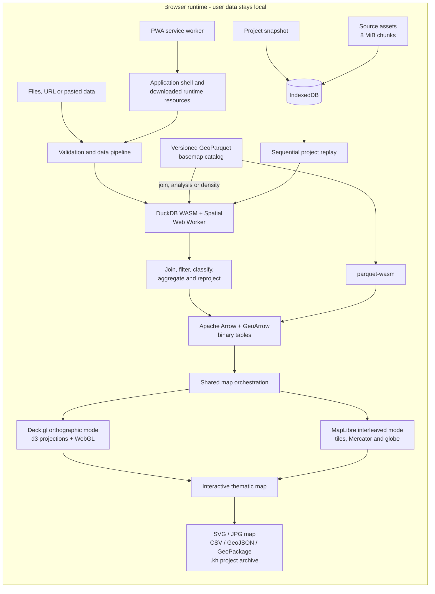

# Khartis v3

<div align="center">
  <h3>Serious thematic cartography, entirely in your browser</h3>
  <p>
    Turn data into clear, publication-ready maps without uploading a dataset,
    creating an account, or installing a desktop GIS.
  </p>
  <p>
    An open-source project by the
    <a href="https://www.sciencespo.fr/cartographie/">Sciences Po Atelier de cartographie</a>.
  </p>

  <p>
    <a href="https://www.sciencespo.fr/cartographie/khartis/">
      
    </a>
    <a href="https://github.com/AtelierCartographie/khartis-v3/releases">
      
    </a>
    <a href="https://github.com/AtelierCartographie/khartis-v3/actions/workflows/pr-validation.yml">
      
    </a>
    <a href="LICENSE">
      
    </a>
  </p>
  <p>
    
    
    
    
    
    
  </p>
</div>

**Khartis** is a free, open-source application for creating thematic maps from
tabular and geographic data. It brings the cartographic expertise of the
Sciences Po Atelier de cartographie into a tool that is approachable for
teaching, research and publication, while remaining technically ambitious
enough for large, modern web-mapping workflows.

The application is static and client-side. Data import, SQL analysis, joins,
classification, reprojection, persistence and GPU rendering happen inside the
browser. There is no application backend receiving the user's dataset.

- **Use Khartis:** <https://www.sciencespo.fr/cartographie/khartis/>
- **Read the developer documentation:** [docs/README.md](docs/README.md)
- **Report a bug or propose a feature:** [GitHub Issues](https://github.com/AtelierCartographie/khartis-v3/issues)
- **Contribute:** [CONTRIBUTING.md](CONTRIBUTING.md)

<details>
<summary><strong>Résumé en français</strong></summary>

Khartis transforme des données tabulaires ou géographiques en cartes
thématiques soignées, directement dans le navigateur. Aucun compte ni serveur
de données n'est nécessaire : l'import, les jointures, les calculs, les
projections, la sauvegarde et le rendu WebGL sont exécutés localement.

Le projet rend l'expertise cartographique de l'Atelier de cartographie de
Sciences Po accessible à l'enseignement, à la recherche, au journalisme de
données et à la communauté open source. Il associe exigence sémiologique,
formats ouverts, confidentialité, interopérabilité et architecture web moderne.

</details>

## Why Khartis matters

Khartis is more than a map editor. It is public digital infrastructure for
understanding and communicating spatial information.

| For Sciences Po and public-interest institutions                                            | For cartographers, researchers and educators                                            | For the open-source community                                                        |
| ------------------------------------------------------------------------------------------- | --------------------------------------------------------------------------------------- | ------------------------------------------------------------------------------------ |
| Turns institutional cartographic expertise into a reusable, openly licensed public tool.    | Makes thematic methods, projections and visual variables explicit rather than implicit. | Demonstrates a fully client-side analytical and geospatial architecture.             |
| Helps disseminate knowledge without requiring a proprietary account or hosted data service. | Supports exploration, teaching and publication on real datasets.                        | Uses open formats and widely adopted web, data and rendering technologies.           |
| Keeps sensitive, unpublished or embargoed working data on the user's device.                | Suggests sound defaults while keeping every cartographic decision editable.             | Provides tests, technical documentation and clear contribution boundaries.           |
| Produces durable project archives instead of locking work into a remote workspace.          | Connects data preparation, semiology, layout and export in one continuous workflow.     | Is MIT-licensed and designed to be inspected, extended and improved collaboratively. |

## What you can do

### From source data to a finished map

1. **Import data** from a file, a URL or pasted tabular content.
2. **Inspect and prepare it** with column analysis, typing, filters,
   calculations, searches and transformations backed by DuckDB.
3. **Locate or join entities** with coordinates, geographic identifiers or a
   reference basemap, while reviewing unmatched values and join quality.
4. **Build a thematic representation** from ranked suggestions or from a blank
   visualization, then adjust every visual variable.
5. **Compose and publish** with legends, annotations, geographic indications,
   facets and export-ready page layout.

### Product capabilities

| Area                        | Current capabilities                                                                                                                                                         |
| --------------------------- | ---------------------------------------------------------------------------------------------------------------------------------------------------------------------------- |
| Data import                 | CSV, TSV, pasted tables, GeoJSON, Shapefile, GeoPackage, Parquet and GeoParquet, GPX, KML, KMZ, ZIP archives and HTTP(S) sources.                                            |
| Data preparation            | Type analysis, column operations, filtering, search, calculations, transformations, geographic detection and DuckDB-powered processing.                                      |
| Geographic matching         | Coordinate-based geolocation, administrative identifiers, assisted joins against catalog basemaps, similarity review and correction of unmatched values.                     |
| Thematic maps               | Choropleths, proportional symbols and lines, categorical maps, bivariate combinations, double symbols, labels and dot-density representations.                               |
| Visual primitives           | Polygons, lines, points, text and density, with configurable fills, strokes, symbols, sizes, patterns, labels and drawing order.                                             |
| Classification and palettes | K-means natural thresholds, quantiles, equal intervals, Q6, nested means, head-tail and manual breaks; sequential, diverging and qualitative palettes with editable classes. |
| Basemaps and projections    | A versioned GeoParquet catalog, custom geographic files, d3 geographic projections, composite layouts, MapLibre tiled styles, OSM and national CRS support through PROJ.4.   |
| Map composition             | Generated legends, scale and orientation tools, graticules, inset/geographic indications, text, shapes, drawings, images, page layout and small-multiple facets.             |
| Review and accessibility    | Geographic search, interactive inspection, color-vision simulation, keyboard-oriented controls, visible focus and French/English localization.                               |
| Export and continuity       | SVG and high-resolution JPG maps; CSV, GeoJSON and GeoPackage data; local autosave; portable, versioned `.kh` project archives.                                              |

> Khartis suggests a cartographic direction, but never locks it in. A ratio may
> lead to a choropleth, an absolute quantity to proportional symbols and a
> qualitative variable to categorical styling. The user remains in control of
> the projection, classification, palette, primitives and layout.

## See it in action

|                              Start a project                              |                                   Design the visualization                                   |                            Compose the final map                            |
| :-----------------------------------------------------------------------: | :------------------------------------------------------------------------------------------: | :-------------------------------------------------------------------------: |
|  |  |  |

## Architecture

Khartis deliberately avoids the usual upload-process-render web architecture.
The complete analytical and rendering loop stays in the browser, using
columnar and binary representations from the SQL engine to the GPU.



### The architectural choices behind the diagram

- **DuckDB first.** Supported formats and analytical operations go through
  DuckDB WASM and its spatial extension instead of a collection of unrelated
  JavaScript parsers.
- **Binary all the way to the GPU.** The normal render path is
  `DuckDB -> Arrow/GeoArrow -> geoarrow-deck-stream -> Deck.gl`. GeoJSON remains
  an explicit fallback and an interchange or export format.
- **A fast path for reference geometry.** Catalog basemaps can travel directly
  from GeoParquet through `parquet-wasm` to Arrow and Deck.gl. They can still be
  materialized in DuckDB when a join, analysis or density calculation needs it.
- **Two coordinated rendering modes.** Deck.gl provides orthographic,
  print-oriented thematic cartography; MapLibre provides interleaved tiled,
  Mercator and globe contexts. One lifecycle owns both modes and releases their
  WebGL resources symmetrically.
- **Durable sources, reproducible runtime.** IndexedDB stores the project
  snapshot and binary source assets. DuckDB tables, calculation caches and GPU
  buffers are reconstructed when a project is reopened.
- **Offline-aware, not storage-confused.** The service worker caches application
  resources; IndexedDB stores projects. An update is proposed explicitly so a
  working session is not replaced silently.

For the detailed contracts and code entry points, read
[Architecture](docs/ARCHITECTURE.md),
[Import, DuckDB and Arrow](docs/IMPORT_DUCKDB.md), and
[Cartographic rendering](docs/RENDU_CARTOGRAPHIQUE.md).

## Privacy by architecture

Khartis has no application backend that receives imported rows or geographic
features. The user's files, joins, derived columns, styling and project state
are processed locally in the browser.

- No account is required to create, save or export a map.
- Imported datasets are not uploaded to a Khartis data service.
- Source assets and project state are stored in the browser's IndexedDB.
- A `.kh` archive can move a project between compatible Khartis installations.
- Analytics events are anonymous, strictly allow-listed and emitted only after
  Cookiebot grants statistics consent. They exclude file names, project names,
  columns, values, queries and place names.
- Remote sources and remote basemaps naturally require network requests; this
  does not change the local processing model for the user's dataset.

See [SECURITY.md](SECURITY.md), [Analytics and consent](docs/ANALYTICS.md), and
[Persistence and archives](docs/PERSISTANCE_ET_ARCHIVES.md) for the precise
boundaries and known limitations.

## Cartographic foundations

Khartis treats cartography as a discipline, not as a generic chart type:

- visual variables are attached to explicit polygon, line, point, text and
  density primitives;
- choropleths are oriented toward ratios and rates, while absolute quantities
  are better represented by proportional symbols or lines;
- classification methods and class breaks are visible, editable and persisted;
- projection suggestions depend on geographic and thematic context, but remain
  overridable;
- categorical, sequential and diverging palettes serve different data
  semantics;
- legends are generated from the visible representation and stay consistent
  across screen and export;
- color-vision simulation helps review a map before publication;
- facets share GPU resources instead of multiplying independent WebGL maps.

The implementation details live in
[Cartographic rendering](docs/RENDU_CARTOGRAPHIQUE.md) and
[Basemaps and projections](docs/FONDS_PROJECTIONS.md).

## Technology stack

| Layer                   | Main choices                                                                                                     |
| ----------------------- | ---------------------------------------------------------------------------------------------------------------- |
| Application             | SvelteKit 2, Svelte 5 runes, TypeScript, Vite and `adapter-static`                                               |
| Interface               | Carbon Design System through Carbon Components Svelte                                                            |
| Analytical engine       | DuckDB WASM with `spatial`, `httpfs`, `parquet` and `json` extensions, isolated in a Web Worker                  |
| Columnar interchange    | Apache Arrow and GeoArrow metadata                                                                               |
| GPU rendering           | Deck.gl, Luma.gl, `geoarrow-deck-stream` and WebGL                                                               |
| Tiled map rendering     | MapLibre GL with interleaved Deck.gl overlays                                                                    |
| Cartography             | d3-geo, d3-geo-projection, d3-geo-polygon, PROJ.4, TopoJSON and dedicated palette/projection suggestion packages |
| Basemap fast path       | GeoParquet, `parquet-wasm` and Arrow                                                                             |
| Persistence and offline | IndexedDB, versioned `.kh` archives and a Workbox-powered service worker                                         |
| Localization            | Inlang Paraglide with compile-time French and English messages                                                   |
| Quality                 | Vitest client/server projects, Svelte Check, ESLint, Prettier, Conventional Commits and GitHub Actions           |

Exact dependency versions are declared in [package.json](package.json).

## Run Khartis locally

### Requirements

- Node.js `>=22 <25`
- pnpm `>=10`, preferably through Corepack
- A current desktop browser with WebGL2
- Network access during the first installation to download the matching DuckDB
  WASM extensions

### Quick start

```sh
corepack enable pnpm
pnpm install
pnpm dev
```

Open <http://localhost:5176>.

The application does not need a `.env` file for local development. The Vite
development and preview servers provide the cross-origin-isolation headers
required by DuckDB WASM. A generic static server without those headers is not
an equivalent runtime.

If installation was interrupted while downloading DuckDB extensions, run:

```sh
pnpm download:extensions
```

### Common commands

| Command                    | Purpose                                                              |
| -------------------------- | -------------------------------------------------------------------- |
| `pnpm dev`                 | Start the development server on port 5176.                           |
| `pnpm build`               | Build the static application into `build/`.                          |
| `pnpm preview`             | Serve the production artifact locally.                               |
| `pnpm check`               | Compile Paraglide and run Svelte and TypeScript checks.              |
| `pnpm lint`                | Check formatting and ESLint rules.                                   |
| `pnpm format`              | Format supported project files with Prettier.                        |
| `pnpm test:unit`           | Run the client-side Vitest project.                                  |
| `pnpm test:pipeline`       | Run server-side data-pipeline tests.                                 |
| `pnpm test:duckdb`         | Run server-side DuckDB integration tests.                            |
| `pnpm test:all`            | Run the three test suites sequentially.                              |
| `pnpm ragmir doctor`       | Check the local developer-documentation index.                       |
| `pnpm ragmir ingest`       | Refresh the local Ragmir knowledge base after documentation changes. |
| `pnpm deploy:pprd:dry-run` | Validate a PPRD release and build without transferring it.           |
| `pnpm deploy:prod:dry-run` | Validate a stable release and build without transferring it.         |

For the validation matrix and contribution workflow, see
[Contributing and testing](docs/CONTRIBUER_ET_TESTER.md).

## Repository map

| Path                                   | Responsibility                                                                   |
| -------------------------------------- | -------------------------------------------------------------------------------- |
| `src/routes/`                          | SvelteKit application shell and runtime startup.                                 |
| `src/lib/features/data-pipeline/`      | Input validation, file detection and processing strategies.                      |
| `src/lib/features/duckdb/`             | DuckDB lifecycle, SQL operations, Arrow tables, joins and analysis.              |
| `src/lib/features/map/`                | Deck.gl and MapLibre engines, layers, projection, interaction and map lifecycle. |
| `src/lib/features/visualization-tab/`  | Visual primitives, classifications, palettes and ranked suggestions.             |
| `src/lib/features/step-toolbar/`       | Layout, annotations, legends, projections, facets and map tools.                 |
| `src/lib/features/project-management/` | IndexedDB, autosave, archive import/export and schema compatibility.             |
| `src/lib/features/commons/`            | Shared stores, services, types, errors and cross-cutting utilities.              |
| `messages/`                            | French and English source messages for Paraglide.                                |
| `static/basemaps/`                     | Versioned basemap metadata, attributes and GeoParquet geometry.                  |
| `tests/` and `tests-datasets/`         | Client/server tests and representative local data fixtures.                      |
| `docs/`                                | Human-readable developer architecture and operating contracts.                   |

Features expose a public surface from their root. Contributors should import
that surface instead of reaching into another feature's internals.

## Developer documentation

The technical corpus is written in French and organized by the decision a
contributor needs to make:

| Document                                                             | Covers                                                                  |
| -------------------------------------------------------------------- | ----------------------------------------------------------------------- |
| [Documentation index](docs/README.md)                                | Reading paths, ownership and sources of truth.                          |
| [Architecture](docs/ARCHITECTURE.md)                                 | Application boundaries, startup and the three major flows.              |
| [Import, DuckDB and Arrow](docs/IMPORT_DUCKDB.md)                    | Formats, data contracts, SQL engine, Arrow and cache invalidation.      |
| [Cartographic rendering](docs/RENDU_CARTOGRAPHIQUE.md)               | Deck.gl, MapLibre, WebGL, primitives, interaction, legend and export.   |
| [Basemaps and projections](docs/FONDS_PROJECTIONS.md)                | Catalog, custom basemaps, joins, CRS, projection and simplification.    |
| [Persistence and archives](docs/PERSISTANCE_ET_ARCHIVES.md)          | IndexedDB, project replay, assets, `.kh` and verified limitations.      |
| [Project format compatibility](docs/PROJECT_FORMAT_COMPATIBILITY.md) | Public archive/schema baseline and migration policy.                    |
| [Performance and workers](docs/PERFORMANCE_ET_WORKERS.md)            | Binary data path, workers, memory, caches, GPU lifecycle and profiling. |
| [Contributing and testing](docs/CONTRIBUER_ET_TESTER.md)             | Installation, validation matrix, CI and review workflow.                |
| [PWA runtime](docs/PWA_RUNTIME.md)                                   | Service worker, cache strategy, update protocol and base paths.         |
| [Troubleshooting](docs/DEPANNAGE.md)                                 | DuckDB, import, rendering, PWA and local-storage diagnosis.             |
| [Analytics](docs/ANALYTICS.md)                                       | Cookiebot-owned consent and allow-listed telemetry.                     |
| [Deployment](docs/DEPLOYMENT.md)                                     | Maintainer-only PPRD and production procedure.                          |

Ragmir provides optional local-first retrieval over this corpus. The index is
stored outside Git, uses the repository as its source of truth and can be
refreshed with `pnpm ragmir ingest`. GitNexus complements it with indexed code
relationships for impact analysis. Neither tool is required to build or use
Khartis.

## Persistence and compatibility

Khartis autosaves projects in IndexedDB and can export them as portable `.kh`
archives. The public compatibility baseline is:

| Contract                | Current baseline |
| ----------------------- | ---------------- |
| `.kh` archive container | v2               |
| Project schema          | `3.9.0`          |

The snapshot stores meaningful project state and references to binary source
assets; it is not just lightweight metadata. Runtime DuckDB tables, caches and
GPU buffers are deliberately recreated from those durable inputs.

Archive and schema versions evolve independently. Published readers and
migrations must remain continuous from the public baseline. See
[Project format compatibility](docs/PROJECT_FORMAT_COMPATIBILITY.md) before
changing persistence, import/export or a public API.

## Quality and performance

The repository validates contributions across complementary layers:

- formatting, lint and static Svelte/TypeScript checks;
- client tests for components, stores and pure browser-side behavior;
- server-side pipeline tests for import and project workflows;
- real DuckDB integration tests;
- a production static build;
- browser scenarios for WebGL, IndexedDB, PWA, projection and visual behavior
  that cannot be proven by JSDOM.

Performance depends on architectural continuity more than on a single
micro-optimization. Arrow table identity feeds weak caches, large geometry
parsing can move off the main thread, dataset restoration is sequential to
limit memory spikes, and one shared lifecycle owns workers and WebGL resources.
Changes to rendering should be profiled on representative formats and maps, not
only on synthetic fixtures.

Read [Performance and workers](docs/PERFORMANCE_ET_WORKERS.md) for the profiling
method and [Troubleshooting](docs/DEPANNAGE.md) for symptom-oriented diagnosis.

## Contributing

Contributions from cartographers, educators, designers, translators, data
engineers and frontend developers are welcome.

Before opening a pull request:

1. Read [CONTRIBUTING.md](CONTRIBUTING.md) and the domain document for the code
   you intend to change.
2. Preserve the DuckDB-first and binary GeoArrow rendering boundaries.
3. Update both French and English messages for user-visible text.
4. Run the smallest relevant checks, then the broader matrix required by the
   scope of the change.
5. Use a Conventional Commit and describe observable behavior and validation.

Useful starting points include:

- improving a cartographic primitive, legend or classification method;
- adding a well-specified format through the existing data pipeline;
- expanding representative fixtures and WebGL browser scenarios;
- improving keyboard, responsive or multilingual behavior;
- clarifying architecture, cartographic rationale or compatibility contracts.

Use [GitHub Issues](https://github.com/AtelierCartographie/khartis-v3/issues) to
report a reproducible defect or discuss a substantial feature before investing
in a large implementation.

## Security

Please do not disclose vulnerabilities in a public issue. Follow the private
reporting process in [SECURITY.md](SECURITY.md).

Never commit source datasets, exported user projects, credentials, deployment
hosts or infrastructure paths. Local deployment is restricted to authorized
maintainers and uses ignored configuration plus versioned release safeguards.

## License and credits

Khartis is released under the [MIT License](LICENSE).

Created and maintained by the
[Atelier de cartographie](https://www.sciencespo.fr/cartographie/) at
[Sciences Po](https://www.sciencespo.fr/), with open-source technologies and
contributions from the wider cartographic and software communities.

© Atelier de cartographie / Sciences Po, 2026
