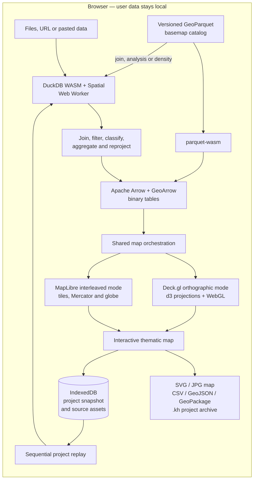

# Khartis v3

<div align="center">
  <h3>Serious thematic cartography, entirely in your browser</h3>
  <p>
    Turn data into clear, publication-ready maps without uploading a dataset,
    creating an account, or installing a desktop GIS.
  </p>
  <p>
    An open-source project by the
    <a href="https://www.sciencespo.fr/cartographie/">Sciences Po Atelier de cartographie</a>.
  </p>

  <p>
    <a href="https://www.sciencespo.fr/cartographie/outils/khartis/app/">
      
    </a>
    <a href="https://github.com/AtelierCartographie/khartis-v3/releases">
      
    </a>
    <a href="https://github.com/AtelierCartographie/khartis-v3/actions/workflows/pr-validation.yml">
      
    </a>
    <a href="LICENSE">
      
    </a>
  </p>
  <p>
    
    
    
    
    
    
  </p>
</div>

**Khartis** is a free, open-source application for making thematic maps from
tabular and geographic data. It puts the cartographic know-how of the Sciences
Po Atelier de cartographie within reach of teachers, researchers and
journalists.

Everything runs in the browser: import, SQL analysis, joins, classification,
reprojection, saving and GPU rendering. No server ever receives your data.

| Where to go                                          | Link                                                                                                                 |
| ---------------------------------------------------- | -------------------------------------------------------------------------------------------------------------------- |
| **Use Khartis**                                      | <https://www.sciencespo.fr/cartographie/outils/khartis/app/>                                                         |
| **Presentation and resources**                       | <https://www.sciencespo.fr/cartographie/fr/outils/khartis>                                                           |
| **User guide** (_mode d'emploi_, French)             | <https://www.sciencespo.fr/cartographie/fr/outils/khartis/mode-emploi>                                               |
| **Send feedback as a user**                          | [Feedback form](https://docs.google.com/forms/d/e/1FAIpQLSdobFeupR7CFppaMTEScMXoSHVUMl39grV3aBsoHzw1NpaHdw/viewform) |
| **Report a bug or propose a feature as a developer** | [GitHub Issues](https://github.com/AtelierCartographie/khartis-v3/issues)                                            |
| **Developer documentation** (French)                 | [docs/README.md](docs/README.md)                                                                                     |
| **Contribute**                                       | [CONTRIBUTING.md](CONTRIBUTING.md)                                                                                   |

> **Looking for the previous Khartis?** Versions 1 and 2 (2016–2025) live in
> [AtelierCartographie/Khartis](https://github.com/AtelierCartographie/Khartis).
> Khartis v3 is a complete rewrite and cannot open projects made with those
> versions.

<details>
<summary><strong>Résumé en français</strong></summary>

Khartis transforme des données tabulaires ou géographiques en cartes
thématiques soignées, directement dans le navigateur. Aucun compte ni serveur
de données n'est nécessaire : import, jointures, calculs, projections,
sauvegarde et rendu WebGL s'exécutent localement.

Le projet met l'expertise de l'Atelier de cartographie de Sciences Po à la
portée de l'enseignement, de la recherche et du journalisme de données.

La documentation pour les développeurs est rédigée en français dans
[`docs/`](docs/README.md). Le
[mode d'emploi](https://www.sciencespo.fr/cartographie/fr/outils/khartis/mode-emploi)
s'adresse aux utilisatrices et utilisateurs de l'application.

</details>

## What you can do

1. **Import data** from a file, a URL or pasted content.
2. **Prepare it**: column typing, filters, calculations, search and
   transformations, all run by DuckDB.
3. **Place it on a map** from coordinates, geographic codes or names joined
   against a reference basemap, and review unmatched values.
4. **Choose a representation** from ranked suggestions or from scratch, then
   adjust every visual variable.
5. **Lay out and export** the map with legends, annotations, scale, north
   arrow, insets and small multiples.

| Area                        | Capabilities                                                                                                                                                      |
| --------------------------- | ----------------------------------------------------------------------------------------------------------------------------------------------------------------- |
| Data import                 | CSV, TSV, pasted tables, GeoJSON, Shapefile, GeoPackage, Parquet and GeoParquet, GPX, KML, KMZ, ZIP archives and HTTP(S) URLs.                                    |
| Geographic matching         | Latitude/longitude plotting, administrative codes and names, assisted joins against catalog basemaps, similarity suggestions and manual correction.               |
| Thematic maps               | Choropleths, proportional symbols and lines, categorical maps, bivariate combinations, double symbols, labels and dot density.                                    |
| Visual primitives           | Polygons, lines, points, text and density, each with its own fill, stroke, symbol, size, pattern and drawing order.                                               |
| Classification and palettes | Natural breaks (k-means), quantiles, equal intervals, Q6, nested means, head/tail and manual breaks; sequential, diverging and qualitative palettes.              |
| Basemaps and projections    | A versioned GeoParquet catalog, imported basemaps, d3 projections, composite layouts, MapLibre tiled styles (IGN, OpenStreetMap) and national CRS through PROJ.4. |
| Map layout                  | Generated legends, scale bar, north arrow, graticules, insets, text, shapes, drawings, images and small multiples (facets).                                       |
| Review and accessibility    | Geographic search, feature inspection, color-vision deficiency simulation, keyboard navigation and French/English interface.                                      |
| Export and continuity       | SVG and JPG (up to 4K) maps; CSV, GeoJSON and GeoPackage data; local autosave; portable `.kh` project archives.                                                   |

Khartis suggests, but never imposes. A ratio leads by default to a choropleth,
an absolute count to proportional symbols, a qualitative variable to
categories. Projection, classification, palette and layout stay editable, and
the legend is generated from what the map actually draws, so screen and export
always agree.

|                              Start a project                              |                                   Design the visualization                                   |                            Compose the final map                            |
| :-----------------------------------------------------------------------: | :------------------------------------------------------------------------------------------: | :-------------------------------------------------------------------------: |
|  |  |  |

## How it works

Khartis has no upload-process-render backend. The whole loop runs in the
browser, and data stays in columnar, binary form from the SQL engine to the GPU.



- **DuckDB first.** Every supported format is read, and every analytical
  operation run, by DuckDB WASM and its spatial extension.
- **Binary all the way to the GPU.** Geometry travels as
  `DuckDB → Arrow/GeoArrow → geoarrow-deck-stream → Deck.gl`. Catalog basemaps
  go straight from GeoParquet to Arrow through `parquet-wasm`, and are loaded
  into DuckDB only when a join, analysis or density needs them. GeoJSON is a
  fallback and an export format.
- **Two render modes.** Deck.gl draws print-oriented maps with d3 projections;
  MapLibre adds tiled basemaps, Web Mercator and globe, with Deck.gl layers
  interleaved.
- **Durable sources, rebuilt runtime.** IndexedDB keeps the project snapshot
  and the source files. DuckDB tables and GPU buffers are rebuilt when a
  project reopens. The service worker caches the application and asks before
  installing an update.

Details: [Architecture](docs/ARCHITECTURE.md) ·
[Import and DuckDB](docs/IMPORT_DUCKDB.md) ·
[Cartographic rendering](docs/RENDU_CARTOGRAPHIQUE.md).

## Privacy

- Imported rows, geometries, joins and project state are processed and stored
  in the browser only. No account is needed, and a `.kh` archive moves a
  project from one browser to another.
- Khartis' own usage events are anonymous, allow-listed and sent only after
  Cookiebot statistics consent. They never contain file, project, column or
  place names, values or queries.
- Remote imports and tiled basemaps are fetched by the browser directly; this
  does not send your dataset anywhere.

Details: [Analytics and consent](docs/ANALYTICS.md) ·
[Persistence and archives](docs/PERSISTANCE_ET_ARCHIVES.md) ·
[SECURITY.md](SECURITY.md).

## Technology stack

| Layer                   | Main choices                                                                               |
| ----------------------- | ------------------------------------------------------------------------------------------ |
| Application             | SvelteKit 2, Svelte 5 runes, TypeScript, Vite, `adapter-static`                            |
| Interface               | Carbon Design System (Carbon Components Svelte)                                            |
| Analytical engine       | DuckDB WASM with the `spatial`, `httpfs`, `parquet` and `json` extensions, in a Web Worker |
| Columnar interchange    | Apache Arrow with GeoArrow metadata                                                        |
| Rendering               | Deck.gl, luma.gl and WebGL2; MapLibre GL for tiled modes                                   |
| Cartography             | d3-geo, d3-geo-projection, d3-geo-polygon, PROJ.4 (proj4js), TopoJSON                      |
| Basemap fast path       | GeoParquet, `parquet-wasm`, Arrow                                                          |
| Persistence and offline | IndexedDB, versioned `.kh` archives, Workbox service worker                                |
| Localization            | Inlang Paraglide, French and English messages compiled at build time                       |
| Quality                 | Vitest, svelte-check, ESLint, Prettier, Conventional Commits, GitHub Actions               |

Exact versions are in [package.json](package.json).

### Libraries built for Khartis

Four building blocks were developed alongside Khartis and published as
independent, ISC-licensed packages:

| Library                                                                             | Role                                                                                                                               |
| ----------------------------------------------------------------------------------- | ---------------------------------------------------------------------------------------------------------------------------------- |
| [geoarrow-deck-stream](https://github.com/AtelierCartographie/geoarrow-deck-stream) | Turns GeoArrow columns into Deck.gl binary attributes and applies d3-geo projections on the fly, keeping geometry off the JS heap. |
| [ok-palette](https://github.com/AtelierCartographie/ok-palette)                     | Generates perceptually even sequential, diverging and categorical color schemes in OKLCH.                                          |
| [proj-suggest](https://github.com/AtelierCartographie/proj-suggest)                 | Ranks suitable projections, including national ones, for a bounding box. Powers the projection suggestions.                        |
| [motif.js](https://github.com/AtelierCartographie/motif.js)                         | Draws customizable SVG and Canvas patterns, used for hatch fills and their legends.                                                |

## Run locally

Requirements: Node.js `>=22 <25`, pnpm `>=10` (through Corepack) and a desktop
browser with WebGL2.

```sh
corepack enable pnpm
pnpm install
pnpm dev
```

Then open <http://localhost:5176>. No `.env` file is needed.

`pnpm install` also downloads the DuckDB WASM extensions; if it was
interrupted, run `pnpm download:extensions`. DuckDB WASM needs cross-origin
isolation: `pnpm dev` and `pnpm preview` send the required headers, a generic
static server does not.

Commands, tests and the review workflow are described in
[CONTRIBUTING.md](CONTRIBUTING.md).

## Developer documentation

The technical documentation is written in French. Start with the
[index](docs/README.md), then open the document for the area you work on:
[Architecture](docs/ARCHITECTURE.md) ·
[Import and DuckDB](docs/IMPORT_DUCKDB.md) ·
[Cartographic rendering](docs/RENDU_CARTOGRAPHIQUE.md) ·
[Classification and colors](docs/DISCRETISATION_ET_COULEURS.md) ·
[Basemaps and projections](docs/FONDS_PROJECTIONS.md) ·
[Persistence and archives](docs/PERSISTANCE_ET_ARCHIVES.md) ·
[Project format compatibility](docs/PROJECT_FORMAT_COMPATIBILITY.md) ·
[Performance and workers](docs/PERFORMANCE_ET_WORKERS.md) ·
[Testing](docs/CONTRIBUER_ET_TESTER.md) ·
[PWA runtime](docs/PWA_RUNTIME.md) ·
[Troubleshooting](docs/DEPANNAGE.md) ·
[Analytics](docs/ANALYTICS.md) ·
[Deployment](docs/DEPLOYMENT.md).

## Project format compatibility

Projects are autosaved in IndexedDB and exported as `.kh` archives. The first
public baseline is **archive container v2** with **project schema `3.9.0`**.
Both versions evolve independently, and every later version must keep reading
and migrating from that baseline. See
[Project format compatibility](docs/PROJECT_FORMAT_COMPATIBILITY.md) before
changing persistence, import/export or a public API.

## Contributing

Cartographers, teachers, designers, translators, data engineers and frontend
developers are all welcome. Read [CONTRIBUTING.md](CONTRIBUTING.md) and the
document for the area you want to change before opening a pull request. For a
substantial feature, open an
[issue](https://github.com/AtelierCartographie/khartis-v3/issues) first.

Good first areas: a cartographic primitive, a legend or a classification
method; a new format through the existing data pipeline; test fixtures and
browser scenarios; keyboard, responsive or multilingual behavior.

## Security

Do not report vulnerabilities in a public issue: follow
[SECURITY.md](SECURITY.md).

## License and credits

The source code is released under the [MIT License](LICENSE). Each basemap's
sources and copyright notices are shown when it is selected, and are added
automatically to the layout of exported maps.

Published by Sciences Po (Fondation Nationale des Sciences Politiques and
Institut d'Études Politiques de Paris), Atelier de cartographie — 27, rue
Saint-Guillaume, 75337 Paris Cedex 07, France. Design, development and
maintenance credits are listed in [CONTRIBUTORS.md](CONTRIBUTORS.md).

Contact: **carto@sciencespo.fr** — data protection: **dpo@sciencespo.fr**.

© Atelier de cartographie / Sciences Po, 2026
