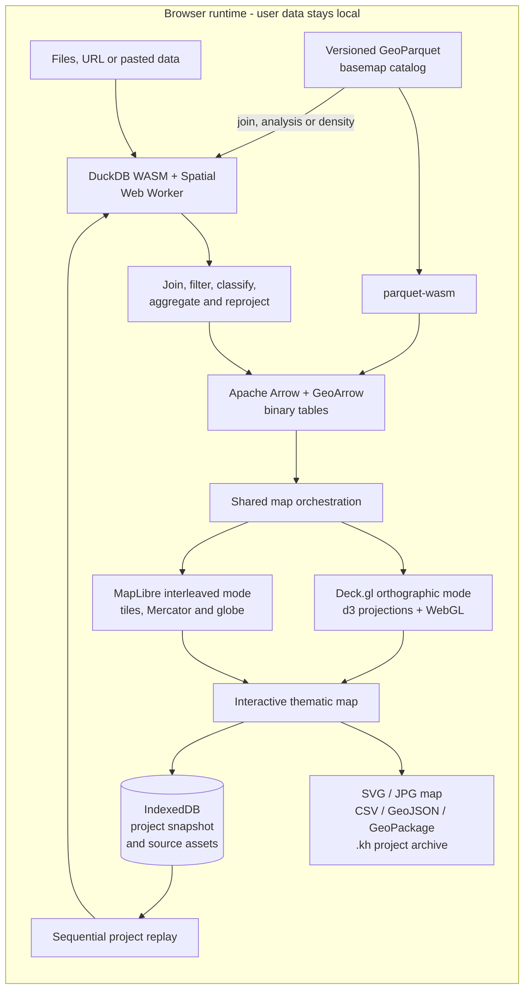

# Khartis v3

<div align="center">
  <h3>Serious thematic cartography, entirely in your browser</h3>
  <p>
    Turn data into clear, publication-ready maps without uploading a dataset,
    creating an account, or installing a desktop GIS.
  </p>
  <p>
    An open-source project by the
    <a href="https://www.sciencespo.fr/cartographie/">Sciences Po Atelier de cartographie</a>.
  </p>

  <p>
    <a href="https://www.sciencespo.fr/cartographie/outils/khartis/app/">
      
    </a>
    <a href="https://github.com/AtelierCartographie/khartis-v3/releases">
      
    </a>
    <a href="https://github.com/AtelierCartographie/khartis-v3/actions/workflows/pr-validation.yml">
      
    </a>
    <a href="LICENSE">
      
    </a>
  </p>
  <p>
    
    
    
    
    
    
  </p>
</div>

**Khartis** is a free, open-source application for creating thematic maps from
tabular and geographic data. It brings the cartographic expertise of the
Sciences Po Atelier de cartographie into a tool that is approachable for
teaching, research and publication, while remaining technically ambitious
enough for large, modern web-mapping workflows.

The application is static and client-side. Data import, SQL analysis, joins,
classification, reprojection, persistence and GPU rendering happen inside the
browser. There is no application backend receiving the user's dataset.

| Where to go                                          | Link                                                                                                                 |
| ---------------------------------------------------- | -------------------------------------------------------------------------------------------------------------------- |
| **Use Khartis**                                      | <https://www.sciencespo.fr/cartographie/outils/khartis/app/>                                                         |
| **Presentation and resources**                       | <https://www.sciencespo.fr/cartographie/fr/outils/khartis>                                                           |
| **User guide** (_mode d'emploi_, French)             | <https://www.sciencespo.fr/cartographie/fr/outils/khartis/mode-emploi>                                               |
| **Send feedback as a user**                          | [Feedback form](https://docs.google.com/forms/d/e/1FAIpQLSdobFeupR7CFppaMTEScMXoSHVUMl39grV3aBsoHzw1NpaHdw/viewform) |
| **Report a bug or propose a feature as a developer** | [GitHub Issues](https://github.com/AtelierCartographie/khartis-v3/issues)                                            |
| **Developer documentation** (French)                 | [docs/README.md](docs/README.md)                                                                                     |
| **Contribute**                                       | [CONTRIBUTING.md](CONTRIBUTING.md)                                                                                   |

> **Looking for the previous Khartis?** Versions 1 and 2 (2016-2025) live in
> [AtelierCartographie/Khartis](https://github.com/AtelierCartographie/Khartis).
> Khartis v3 is a complete rewrite and does not read v2 project files.

<details>
<summary><strong>Résumé en français</strong></summary>

Khartis transforme des données tabulaires ou géographiques en cartes
thématiques soignées, directement dans le navigateur. Aucun compte ni serveur
de données n'est nécessaire : l'import, les jointures, les calculs, les
projections, la sauvegarde et le rendu WebGL sont exécutés localement.

Le projet rend l'expertise cartographique de l'Atelier de cartographie de
Sciences Po accessible à l'enseignement, à la recherche, au journalisme de
données et à la communauté open source. Il associe exigence sémiologique,
formats ouverts, confidentialité, interopérabilité et architecture web moderne.

La documentation destinée aux développeurs est rédigée en français dans
[`docs/`](docs/README.md). Le
[mode d'emploi](https://www.sciencespo.fr/cartographie/fr/outils/khartis/mode-emploi)
s'adresse aux utilisatrices et utilisateurs de l'application.

</details>

## What you can do

1. **Import data** from a file, a URL or pasted tabular content.
2. **Inspect and prepare it** with column analysis, typing, filters,
   calculations, searches and transformations backed by DuckDB.
3. **Locate or join entities** with coordinates, geographic identifiers or a
   reference basemap, while reviewing unmatched values and join quality.
4. **Build a thematic representation** from ranked suggestions or from a blank
   visualization, then adjust every visual variable.
5. **Compose and publish** with legends, annotations, geographic indications,
   facets and export-ready page layout.

| Area                        | Current capabilities                                                                                                                                                                                                                   |
| --------------------------- | -------------------------------------------------------------------------------------------------------------------------------------------------------------------------------------------------------------------------------------- |
| Data import                 | CSV, TSV, pasted tables, GeoJSON, Shapefile, GeoPackage, Parquet and GeoParquet, GPX, KML, KMZ, ZIP archives and HTTP(S) sources.                                                                                                      |
| Data preparation            | Type analysis, column operations, filtering, search, calculations, transformations, geographic detection and DuckDB-powered processing.                                                                                                |
| Geographic matching         | Coordinate-based geolocation, administrative identifiers, assisted joins against catalog basemaps, similarity review and correction of unmatched values.                                                                               |
| Thematic maps               | Choropleths, proportional symbols and lines, categorical maps, bivariate combinations, double symbols, labels and dot-density representations.                                                                                         |
| Visual primitives           | Polygons, lines, points, text and density, with configurable fills, strokes, symbols, sizes, patterns, labels and drawing order.                                                                                                       |
| Classification and palettes | K-means natural thresholds, quantiles, equal intervals, Q6, nested means, head-tail and manual breaks; sequential, diverging and qualitative palettes with editable classes.                                                           |
| Basemaps and projections    | A versioned GeoParquet catalog, custom geographic files with derived territory and limit layers, d3 geographic projections, composite layouts, MapLibre tiled styles, IGN and OSM references, and national CRS support through PROJ.4. |
| Map composition             | Generated legends, scale and orientation tools, graticules, inset/geographic indications, text, shapes, drawings, images, page layout and small-multiple facets.                                                                       |
| Review and accessibility    | Geographic search, interactive inspection, color-vision simulation, keyboard-oriented controls, visible focus and French/English localization.                                                                                         |
| Export and continuity       | SVG and high-resolution JPG maps; CSV, GeoJSON and GeoPackage data; local autosave; portable, versioned `.kh` project archives.                                                                                                        |

Khartis suggests a cartographic direction, but never locks it in. A ratio may
lead to a choropleth, an absolute quantity to proportional symbols, a
qualitative variable to categorical styling — and the user remains in control
of the projection, classification, palette, primitives and layout.

|                              Start a project                              |                                   Design the visualization                                   |                            Compose the final map                            |
| :-----------------------------------------------------------------------: | :------------------------------------------------------------------------------------------: | :-------------------------------------------------------------------------: |
|  |  |  |

## Architecture

Khartis deliberately avoids the usual upload-process-render web architecture.
The complete analytical and rendering loop stays in the browser, using
columnar and binary representations from the SQL engine to the GPU.



- **DuckDB first.** Supported formats and analytical operations go through
  DuckDB WASM and its spatial extension instead of a collection of unrelated
  JavaScript parsers.
- **Binary all the way to the GPU.** The normal render path is
  `DuckDB -> Arrow/GeoArrow -> geoarrow-deck-stream -> Deck.gl`. GeoJSON remains
  an explicit fallback and an interchange or export format. Catalog basemaps can
  also travel straight from GeoParquet through `parquet-wasm` to Arrow, and be
  materialized in DuckDB when a join, analysis or density calculation needs it.
- **Two coordinated rendering modes.** Deck.gl provides orthographic,
  print-oriented thematic cartography; MapLibre provides interleaved tiled,
  Mercator and globe contexts. One lifecycle owns both and releases their WebGL
  resources symmetrically.
- **Durable sources, reproducible runtime.** IndexedDB stores the project
  snapshot and binary source assets; DuckDB tables, caches and GPU buffers are
  reconstructed when a project is reopened. A service worker caches application
  resources and proposes updates explicitly, so a working session is never
  replaced silently.

Read [Architecture](docs/ARCHITECTURE.md),
[Import, DuckDB and Arrow](docs/IMPORT_DUCKDB.md) and
[Cartographic rendering](docs/RENDU_CARTOGRAPHIQUE.md) for the detailed
contracts and code entry points.

## Privacy by architecture

Khartis has no application backend that receives imported rows or geographic
features. Files, joins, derived columns, styling and project state are
processed locally in the browser.

- No account is required to create, save or export a map. Source assets and
  project state are stored in the browser's IndexedDB, and a `.kh` archive
  moves a project between compatible Khartis installations.
- Analytics events are anonymous, strictly allow-listed and emitted only after
  Cookiebot grants statistics consent. They exclude file names, project names,
  columns, values, queries and place names.
- Remote sources and remote basemaps naturally require network requests; this
  does not change the local processing model for the user's dataset.

See [SECURITY.md](SECURITY.md), [Analytics and consent](docs/ANALYTICS.md) and
[Persistence and archives](docs/PERSISTANCE_ET_ARCHIVES.md) for the precise
boundaries and known limitations.

## Cartographic foundations

Khartis treats cartography as a discipline, not as a generic chart type. Visual
variables are attached to explicit polygon, line, point, text and density
primitives. Choropleths are oriented toward ratios and rates, while absolute
quantities are better served by proportional symbols or lines. Classification
methods, class breaks, palettes and projections stay visible, editable and
persisted, and legends are generated from the visible representation so screen
and export agree.

The implementation lives in
[Classification and colors](docs/DISCRETISATION_ET_COULEURS.md),
[Cartographic rendering](docs/RENDU_CARTOGRAPHIQUE.md) and
[Basemaps and projections](docs/FONDS_PROJECTIONS.md).

## Technology stack

| Layer                   | Main choices                                                                                           |
| ----------------------- | ------------------------------------------------------------------------------------------------------ |
| Application             | SvelteKit 2, Svelte 5 runes, TypeScript, Vite and `adapter-static`                                     |
| Interface               | Carbon Design System through Carbon Components Svelte                                                  |
| Analytical engine       | DuckDB WASM with `spatial`, `httpfs`, `parquet` and `json` extensions, isolated in a Web Worker        |
| Columnar interchange    | Apache Arrow and GeoArrow metadata                                                                     |
| Rendering               | Deck.gl, Luma.gl and WebGL, with MapLibre GL for interleaved tiled modes                               |
| Cartography             | d3-geo, d3-geo-projection, d3-geo-polygon, PROJ.4 and TopoJSON                                         |
| Basemap fast path       | GeoParquet, `parquet-wasm` and Arrow                                                                   |
| Persistence and offline | IndexedDB, versioned `.kh` archives and a Workbox-powered service worker                               |
| Localization            | Inlang Paraglide with compile-time French and English messages                                         |
| Quality                 | Vitest client/server projects, Svelte Check, ESLint, Prettier, Conventional Commits and GitHub Actions |

Exact dependency versions are declared in [package.json](package.json).

### Libraries built for Khartis, usable without it

Four building blocks were designed alongside Khartis and released as
independent, ISC-licensed packages. Each one fills a gap in the cartographic
web ecosystem and stands on its own:

| Library                                                                             | Role in Khartis                                                                                                                                                           |
| ----------------------------------------------------------------------------------- | ------------------------------------------------------------------------------------------------------------------------------------------------------------------------- |
| [geoarrow-deck-stream](https://github.com/AtelierCartographie/geoarrow-deck-stream) | Turns GeoArrow columns into Deck.gl binary attributes, applying d3-geo projections by streaming. This is what keeps geometry off the JavaScript heap and on the GPU path. |
| [ok-palette](https://github.com/AtelierCartographie/ok-palette)                     | Generates sequential, diverging and categorical color schemes in OKLCH, for perceptually even ramps and legible categories.                                               |
| [proj-suggest](https://github.com/AtelierCartographie/proj-suggest)                 | Ranks suitable map projections for a bounding box, including national projections. It powers the projection suggestions.                                                  |
| [motif.js](https://github.com/AtelierCartographie/motif.js)                         | Produces customizable SVG and Canvas patterns, used for hatch fills and their legends.                                                                                    |

## Run Khartis locally

Requires Node.js `>=22 <25`, pnpm `>=10` (preferably through Corepack) and a
current desktop browser with WebGL2.

```sh
corepack enable pnpm
pnpm install
pnpm dev
```

Open <http://localhost:5176>.

No `.env` file is needed for local development. The Vite development and
preview servers provide the cross-origin-isolation headers required by DuckDB
WASM; a generic static server without those headers is not an equivalent
runtime. If installation was interrupted while downloading DuckDB extensions,
run `pnpm download:extensions`.

| Command              | Purpose                                                 |
| -------------------- | ------------------------------------------------------- |
| `pnpm dev`           | Start the development server on port 5176.              |
| `pnpm build`         | Build the static application into `build/`.             |
| `pnpm preview`       | Serve the production artifact locally.                  |
| `pnpm check`         | Compile Paraglide and run Svelte and TypeScript checks. |
| `pnpm lint`          | Check formatting and ESLint rules.                      |
| `pnpm format`        | Format supported project files with Prettier.           |
| `pnpm test:unit`     | Run the client-side Vitest project.                     |
| `pnpm test:pipeline` | Run server-side data-pipeline tests.                    |
| `pnpm test:duckdb`   | Run server-side DuckDB integration tests.               |
| `pnpm test:all`      | Run the three test suites sequentially.                 |

For the validation matrix and review workflow, see
[Contributing and testing](docs/CONTRIBUER_ET_TESTER.md). Deployment is
maintainer-only and documented in [Deployment](docs/DEPLOYMENT.md).

## Repository map

| Path                                   | Responsibility                                                                   |
| -------------------------------------- | -------------------------------------------------------------------------------- |
| `src/routes/`                          | SvelteKit application shell and runtime startup.                                 |
| `src/lib/features/data-pipeline/`      | Input validation, file detection and processing strategies.                      |
| `src/lib/features/duckdb/`             | DuckDB lifecycle, SQL operations, Arrow tables, joins and analysis.              |
| `src/lib/features/map/`                | Deck.gl and MapLibre engines, layers, projection, interaction and map lifecycle. |
| `src/lib/features/visualization-tab/`  | Visual primitives, classifications, palettes and ranked suggestions.             |
| `src/lib/features/step-toolbar/`       | Layout, annotations, legends, projections, facets and map tools.                 |
| `src/lib/features/project-management/` | IndexedDB, autosave, archive import/export and schema compatibility.             |
| `src/lib/features/commons/`            | Shared stores, services, types, errors and cross-cutting utilities.              |
| `messages/`                            | French and English source messages for Paraglide.                                |
| `static/basemaps/`                     | Versioned basemap metadata, attributes and GeoParquet geometry.                  |
| `tests/` and `tests-datasets/`         | Client/server tests and representative local data fixtures.                      |
| `docs/`                                | Developer architecture and operating contracts (French).                         |

Features expose a public surface from their root. Contributors should import
that surface instead of reaching into another feature's internals.

## Developer documentation

The technical corpus is written in French and organized by the decision a
contributor needs to make. Start from the
**[documentation index](docs/README.md)**, which carries the reading paths and
the sources of truth, then open the relevant domain document:
[Architecture](docs/ARCHITECTURE.md) ·
[Import, DuckDB and Arrow](docs/IMPORT_DUCKDB.md) ·
[Cartographic rendering](docs/RENDU_CARTOGRAPHIQUE.md) ·
[Classification and colors](docs/DISCRETISATION_ET_COULEURS.md) ·
[Basemaps and projections](docs/FONDS_PROJECTIONS.md) ·
[Persistence and archives](docs/PERSISTANCE_ET_ARCHIVES.md) ·
[Project format compatibility](docs/PROJECT_FORMAT_COMPATIBILITY.md) ·
[Performance and workers](docs/PERFORMANCE_ET_WORKERS.md) ·
[Contributing and testing](docs/CONTRIBUER_ET_TESTER.md) ·
[PWA runtime](docs/PWA_RUNTIME.md) ·
[Troubleshooting](docs/DEPANNAGE.md) ·
[Analytics](docs/ANALYTICS.md) ·
[Deployment](docs/DEPLOYMENT.md).

## Persistence and compatibility

Khartis autosaves projects in IndexedDB and exports them as portable `.kh`
archives. The public compatibility baseline is **archive container v2** and
**project schema `3.9.0`**; the two versions evolve independently, and
published readers and migrations must remain continuous from that baseline.
Read [Project format compatibility](docs/PROJECT_FORMAT_COMPATIBILITY.md)
before changing persistence, import/export or a public API.

## Contributing

Contributions from cartographers, educators, designers, translators, data
engineers and frontend developers are welcome.
[CONTRIBUTING.md](CONTRIBUTING.md) carries the engineering contracts, the
validation matrix and the review workflow — read it, along with the domain
document for the code you intend to change, before opening a pull request.

Good starting points: improving a cartographic primitive, legend or
classification method; adding a well-specified format through the existing data
pipeline; expanding fixtures and WebGL browser scenarios; improving keyboard,
responsive or multilingual behavior; clarifying architecture or compatibility
contracts. Use
[GitHub Issues](https://github.com/AtelierCartographie/khartis-v3/issues) to
report a reproducible defect or to discuss a substantial feature before
investing in a large implementation.

## Security

Please do not disclose vulnerabilities in a public issue: follow the private
reporting process in [SECURITY.md](SECURITY.md).

## License and credits

The source code of this application is open and distributed under the
[MIT License](LICENSE). Sources and copyright notices specific to each basemap
are shown when a basemap is selected in the application, and are automatically
included in the layout of the maps you generate.

Published by Sciences Po (the Fondation Nationale des Sciences Politiques and
the Institut d'Études Politiques de Paris), Atelier de cartographie — 27, rue
Saint-Guillaume, 75337 Paris Cedex 07, France.

| Role                  | People                                  |
| --------------------- | --------------------------------------- |
| General design        | The Atelier de cartographie team        |
| UI/UX design          | Antoine Rio (Atelier de cartographie)   |
| Development           | Jean-Baptiste Thery (via RECSI-GROUP)   |
| Open-source ecosystem | Thomas Ansart (Atelier de cartographie) |

Contact: **carto@sciencespo.fr** — data protection: **dpo@sciencespo.fr**.

These credits mirror the application's **Legal notice** panel, which is the
validated reference.

© Atelier de cartographie / Sciences Po, 2026
