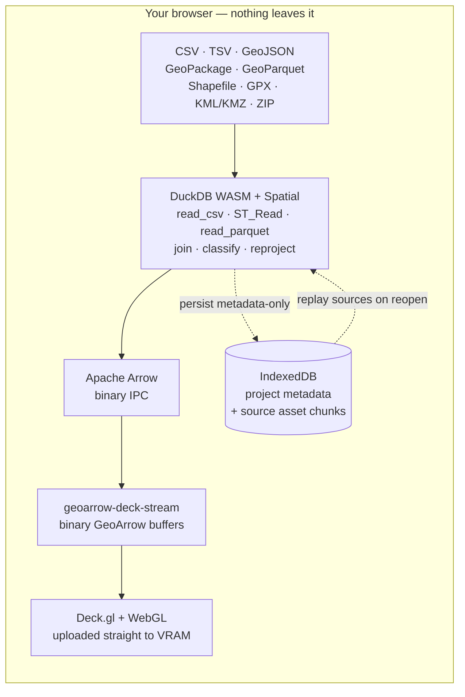

# Khartis v3

<div align="center">
  <h3>Thematic mapping that runs entirely in your browser</h3>
  <p>An open-source project by <a href="http://www.sciencespo.fr/cartographie/">Sciences Po – Atelier de cartographie</a></p>

  <p>
    <a href="LICENSE">
      
    </a>
    
  </p>
  <p>
    
    
    
    
  </p>
  <p>
    
    
    
    
  </p>
</div>

**Khartis** turns a spreadsheet into a publication-grade thematic map — choropleths, proportional symbols, categorical and bivariate maps — without a GIS, an account, or a server. It is a SvelteKit single-page app that ships as static files and does all of its work on the client: the SQL engine, the projections, and the GPU rendering all run in your browser tab. **Your data never leaves the machine.**

It is built for people who take maps seriously: cartographers, data journalists, researchers, and the developers who build tools for them.

- **Try it**: <https://www.sciencespo.fr/cartographie/khartis>
- **Issues and feature requests**: [GitHub Issues](https://github.com/AtelierCartographie/khartis-v3/issues)
- **Developer documentation** (French): [`docs/`](docs/README.md)

## Why it's built this way

Most web mapping tools push your data to a backend to be parsed, joined, and tiled. Khartis does the opposite — and that choice drives the whole architecture.

- **100% client-side, by design.** Import, join, classification, reprojection, aggregation, and rendering all happen in the tab. There is no server to send rows to, so confidential and embargoed datasets stay on your machine. After the first load the app is a PWA and keeps working offline (remote basemaps aside).
- **A real analytical SQL engine in the browser.** Every format — CSV, TSV, GeoJSON, GeoPackage, GeoParquet, Shapefile, GPX, KML/KMZ, ZIP — is read through [DuckDB WASM](https://duckdb.org/docs/api/wasm/overview) and its spatial extension, running in a Web Worker (`read_csv`, `ST_Read`, `read_parquet`). No hand-rolled JavaScript parsers, no per-format edge cases: joins, filters, and classification are just SQL over columnar data.
- **A binary path all the way to the GPU.** Geometry never becomes GeoJSON on the render path. It flows `DuckDB → Apache Arrow → GeoArrow → Deck.gl`, uploaded straight to VRAM as binary buffers. GeoJSON is only a fallback and an export format. This is what keeps large layers interactive at ~60 fps.
- **Two coordinated render modes behind one interface.** An orthographic mode (Deck.gl `OrthographicView` with d3-geo projections) for print-style, equal-area cartography, and a MapLibre interleaved mode (Web Mercator / Globe) for slippy vector basemaps — swapped transparently depending on the active basemap.
- **Cartographic rigor as the default, not an afterthought.** Equal-area projections are preferred for choropleths, discretization methods are first-class, and every basemap, visualization, projection, and palette is surfaced as a ranked, scored suggestion with the best option preselected and everything overridable.

### Data → GPU, without leaving the tab



Catalog basemaps take a second binary path that deliberately bypasses DuckDB (`GeoParquet → parquet-wasm → Apache Arrow → geoarrow-deck-stream → Deck.gl`), so the reference geometry loads as fast as possible. Projects persist as **metadata only**: the JSON never contains your source files — raw imports live in IndexedDB as 8 MB asset chunks and are replayed into DuckDB when you reopen a project.

## Use cases

| You want to…                                          | Khartis gives you                                                                                                                                                             |
| ----------------------------------------------------- | ----------------------------------------------------------------------------------------------------------------------------------------------------------------------------- |
| Map census, electoral, or economic data by admin unit | Import a CSV, let the join assistant match names or codes against a bundled basemap (communes, départements, régions, countries…), see the join graded, and get a choropleth. |
| Publish a print-quality map without opening a GIS     | Pick an equal-area projection, tune classification and palette, add legend, scale bar, north arrow and annotations, then export SVG or high-resolution JPG.                   |
| Work with confidential or embargoed data              | Everything stays in the browser — rows, place names, and joined results never touch a server. No account, no upload.                                                          |
| Explore designs before committing                     | Ranked visualization, projection, and palette suggestions with match scores; semiology-aware defaults you can always override.                                                |
| Teach thematic cartography and graphic semiology      | Compare choropleth vs proportional symbols, switch classification methods, simulate color-vision deficiencies — live, on real data.                                           |
| Reproject national datasets                           | A broad d3-geo + d3-geo-projection catalog plus PROJ.4 national projections; Lambert-93 (EPSG:2154) and French variants handled through a proj4 fallback.                     |

## Features

- **Data**: import CSV, TSV, GeoJSON, GeoPackage, GeoParquet, Shapefile, GPX, KML, KMZ, ZIP; variable typing, column operations, filters, join assistant with quality grading, geolocation (admin codes or lat/lon).
- **Visualization**: choropleth, proportional symbols, categorical, bivariate; classification by K-means/Jenks, quantiles, equal interval, Q6, nested means, head-tail, or manual breaks; palette editor with color-blindness-safe ramps.
- **Map tools**: extensive projection catalog (d3-geo + d3-geo-projection + national projections via PROJ.4), topology-aware simplification, layer manager, geographic search.
- **Layout (habillage)**: legends, scale bar, north arrow, inset maps, annotations, color-blindness simulation, small-multiple facets.
- **Export**: map (JPG, SVG); data (CSV, GeoJSON); portable project archive (`.kh`); automatic save to IndexedDB.
- **Accessibility and i18n**: keyboard navigation with visible focus, French/English interface (Paraglide, compile-time).

## Screenshots

|                      Welcome                      |                        Visualization                        |                     Styling                     |
| :-----------------------------------------------: | :---------------------------------------------------------: | :---------------------------------------------: |
|  |  |  |

## Tech stack

| Layer         | Choice                                                                                                                  |
| ------------- | ----------------------------------------------------------------------------------------------------------------------- |
| App framework | SvelteKit 2 + Svelte 5 (Runes), TypeScript (strict, no `any`), Vite, `adapter-static`                                   |
| UI            | Carbon Design System (Carbon Components Svelte)                                                                         |
| Data engine   | DuckDB WASM + Spatial extension, in a Web Worker; Apache Arrow for columnar interchange                                 |
| Rendering     | Deck.gl 9 + WebGL on binary GeoArrow buffers (`geoarrow-deck-stream`); MapLibre GL 5 for vector basemaps                |
| Projections   | d3-geo, d3-geo-projection, d3-geo-polygon; proj4 fallback for EPSG:2154 and national CRS; `parquet-wasm` for GeoParquet |
| State & data  | Svelte 5 Runes stores; IndexedDB (metadata + 8 MB binary asset chunks); PWA via Workbox                                 |
| i18n          | Inlang Paraglide (compile-time, FR/EN)                                                                                  |
| Quality       | Vitest (jsdom + node projects), ESLint, Prettier                                                                        |

> Exact versions live in [`package.json`](package.json); the table above names the load-bearing choices, not pinned versions.

## Quick start

**Prerequisites**: Node.js >= 22 (< 25), pnpm via Corepack.

```bash
# Enable pnpm once
corepack enable pnpm

# Install dependencies (postinstall also downloads the DuckDB WASM extensions)
pnpm install

# Dev server on http://localhost:5176
pnpm dev

# Production build → build/  then preview it
pnpm build && pnpm preview
```

The app runs locally without a `.env` file. The committed `.env.example` is only for the local PPRD/PRD deployment helper and must contain placeholders, never real infrastructure values.

> **Cross-origin isolation**: DuckDB WASM needs the `COOP`/`COEP` headers, which the dev and preview servers already send. A plain static file server without them will make DuckDB fail to initialize — that is an environment issue, not an app bug.

## Commands

| Command                    | Description                                                       |
| -------------------------- | ----------------------------------------------------------------- |
| `pnpm dev`                 | Development server on :5176 (HMR)                                 |
| `pnpm build`               | Production build → `build/`                                       |
| `pnpm check`               | Compile Paraglide, `svelte-kit sync`, then `svelte-check`         |
| `pnpm lint`                | Prettier check + ESLint                                           |
| `pnpm format`              | Auto-format with Prettier                                         |
| `pnpm test:unit`           | Client tests (jsdom): components, stores, utils                   |
| `pnpm test:pipeline`       | Server tests (node): data pipeline, DuckDB-backed                 |
| `pnpm test:duckdb`         | Server tests (node): DuckDB integration                           |
| `pnpm test:all`            | Full suite (unit + pipeline + duckdb)                             |
| `pnpm deploy:pprd:dry-run` | Validate the latest pprd prerelease, CI gate, and build (no SFTP) |
| `pnpm deploy:pprd`         | Deploy the latest pprd prerelease via the local SFTP helper       |
| `pnpm deploy:prod:dry-run` | Validate the latest stable release, CI gate, and build (no SFTP)  |
| `pnpm deploy:prod`         | Deploy the latest stable release to PROD (retype the tag)         |

> `pnpm test:*` scripts run `vitest run` (single pass). Use `pnpm exec vitest --project client` for watch mode during development. The `client` project mocks DuckDB WASM and runs locally; the `server` project runs in CI.

## Documentation

The [`docs/`](docs/README.md) folder holds the developer documentation (in French). Start with the index, then dive into the focused documents:

| Document                                        | Covers                                                            |
| ----------------------------------------------- | ----------------------------------------------------------------- |
| [ARCHITECTURE.md](docs/ARCHITECTURE.md)         | The four pillars, global data flow, technical layers              |
| [PIPELINE_DONNEES.md](docs/PIPELINE_DONNEES.md) | File import: supported formats, detection, validation, processors |
| [DUCKDB.md](docs/DUCKDB.md)                     | DuckDB WASM engine: the `Duck` façade, orchestrator, SQL macros   |
| [MAP.md](docs/MAP.md)                           | Deck.gl / MapLibre rendering, WeakMap caches, projections, layers |
| [CARTOGRAPHIE.md](docs/CARTOGRAPHIE.md)         | Cartographic concepts: semiology, discretization, color, CRS      |
| [VISUALISATIONS.md](docs/VISUALISATIONS.md)     | The 3-step workflow, right-toolbar tools, layout, export          |
| [GESTION_ETAT.md](docs/GESTION_ETAT.md)         | Svelte 5 stores, IndexedDB persistence, project snapshot          |
| [DEPLOYMENT.md](docs/DEPLOYMENT.md)             | Local PPRD deployment, env vars, SFTP guard rails                 |

The full list — including feature architecture, basemaps, legends, PWA, the developer guide, and the glossary — is in [`docs/README.md`](docs/README.md).

## Privacy, security, and data

- **Client-side only**: imported data never leaves the browser; the attack surface on a server is nil because there is no data server.
- **Metadata-only persistence**: project JSON stores styling and references, not source files; raw imports live in IndexedDB asset chunks and are replayed into DuckDB on reopen.
- **Input hardening**: file names, CSV cells, and user input are sanitized; user-authored SQL expressions pass through `validateExpression()`, which rejects subqueries, multi-statements, and dangerous calls. Quotas cap file sizes (150 MB text/geo, 200 MB binary) and project count.
- **Consent-first analytics**: Khartis loads the Sciences Po Google Tag Manager container only after user consent, using the container ID from the public `PUBLIC_GTM_CONTAINER_ID` value (no analytics identifier is hard-coded in the repository). Analytics records anonymous, allow-listed usage events only, never project names, file names, data values, column names, or place names. See [analytics configuration](docs/ANALYTICS.md).
- **Deployment**: the local PPRD and PROD helpers are documented in [docs/DEPLOYMENT.md](docs/DEPLOYMENT.md); PROD requires retyping the release tag to confirm. Dependencies are scanned via Dependabot.
- To report a security vulnerability, see [SECURITY.md](SECURITY.md).

## Browser compatibility

Recent versions of Chrome, Firefox, Edge, and Safari on desktop. DuckDB WASM and WebGL are required.

## Contributing

Contributions are welcome. See [CONTRIBUTING.md](CONTRIBUTING.md). Before opening a PR:

- Follow [Conventional Commits](https://www.conventionalcommits.org/) — `feat:`, `fix:`, `refactor:`, `test:`, `chore:`.
- Run `pnpm lint && pnpm check` locally.
- Run `pnpm test:unit` for component/store/utility changes; `pnpm test:pipeline` / `pnpm test:duckdb` for data or DuckDB changes.
- Add or update i18n keys (FR **and** EN) for any user-facing text — no hardcoded strings.
- Keep the two engine boundaries intact: parse through DuckDB, keep geometry on the binary GeoArrow path.
- Keep accessibility in mind: keyboard navigation, visible focus, sufficient contrast.

## AI-assisted development (optional)

This repo ships a shared, version-controlled [Claude Code](https://claude.com/claude-code) setup so contributors get consistent AI assistance out of the box. It is entirely optional — the project builds, runs, and is reviewed the same way without it.

- **`.claude/rules/`** — path-scoped quality rules that load automatically when you edit matching files: DuckDB usage, render pipeline, color/classification, projections, state & persistence, Svelte 5 + Carbon traps, plus a cartographic domain primer and glossary.
- **`.claude/settings.json`** — the enabled Claude Code plugins (code review, PR review, commit helpers, doc management, TypeScript LSP, DuckDB skills, Chrome DevTools). See [`.claude/README.md`](.claude/README.md) for what each does.
- **GitNexus** — the codebase is indexed for code intelligence (impact analysis, dependency-aware navigation), exposed via the MCP server declared in [`.mcp.json`](.mcp.json). Rebuild the local index with `npx gitnexus analyze`.
- **`scripts/check-doc-sync.sh`** — a non-blocking pre-commit reminder that warns when structural changes are committed without touching docs. Set `DOC_SYNC_STRICT=1` to make it fail the commit.

Personal or machine-local Claude settings stay out of Git (`.claude/settings.local.json` is ignored); only the shared team config is committed. Full details in [`.claude/README.md`](.claude/README.md).

## License

MIT — see [LICENSE](LICENSE).

© Atelier de cartographie / Sciences Po, 2025
