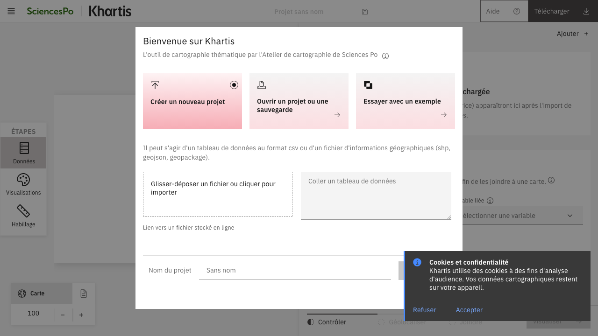
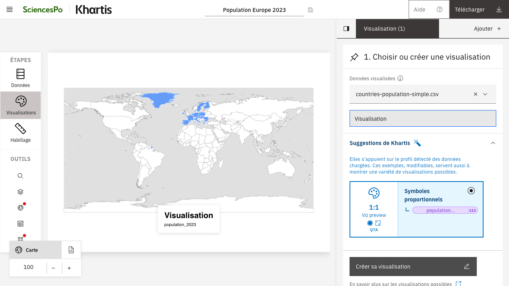
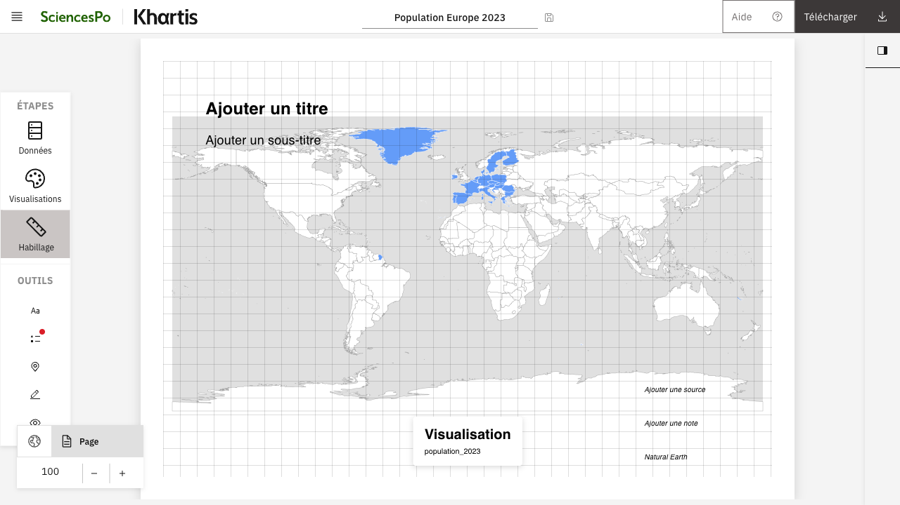

# Khartis v3

<div align="center">
  <h3>Simple thematic mapping tool</h3>
  <p>An open-source project by <a href="http://www.sciencespo.fr/cartographie/">Sciences Po – Cartography Workshop</a></p>

  <p>
    <a href="https://github.com/AtelierCartographie/khartis-v3/actions/workflows/release.yml">
      
    </a>
    <a href="https://github.com/AtelierCartographie/khartis-v3/actions/workflows/pr-validation.yml">
      
    </a>
    <a href="LICENSE">
      
    </a>
    
  </p>
  <p>
    
    
    
    
  </p>
  <p>
    
    
    
    
  </p>
</div>

Khartis is a web application to create professional thematic maps without prior GIS expertise. It runs fully client-side — your data never leaves the browser.

- Website: https://www.sciencespo.fr/cartographie/khartis
- Issues and feature requests: [GitHub Issues](https://github.com/AtelierCartographie/khartis-v3/issues)

## Features

- **Data**: import CSV, GeoJSON, GeoPackage, Shapefile, GPX, KML; variable typing, column operations, filters, join assistant, geolocation
- **Visualization**: choropleth, proportional symbols, categorical, bivariate; classification methods (Jenks, quantiles, equal interval, Q6, nested means, head-tail); palette editor
- **Map tools**: 150+ projection catalog, topology-aware simplification, layer manager, geographic search
- **Layout**: legends, scale bar, north arrow, inset maps, annotations, color-blindness simulation, facets
- **Export**: PNG/SVG/PDF; data exports (CSV, GeoJSON, GPKG, Shapefile, KML/KMZ); auto-save and project versions (`.kh`)
- **Accessibility and i18n**: keyboard shortcuts, French/English interface

## Screenshots

|                      Accueil                       |                        Visualisation                         |                     Habillage                      |
| :------------------------------------------------: | :----------------------------------------------------------: | :------------------------------------------------: |
|  |  |  |

## Tech stack

- SvelteKit 5 (Runes), TypeScript, Vite
- Carbon Design System (Svelte) for UI components
- Deck.gl 9 + WebGL for GPU-accelerated rendering; D3 for projections
- DuckDB WASM + Spatial for all in-browser data processing
- Playwright + Vitest for tests; ESLint + Prettier for lint/format

## Quick Start

**Prerequisites**: Node.js >= 22, pnpm (via Corepack)

```bash
# Enable Corepack (once)
corepack enable pnpm

# Create your local environment file
cp .env.sample .env

# Install dependencies (also downloads DuckDB WASM extensions)
pnpm install

# Dev server on :5176
pnpm dev

# Production build
pnpm build && pnpm preview
```

`.env` must exist before running the app locally. The committed sample (`.env.sample`) only contains non-sensitive values. By default it uses the pre-production `BASE_PATH`, which is convenient for testing deployed path prefixes; set `BASE_PATH=` in `.env` if you want a root local URL.

## Commands

| Command              | Description                         |
| -------------------- | ----------------------------------- |
| `pnpm dev`           | Development server on :5176         |
| `pnpm build`         | Production build                    |
| `pnpm check`         | TypeScript + Svelte type check      |
| `pnpm lint`          | ESLint + Prettier check             |
| `pnpm test`          | Server-side CI test suite           |
| `pnpm format`        | Auto-format code                    |
| `pnpm test:unit`     | Vitest unit tests                   |
| `pnpm test:e2e`      | Playwright E2E tests                |
| `pnpm test:pipeline` | Pipeline + DuckDB integration tests |
| `pnpm test:duckdb`   | DuckDB server-side tests            |

**i18n**: Inlang Paraglide (English, French) — all user-facing strings via `m.key()` syntax.

## Privacy, security, and data

- **Client-side only**: imported data never leaves the browser; no server, no tracking
- All processing runs in DuckDB WASM and IndexedDB
- Dependency scanning via Dependabot
- To report a security vulnerability, see [SECURITY.md](SECURITY.md)

## Browser compatibility

Recent versions of Chrome, Firefox, Edge, and Safari on desktop.

## Contributing

See [CONTRIBUTING.md](CONTRIBUTING.md). Before submitting a PR:

- Follow [Conventional Commits](https://www.conventionalcommits.org/) — `feat:`, `fix:`, `refactor:`, `test:`, `chore:`
- Run `pnpm lint && pnpm check && pnpm test` locally
- Run `pnpm test:unit` for client, store, or utility changes, and `pnpm test:e2e` for workflow or rendering changes
- Add/update i18n keys when adding user-facing text (no hardcoded strings)
- Keep accessibility in mind (keyboard navigation, contrast)

## License

MIT — see [LICENSE](LICENSE).

© Atelier de cartographie / Sciences Po, 2025
