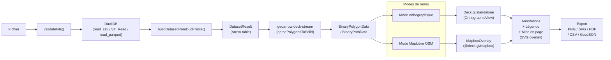

# Architecture

> Principes fondamentaux et flux de données de Khartis v3.

**Voir aussi** : [Gestion de l'état](./GESTION_ETAT.md) | [Pipeline de données](./PIPELINE_DONNEES.md) | [DuckDB](./DUCKDB.md) | [Rendu carte](./MAP.md) | [Cartographie](./CARTOGRAPHIE.md)

---

## Flux global

**Bibliothèques de rendu** : [Deck.gl](https://context7.com/visgl/deck.gl) (`@deck.gl/core`, `@deck.gl/layers`) · [MapLibre GL JS](https://context7.com/maplibre/maplibre-gl-js) · [Apache Arrow](https://context7.com/apache/arrow) (`tableFromIPC`).

---

## Les 4 piliers

| Pilier                          | Description                                                                                                                                                                                                                            |
| ------------------------------- | -------------------------------------------------------------------------------------------------------------------------------------------------------------------------------------------------------------------------------------- |
| **Confidentialité client-only** | Tout le traitement dans le navigateur (IndexedDB + mémoire). Aucun envoi serveur, aucune API externe pour les données utilisateur. Fonctionne hors-ligne.                                                                              |
| **Modularité par feature**      | Chaque feature dans `src/lib/features/` possède son store, ses composants et ses types. Couplage minimal entre features.                                                                                                               |
| **Réactivité Svelte 5 Runes**   | `$state` et `$derived` pour l'état réactif. Mutations explicites via méthodes, jamais d'affectation directe sur l'état de domaine.                                                                                                     |
| **Rendu GPU-first**             | [Deck.gl](https://context7.com/visgl/deck.gl) pour les couches thématiques. Deux modes : **orthographique** (Deck.gl standalone, fond vectoriel GeoArrow) ou **MapLibre interleaved** (MapboxOverlay, fond OSM tuilé). Environ 60 fps. |

---

## Couches de stockage

| Couche              | Rôle                           | Durée de vie      | Implémentation                                                                                                |
| ------------------- | ------------------------------ | ----------------- | ------------------------------------------------------------------------------------------------------------- |
| **Composant local** | État UI éphémère               | Montage composant | `$state` dans le `.svelte`                                                                                    |
| **Store feature**   | Modèle de domaine              | Session           | `$state` dans le store `.svelte.ts`                                                                           |
| **Store global**    | Coordination cross-feature     | Session           | Singleton (`projectStore`, etc.)                                                                              |
| **IndexedDB**       | Projets, métadonnées et assets | Persistant        | Object stores dédiés (`projects`, `metadata`, `project_assets`, `project_asset_chunks`, `project_asset_refs`) |

**Flux** : Composant → Store feature → Store global → IndexedDB (debounce 5 s sur les métadonnées projet, persistance immédiate des assets binaires).

Voir [Gestion de l'état](./GESTION_ETAT.md) pour le détail complet.

---

## Performance

| Défi                 | Solution                                                               |
| -------------------- | ---------------------------------------------------------------------- |
| Import volumineux    | Parsing natif DuckDB + stockage source chunked IndexedDB (8 Mo)        |
| Calculs lourds       | DuckDB WASM dans le navigateur                                         |
| Géométries complexes | Simplification pré-calculée + LOD dynamique                            |
| Réouverture projet   | Rejeu DuckDB à partir des assets source, pas de snapshot lourd         |
| Rendu interactif     | GeoArrow binaire + [Deck.gl](https://context7.com/visgl/deck.gl) WebGL |

**Cibles** :

| Métrique | Objectif |
| -------- | -------- |
| FCP      | < 0,6 s  |
| LCP      | < 1,0 s  |
| TTI      | < 1,0 s  |
| TBT      | 0 ms     |
| CLS      | 0        |
| Rendu    | ~60 fps  |

---

## Stratégie d'erreur

- **Échouer vite** sur les entrées invalides (validation stricte).
- **Dégradation gracieuse** sur les erreurs de calcul (projection par défaut, classification de secours).
- **Ne jamais bloquer l'UI** pour les tâches longues (feedback de progression).
- **Messages utilisateur** contextuels et actionnables.

---

## Sécurité et vie privée

Aucune surface d'attaque serveur : toutes les données restent dans le navigateur. Les noms de fichiers, cellules CSV et saisies utilisateur sont assainis. Quotas par format : 150 Mo pour les formats texte géo/tabulaires, 200 Mo pour GeoPackage / GeoParquet / Arrow / Shapefile, 100 Mo pour ZIP générique, 50 projets maximum.

---

## Accessibilité

- Navigation clavier complète avec indicateurs de focus visibles.
- Palettes respectant les contrastes WCAG.
- Descriptions textuelles des statistiques et de la carte pour les lecteurs d'écran.

---

## Internationalisation

[Paraglide JS 2](https://inlang.com/m/gerre34r/library-inlang-paraglideJs) : extraction des messages au build, clés sémantiques (`m.key()`), FR/EN. Pas de concaténation — toujours utiliser les paramètres de message.

---

## Points d'entrée principaux

| Besoin                        | Point d'entrée                                               | Fichier                                                       |
| ----------------------------- | ------------------------------------------------------------ | ------------------------------------------------------------- |
| Traitement de fichiers        | `dataPipeline.processFile()`                                 | `src/lib/features/data-pipeline/index.ts`                     |
| DuckDB (lecture/requêtes SQL) | `Duck.query()`, `Duck.read_tabular()`, `Duck.read_geofile()` | `src/lib/features/duckdb/duck.ts`                             |
| Opérations de haut niveau     | `duckDBOrchestrator`                                         | `src/lib/features/duckdb/orchestrator/`                       |
| Stores globaux                | `projectStore`, `datasetsStore`, `visualizationStore`        | `src/lib/features/commons/store/`                             |
| Rendu carte                   | `useMapLayers`, `useMapInit`, `useMapBasemap`                | `src/lib/features/map/hooks/`                                 |
| Classification                | `calculateBreaks()`, `generateColorsForBreaks()`             | `src/lib/features/commons/services/classification.service.ts` |
| Suggestion de visualisation   | `vizSuggester`                                               | `src/lib/features/commons/services/viz-suggester.service.ts`  |
| Messages i18n                 | `* as m` depuis `$lib/paraglide/messages`                    | `messages/fr.json`, `messages/en.json`                        |

---

**Voir aussi :** [GESTION_ETAT.md](./GESTION_ETAT.md) — [PIPELINE_DONNEES.md](./PIPELINE_DONNEES.md) — [DUCKDB.md](./DUCKDB.md) — [MAP.md](./MAP.md) — [CARTOGRAPHIE.md](./CARTOGRAPHIE.md) — [GUIDE_DEVELOPPEUR.md](./GUIDE_DEVELOPPEUR.md)
