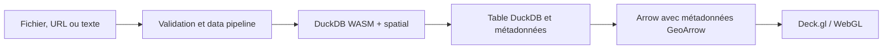
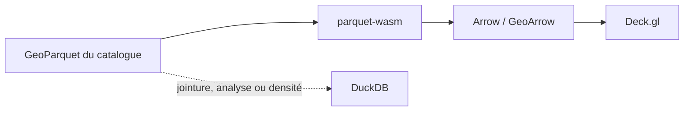
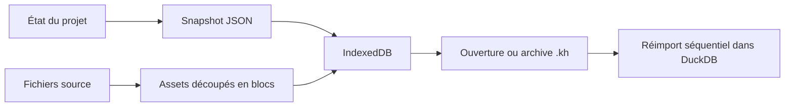

# Architecture de Khartis

Vue d'ensemble pour les développeurs. Chaque domaine est détaillé dans le
document lié ; cette page n'en donne que les frontières.

Khartis est une application SvelteKit statique, entièrement cliente : elle
importe, analyse, joint, projette et dessine les données dans le navigateur.
Aucun serveur applicatif ne reçoit les jeux de données.

## Invariants

1. **DuckDB WASM est le moteur de données.** Les formats sont lus par DuckDB et
   son extension `spatial` ; les rares exceptions sont listées dans
   [Import et DuckDB](IMPORT_DUCKDB.md).
2. **La géométrie reste binaire jusqu'au GPU** :
   `DuckDB → Arrow/GeoArrow → geoarrow-deck-stream → Deck.gl`. GeoJSON n'est
   qu'un format de secours ou d'export.
3. **Les tables DuckDB ne sont pas la persistance.** Les fichiers source et le
   snapshot du projet sont conservés dans IndexedDB ; tables, caches et buffers
   GPU sont reconstruits à l'ouverture.
4. **Une suggestion n'est jamais imposée.** Fonds, projections, visualisations
   et palettes sont proposés par ordre de pertinence et restent modifiables.
5. **Les données de l'utilisateur ne quittent pas le navigateur.** Les
   événements d'usage sont anonymes et soumis au consentement
   ([Analytics](ANALYTICS.md)).

## Carte du dépôt

| Zone                           | Responsabilité                                                | Points d'entrée                                       |
| ------------------------------ | ------------------------------------------------------------- | ----------------------------------------------------- |
| `src/routes/`                  | shell SvelteKit et démarrage                                  | `+layout.svelte`                                      |
| `features/data-pipeline/`      | validation et orientation des fichiers importés               | `pipeline.ts`, `processors/`                          |
| `features/duckdb/`             | moteur WASM, SQL, Arrow, jointures et analyses                | `duck.ts`, `orchestrator/`                            |
| `features/map/`                | Deck.gl, MapLibre, couches, projection et interaction         | `components/thematic-map.svelte`, `hooks/`, `layers/` |
| `features/visualization-tab/`  | primitives, classifications et suggestions                    | `visualization.svelte`, `hooks/`                      |
| `features/step-toolbar/`       | outils de carte et habillage                                  | `tools/`                                              |
| `features/project-management/` | IndexedDB, archives `.kh`, compatibilité, autosave            | `services/`, `io/`, `core/`                           |
| `features/commons/`            | stores globaux, services, types, erreurs, utilitaires communs | `stores/`, `services/`, `utils/`                      |
| `messages/`                    | messages Paraglide français et anglais                        | `fr.json` (référence), `en.json`                      |
| `static/basemaps/`             | catalogue versionné des fonds (métadonnées et GeoParquet)     | —                                                     |
| `tests/`                       | tests Vitest `server` (pipeline, DuckDB)                      | `tests/pipeline/`, `tests/duckdb/`                    |
| `tests-datasets/`              | jeux de données de test, servis en développement              | —                                                     |

Les tests `client` sont placés à côté du code (`*.svelte.test.ts`).

Chaque feature expose son API publique par son `index.ts` ; un autre domaine
importe ce barrel, jamais les modules internes. `commons` est le noyau partagé
et n'a volontairement pas de barrel.

## Démarrage

Le store de projet s'initialise dès le chargement de son module et restaure le
dernier projet ouvert ; DuckDB est alors démarré à la demande. Une fois
`projectStore.waitForInit()` résolu, `+layout.svelte` lance en arrière-plan :

```text
duckDBOrchestrator.initialize()      DuckDB WASM, Worker, extension spatial, macros SQL
  → basemapService.initialize()      catalogue des fonds
  → dataOrchestratorService.initialize()
```

Si aucun projet n'est ouvert, ou si ces services échouent, la modale de
création de projet s'ouvre. Un paramètre `?kh=<url>` charge une archive
distante à la place de ce parcours.

## Les trois flux

### Données utilisateur vers la carte



Recherche, filtre, jointure, classification, densité et simplification
s'exécutent dans DuckDB. Référence : [Import et DuckDB](IMPORT_DUCKDB.md).

### Fonds du catalogue vers la carte



L'affichage d'un fond du catalogue contourne DuckDB pour charger vite une
géométrie déjà préparée. Le fond n'est chargé dans DuckDB que si une jointure,
une analyse ou une densité l'exige. Référence :
[Fonds et projections](FONDS_PROJECTIONS.md).

### Persistance et reprise



Le snapshot ne contient ni mémoire DuckDB ni buffers GPU : l'ouverture
réimporte les sources et rejoue l'état. Référence :
[Persistance et archives](PERSISTANCE_ET_ARCHIVES.md).

## Deux moteurs de rendu

`resolveMapRenderEngine()` choisit le moteur selon le fond actif :

| Moteur                 | Quand                           | Principe                                                                  |
| ---------------------- | ------------------------------- | ------------------------------------------------------------------------- |
| Deck.gl orthographique | fond blanc, projections d3      | `OrthographicView`, projection appliquée aux buffers GeoArrow             |
| MapLibre intercalé     | style de fond tuilé ou fond OSM | carte tuilée, couches Deck.gl dans `MapboxOverlay({ interleaved: true })` |

Changer de mode recrée le moteur. Création et libération des contextes WebGL
appartiennent à `use-map-init.svelte.ts` ; aucune feature n'instancie son
propre moteur. Référence : [Rendu cartographique](RENDU_CARTOGRAPHIQUE.md).

## Où intervenir

| Besoin                             | Point de départ                                    | Vérification minimale                                                  |
| ---------------------------------- | -------------------------------------------------- | ---------------------------------------------------------------------- |
| Ajouter ou modifier un format      | `data-pipeline/processors/`, lecteurs DuckDB       | tests pipeline et DuckDB ciblés                                        |
| Modifier un calcul de données      | `duckdb/orchestrator/`, `duckdb/operations/`       | tests DuckDB réels, invalidation des caches                            |
| Ajouter une primitive ou un style  | `visualization-tab/` puis `map/layers/`            | test de factory, rendu navigateur, persistance                         |
| Modifier un fond ou une projection | `map/services/`, `step-toolbar/tools/projections/` | plusieurs fonds et jeux de données représentatifs                      |
| Ajouter un état durable            | store de feature, puis `persistenceRegistry`       | rechargement, archive, migration si nécessaire                         |
| Modifier le format `.kh`           | `project-management/`                              | [compatibilité](PROJECT_FORMAT_COMPATIBILITY.md), tests d'aller-retour |
