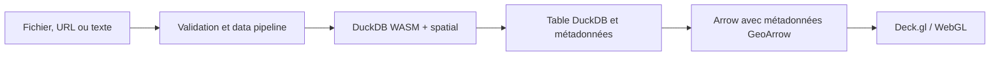
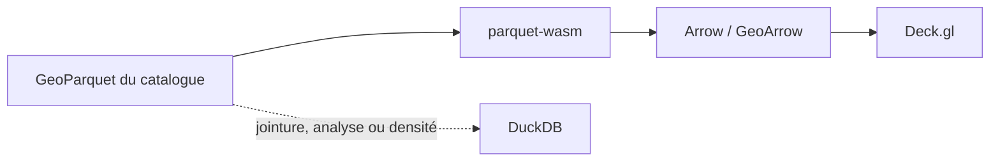
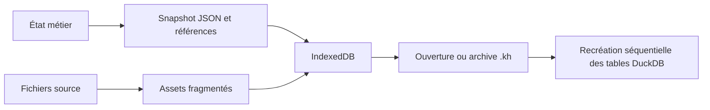

# Architecture de Khartis

> Vue de référence pour les développeurs. Les détails d’un domaine vivent dans
> les documents liés, pas ici.

Khartis est une application SvelteKit statique et entièrement cliente. Elle
importe, analyse, joint, projette et dessine les données dans le navigateur.
Il n’existe pas de serveur applicatif recevant les jeux de données de l’utilisateur.

## Les invariants qui guident le code

1. **DuckDB WASM est le moteur de données.** Les formats pris en charge sont lus
   par DuckDB et son extension `spatial`, sauf les exceptions explicitement
   justifiées par le pipeline.
2. **La géométrie reste binaire jusqu’au GPU.** Le chemin normal est
   `DuckDB → Arrow/GeoArrow → geoarrow-deck-stream → Deck.gl`. GeoJSON est un
   format de secours ou d’export, jamais une étape normale de rendu.
3. **Les données durables ne sont pas les tables DuckDB.** Les sources et le
   snapshot de projet sont conservés localement; les tables, caches et buffers
   sont reconstruits à l’ouverture.
4. **Une suggestion est révisable.** Les suggestions de fond, de projection,
   de visualisation ou de palette sont classées, jamais imposées.
5. **Les frontières de confidentialité sont explicites.** Les événements
   d’usage sont autorisés seulement après consentement Cookiebot et ne portent
   pas les données, noms de fichiers, colonnes ni lieux de l’utilisateur.

## Carte du dépôt

| Zone                           | Responsabilité                                                    | Points d’entrée utiles                                |
| ------------------------------ | ----------------------------------------------------------------- | ----------------------------------------------------- |
| `src/routes/`                  | démarrage de l’application et shell SvelteKit                     | `+layout.svelte`                                      |
| `features/data-pipeline/`      | validation et orientation des fichiers importés                   | `pipeline.ts`, `processors/`                          |
| `features/duckdb/`             | moteur WASM, SQL, Arrow, tables, jointures et analyses            | `duck.ts`, `orchestrator/`                            |
| `features/map/`                | données d’affichage, Deck.gl, MapLibre, projection et interaction | `components/thematic-map.svelte`, `hooks/`, `layers/` |
| `features/visualization-tab/`  | configuration des primitives, classifications et suggestions      | `visualization.svelte`, `hooks/`                      |
| `features/project-management/` | IndexedDB, archives `.kh`, compatibilité et autosave              | `services/`, `io/`, `core/`                           |
| `features/step-toolbar/`       | outils de carte et habillage                                      | `tools/`                                              |
| `features/commons/`            | stores partagés, erreurs, types, sécurité et services transverses | `stores/`, `services/`, `utils/`                      |

Les features gardent une API publique à leur racine. Un autre domaine importe
le barrel de la feature, pas ses modules internes.

## Démarrage applicatif

`+layout.svelte` attend d’abord l’initialisation du projet local, puis démarre
les services de données dans cet ordre :

```text
projectStore.waitForInit()
  └─ duckDBOrchestrator.initialize()
       └─ DuckDB WASM, Worker, extension spatial et macros SQL
  └─ basemapService.initialize()
  └─ dataOrchestratorService.initialize()
```

Cet ordre importe : le rétablissement d’un projet peut avoir besoin du moteur,
des fonds et des sources locales. Une initialisation échouée ouvre le parcours
de création au lieu de laisser l’interface dans un état partiellement prêt.

## Les trois flux à connaître

### 1. Données utilisateur vers la carte



Les opérations métier telles que recherche, filtre, jointure, classification,
densité et simplification se font dans DuckDB. La page
[Import et DuckDB](IMPORT_DUCKDB.md) est la référence pour ce flux.

### 2. Fonds de catalogue vers la carte



Le rendu initial d’un fond catalogue évite DuckDB afin de charger vite une
géométrie préparée. Ce même fond peut être matérialisé dans DuckDB lorsqu’une
jointure, une analyse ou une densité l’exige. Voir
[Fonds et projections](FONDS_PROJECTIONS.md).

### 3. Projet durable et reprise



Le snapshot ne stocke pas de mémoire DuckDB ni de buffers GPU. L’ouverture
rejoue les sources et les transformations nécessaires. Les limites et le
contrat d’archive sont décrits dans
[Persistance et archives](PERSISTANCE_ET_ARCHIVES.md).

## Deux moteurs de rendu derrière une même carte

`resolveMapRenderEngine()` choisit l’un des modes suivants :

| Moteur                 | Quand l’utiliser                         | Responsabilité                                           |
| ---------------------- | ---------------------------------------- | -------------------------------------------------------- |
| Deck.gl orthographique | carte thématique et projection d3        | vue `OrthographicView`, interaction et couches binaires  |
| MapLibre intercalé     | fond ou projection qui l’exige, dont OSM | carte tuilée avec `MapboxOverlay({ interleaved: true })` |

Le moteur est recréé lors d’un changement de mode. Les contextes WebGL doivent
être libérés par les helpers de `use-map-init.svelte.ts`, pas par une instance
créée localement dans une feature. Le détail de ce cycle est dans
[Rendu cartographique](RENDU_CARTOGRAPHIQUE.md).

## Où modifier quoi

| Besoin                             | Commencer par                                      | Vérification minimale                                                   |
| ---------------------------------- | -------------------------------------------------- | ----------------------------------------------------------------------- |
| Ajouter ou modifier un format      | `data-pipeline/processors/` et lecteurs DuckDB     | tests pipeline et DuckDB ciblés                                         |
| Modifier un calcul de données      | `duckdb/orchestrator/` ou `operations/`            | tests DuckDB réels et invalidation des caches                           |
| Ajouter une primitive ou un style  | `visualization-tab/` puis `map/layers/`            | test de factory, rendu navigateur et persistance                        |
| Modifier un fond ou une projection | `map/services/`, `step-toolbar/tools/projections/` | plusieurs fonds et jeux de données représentatifs                       |
| Ajouter un état durable            | store de feature puis `persistenceRegistry`        | recharge, archive et migration si nécessaire                            |
| Modifier un contrat `.kh`          | `project-management/`                              | [compatibilité](PROJECT_FORMAT_COMPATIBILITY.md) et tests de round-trip |

## Lire ensuite

- [Import et DuckDB](IMPORT_DUCKDB.md)
- [Rendu cartographique](RENDU_CARTOGRAPHIQUE.md)
- [Fonds et projections](FONDS_PROJECTIONS.md)
- [Persistance et archives](PERSISTANCE_ET_ARCHIVES.md)
- [Performance et workers](PERFORMANCE_ET_WORKERS.md)
- [Contribuer et tester](CONTRIBUER_ET_TESTER.md)
