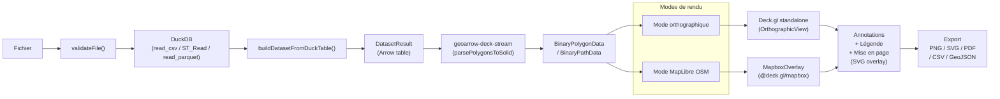

# Architecture

> Principes fondamentaux et flux de donnees de Khartis v3.

**Voir aussi** : [Gestion de l'etat](./GESTION_ETAT.md) | [Pipeline](./PIPELINE.md) | [DuckDB](./DUCKDB.md) | [Map](./MAP.md) | [Cartographie](./CARTOGRAPHIE.md)

---

## Flux global

**Librairies de rendu** : [Deck.gl](https://context7.com/visgl/deck.gl) (`@deck.gl/core`, `@deck.gl/layers`) · [MapLibre GL JS](https://context7.com/maplibre/maplibre-gl-js) · [Apache Arrow](https://context7.com/apache/arrow) (`tableFromIPC`)

---

## Les 4 piliers

| Pilier                          | Description                                                                                                                                                                                                                                 |
| ------------------------------- | ------------------------------------------------------------------------------------------------------------------------------------------------------------------------------------------------------------------------------------------- |
| **Confidentialite client-only** | Tout le traitement dans le navigateur (IndexedDB + memoire). Aucun envoi serveur, aucune API externe pour les donnees utilisateur. Fonctionne hors-ligne.                                                                                   |
| **Modularite par feature**      | Chaque feature dans `src/lib/features/` possede son store, ses composants et ses types. Couplage minimal entre features.                                                                                                                    |
| **Reactivite Svelte 5 Runes**   | `$state` et `$derived` pour l'etat reactif. Mutations explicites via methodes, jamais d'affectation directe sur l'etat domaine.                                                                                                             |
| **Rendu GPU-first**             | [Deck.gl](https://context7.com/visgl/deck.gl) pour les couches thematiques. Deux modes : **orthographique** (Deck.gl standalone, fond vectoriel GeoArrow) ou **MapLibre interleaved** (MapboxOverlay, fond OSM tuile). ~60 fps en pan/zoom. |

---

## Couches de stockage

| Couche              | Role                         | Duree de vie      | Implementation                      |
| ------------------- | ---------------------------- | ----------------- | ----------------------------------- |
| **Composant local** | Etat UI ephemere             | Montage composant | `$state` dans le `.svelte`          |
| **Store feature**   | Modele domaine               | Session           | `$state` dans le store `.svelte.ts` |
| **Store global**    | Coordination cross-feature   | Session           | Singleton (`projectStore`, etc.)    |
| **IndexedDB**       | Projets et datasets durables | Persistant        | localforage (metadonnees)           |

**Flux** : Composant --> Store feature --> Store global --> IndexedDB (debounce 5 s sur mutations, auto-save intervalle 30 s)

Voir [Gestion de l'etat](GESTION_ETAT.md) pour le detail complet.

---

## Performance

| Defi                 | Solution                                                               |
| -------------------- | ---------------------------------------------------------------------- |
| Import volumineux    | Parsing natif DuckDB (`read_csv`, `ST_Read`, `read_parquet`)           |
| Calculs lourds       | DuckDB WASM dans le navigateur                                         |
| Geometries complexes | Simplification pre-calculee + LOD dynamique                            |
| Rendu interactif     | GeoArrow binaire + [Deck.gl](https://context7.com/visgl/deck.gl) WebGL |

**Cibles** :

| Metrique | Objectif |
| -------- | -------- |
| FCP      | < 0.6 s  |
| LCP      | < 1.0 s  |
| TTI      | < 1.0 s  |
| TBT      | 0 ms     |
| CLS      | 0        |
| Rendu    | ~60 fps  |

---

## Strategie d'erreur

- **Echouer vite** sur entrees invalides (validation stricte)
- **Degradation gracieuse** sur erreurs de calcul (projection par defaut, classification de secours)
- **Ne jamais bloquer l'UI** pour les taches longues (feedback de progression)
- **Messages utilisateur** contextuels et actionnables

---

## Securite et vie privee

Aucune surface d'attaque serveur : toutes les donnees restent dans le navigateur. Les noms de fichier, cellules CSV et saisies utilisateur sont assainis. Quotas : 50 Mo/fichier, 100 Mo/projet, 50 projets max.

---

## Accessibilite

- Navigation clavier complete avec indicateurs de focus visibles
- Palettes respectant les contrastes WCAG
- Descriptions textuelles des statistiques et de la carte pour lecteurs d'ecran

---

## Internationalisation

[Paraglide JS 2](https://github.com/nicholasorlandi/ParaglideJS) : extraction des messages au build, cles semantiques (`m.key()`), FR/EN. Pas de concatenation -- utiliser les parametres de messages.

---

## Points d'entree principaux

| Besoin                        | Point d'entree                                               | Fichier                                                       |
| ----------------------------- | ------------------------------------------------------------ | ------------------------------------------------------------- |
| Traitement de fichiers        | `dataPipeline.processFile()`                                 | `src/lib/features/data-pipeline/index.ts`                     |
| DuckDB (lecture/requetes SQL) | `Duck.query()`, `Duck.read_tabular()`, `Duck.read_geofile()` | `src/lib/features/duckdb/duck.ts`                             |
| Operations de haut niveau     | `duckDBOrchestrator`                                         | `src/lib/features/duckdb/orchestrator/`                       |
| Stores globaux                | `projectStore`, `datasetsStore`, `visualizationStore`        | `src/lib/features/commons/store/`                             |
| Rendu carte                   | `useMapLayers`, `useMapInit`, `useMapBasemap`                | `src/lib/features/map/hooks/`                                 |
| Classification                | `calculateBreaks()`, `generateColorsForBreaks()`             | `src/lib/features/commons/services/classification.service.ts` |
| Suggestion de viz             | `vizSuggester`                                               | `src/lib/features/commons/services/viz-suggester.service.ts`  |
| Messages i18n                 | `* as m` depuis `$lib/paraglide/messages`                    | `messages/fr.json`, `messages/en.json`                        |

---

**Voir aussi :** [GESTION_ETAT.md](./GESTION_ETAT.md) — [PIPELINE.md](./PIPELINE.md) — [DUCKDB.md](./DUCKDB.md) — [MAP.md](./MAP.md) — [CARTOGRAPHIE.md](./CARTOGRAPHIE.md) — [GUIDE_DEVELOPPEUR.md](./GUIDE_DEVELOPPEUR.md)
