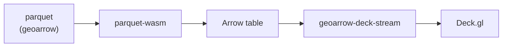
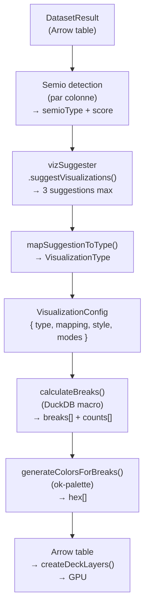

# Cartographie thématique — Guide développeur

> Concepts cartographiques appliqués dans Khartis v3. Lire ARCHITECTURE.md et MAP.md d'abord pour le pipeline technique.

**Voir aussi** : [ARCHITECTURE](./ARCHITECTURE.md) — [MAP](./MAP.md) — [PIPELINE](./PIPELINE.md) — [DUCKDB](./DUCKDB.md) — [GUIDE_DEVELOPPEUR](./GUIDE_DEVELOPPEUR.md)

---

## Détecteur sémiotique

**Fichier** : `commons/utils/semio-detector.utils.ts`

Chaque colonne est classée selon son **type sémiotique** (semioType) à partir des statistiques DuckDB :

| SemioType | Signification            | Détection                                         | Usage cartographique    |
| --------- | ------------------------ | ------------------------------------------------- | ----------------------- |
| `QTA`     | Quantitatif absolu       | Entiers élevés, grande étendue, mots pop./surface | Symboles proportionnels |
| `QTR`     | Quantitatif ratio        | Floats, plage 0-100, mots ratio/percent           | Choroplèthe             |
| `QL`      | Qualitatif               | Faible unicité, répétitions, texte                | Catégoriel              |
| `QLO`     | Qualitatif ordonné       | Mots-clés rang, intervalles ordonnés              | Catégoriel ordonné      |
| `geoid`   | Identifiant géographique | Haute unicité, mots ID/code                       | Jointure                |
| `geolat`  | Latitude                 | Valeurs ±90, mots lat/latitude                    | Géolocalisation         |
| `geolon`  | Longitude                | Valeurs ±180, mots lon/lng                        | Géolocalisation         |

**Score sémiotique** : chaque détecteur rend un score (0–6.5). La colonne prend le semioType du score le plus élevé. Les scores servent au suggesteur de viz pour classer les colonnes par pertinence.

**Mots-clés détectés** : `id`, `code`, `iso` (geoid) · `lat`, `latitude` / `lon`, `lng`, `longitude` (geo) · `ratio`, `rate`, `percent`, `pct`, `%`, `pour`, `taux` (QTR) · `rank`, `order`, `niveau`, `level` (QLO)

---

## Les 4 types de visualisation

**Fichier** : `commons/store/visualization.store.svelte.ts`

| Type           | Variable   | Géométries                   | Layer Deck.gl                         |
| -------------- | ---------- | ---------------------------- | ------------------------------------- |
| `CHOROPLETH`   | QTR        | Polygones, lignes            | `SolidPolygonLayer` / `PathLayer`     |
| `PROPORTIONAL` | QTA        | Points, polygones (centroid) | `ScatterplotLayer`                    |
| `CATEGORICAL`  | QL / QLO   | Toute                        | Geometry layer                        |
| `BIVARIATE`    | 2 colonnes | Points, polygones            | `ScatterplotLayer` (taille + couleur) |

**Choroplèthe** : polygones colorés selon une variable de ratio (densité, taux, pourcentage). Classification en classes → palette séquentielle ou divergente.

**Proportionnel** : symboles dont la taille est proportionnelle à une valeur absolue (QTA : population, surface). Échelle linéaire, sqrt ou log. Sur données polygonales, les symboles sont rendus sur les centroïdes des entités, en complément du fond polygonal.

**Catégoriel** : couleurs différentes par catégorie (QL : pays, régions). Palette qualitative. Pas de classement ordre.

**Bivarié** : combinaison taille + couleur pour deux variables. Ex : taille = population, couleur = taux d'urbanisation.

---

## Discrétisation (8 méthodes)

**Fichier** : `commons/services/classification.service.ts` + `duckdb/macros/breaks.ts`

Implémentée via **macros SQL DuckDB** (appelées une fois à l'init, jamais rechargées) :

| Méthode              | Macro DuckDB     | Principe cartographique                                                            |
| -------------------- | ---------------- | ---------------------------------------------------------------------------------- |
| `QUANTILES`          | `quantile()`     | Fréquences égales par classe — bonne distribution uniforme                         |
| `EQUAL_INTERVAL`     | `equi_width()`   | Intervalles de même amplitude — lisibles mais sensibles aux outliers               |
| `JENKS`              | `kmeans()`       | Seuils naturels (variance intra-classe min) — meilleur pour distributions clumpées |
| `Q6`                 | `q6()`           | 6 quantiles fixes (5e, 27.5e, 50e, 72.5e, 95e percentiles) — standardisé           |
| `NESTED_MEANS`       | `nested_means()` | Moyennes emboîtées récursivement — distributions asymétriques                      |
| `HEAD_TAIL`          | `headtail2()`    | Head/Tail breaks — distributions à forte queue (power-law, exponentielles)         |
| `MANUAL`             | (aucune)         | Bornes saisies manuellement — contrôle total                                       |
| `STANDARD_DEVIATION` | `nested_means`   | Écart-type — en interne, utilise `nested_means` comme fallback                     |

**Pipeline** : `calculateBreaks()` → récupère min/max via DuckDB → appelle la macro → `round_thresholds()` (arrondi lisible) → COUNT par classe via un seul `CASE WHEN` → `BreaksResult { breaks[], counts[], min, max }`.

**Note** : `standard_deviation` dans l'enum pointe vers `nested_means` (fallback). La méthode n'a pas de macro dédiée.

**Mémorisation** : `breaksCache` (Map, 50 entrées max) — évite les requêtes redondantes sur simple changement de style.

---

## Génération de couleurs (Oklch)

**Fichier** : `commons/services/classification.service.ts` — `generateColorsForBreaks()`

Couleur via `@ateliercartographie/ok-palette` en **espace Oklch** (perceptuellement uniforme) :

| Type de palette  | Usage                              | Construction                                                |
| ---------------- | ---------------------------------- | ----------------------------------------------------------- |
| **Séquentielle** | Choroplèthe (QTR), proportionnel   | `sequential(colorStart, colorEnd, numClasses)`              |
| **Divergente**   | Choroplèthe avec valeur de rupture | `divergentSequential(colorA, colorB, steps[half, half])`    |
| **Qualitative**  | Catégoriel                         | Palette prédéfinie (set1, set2, pastel, dark) — pas générée |

**Couleurs par défaut** :

- Séquentielle : `#f7fbff` (clair) → `#08519c` (foncé)
- Divergente : `#b2182b` (rouge) ↔ `#2166ac` (bleu)

**Options de contraste** : mode `contrast` (accessibilité WCAG) passé à `ok-palette`.

**Motifs accessibles** : 10 formes hatchées via `@ateliercartographie/motif.js` + `RotatableFillStyleExtension`. Chaque motif = atlas texture SVG → texture WebGL → `SolidPolygonLayer.fillTexture`. Activé via `patternId` dans `ClassificationConfig`.

---

## Suggestion de visualisation

**Fichier** : `commons/services/viz-suggester.service.ts`

24 patterns de suggestion combinant géométrie + semioTypes + nombre de colonnes :

| Pattern                            | Colonnes   | Géométries     | Résultat                      |
| ---------------------------------- | ---------- | -------------- | ----------------------------- |
| `choropleth`                       | 1 QTR      | polygon        | CHOROPLETH                    |
| `symbols_proportional`             | 1 QTA      | point, polygon | PROPORTIONAL                  |
| `polygons_colorful_QL`             | 1 QL       | polygon        | CATEGORICAL                   |
| `symbols_proportional_colorful_QL` | 2 (QTA+QL) | point, polygon | BIVARIATE                     |
| `symbols_uniques`                  | 0          | point, polygon | CATEGORICAL (géométrie seule) |
| `lines_proportional`               | 1 QTA      | line           | PROPORTIONAL (lignes)         |
| ... et 18 autres                   |            |                |                               |

**Algorithme** :

1. Enrichir chaque colonne avec son semioType + score
2. Trier par score décroissant, écarter geoid/geolat/geolon
3. Générer les suggestions 1-colonne, puis 2-colonnes
4. Retourner les 3 meilleures par score calculé (`avgScore / 6.5 * 100`)

**Mapping** : `visualization-tab/suggestion.utils.ts::mapSuggestionToType()` fait la correspondance suggestion ID → `VisualizationType`.
La sélection d'une suggestion réapplique le preset complet du type cible (modes, primitives, style, mapping, classification) avant d'affecter les colonnes proposées.

---

## Projections cartographiques

**Fichier** : `commons/utils/projection.utils.ts` + `map/utils/proj4d3.ts`

12 projections intégrées via d3-geo + d3-geo-projection :

| Nom                   | Usage                     |
| --------------------- | ------------------------- |
| Mercator              | Web (OSM)                 |
| Robinson              | Monde, usage général      |
| Winkel Tripel         | Atlas mondial             |
| Orthographique        | Globe                     |
| Natural Earth         | Projection standard Atlas |
| Équirectangulaire     | Plat, données brutes      |
| Albers                | USA, thématiques          |
| Conique Conforme      | Zones régionales          |
| Stéréographique       | Pôles                     |
| Azimutale Équivalente | Pôles                     |
| Aitoff                | Atlas elliptique          |
| Mollweide             | Monde, surfaces propor.   |

**Suggestion algorithmique** : selon Snyder 1987 / Savric 2016 via l'algo `proj-suggest` (repo privé AtelierCartographie). Khartis suggère la projection nationale (EPSG) ou générique (d3-geo pure).

**Projections composites** (DOM-TOM) : `FRANCE_DOM_TOM` = Lambert-93 principal + encarts ultra-marins. Bounds et layout prédéfinis dans `static/basemaps/projection-presets.json`.

**Reprojection** :

- DuckDB natif : `ST_Transform(geom, fromCRS, 'EPSG:4326')` — fonctionne pour EPSG:3857, UTM, la plupart des EPSG
- Fallback client proj4 : EPSG:2154, 27572, 3035 (CRS France non supportés par DuckDB spatial)
  - Points : 5 000 / batch
  - Polygones/lignes : 1 000 / batch

---

## Fonds de carte

### Catalogue GeoParquet

111 fonds multi-resolution (low/medium/high). Architecture geoarrow natif :

**JAMAIS via DuckDB**.

Métadonnées dans `all-basemaps-metadata.json`. Attributs (noms de régions) dans `all-basemaps-attributes.parquet` (chargé via DuckDB uniquement au moment d'une jointure). Les couches annexes de basemap (limites, graticules, lignes geographiques) sont chargées a la demande selon les couches visibles.

### Carte Facile

6 styles MapLibre GL JSON :

- France / Monde × couleurs / niveaux-de-gris / satellite
- Styles IGN (France) + OpenMapTiles (Monde)

Catalogue des groupes de calques dans `carte-facile-layer-groups.ts` — chaque groupe affichable/masquable avec opacité, couleur, épaisseur, pointillés.

### Fond importé

Format GeoJSON ou Shapefile. Reprojection via DuckDB. Personnalisation limitée (pas de couches additionnelles).

---

## Jointure assistée

**Fichier** : `duckdb/orchestrator/join-ops.ts`

4 catégories de résultat (couleur dans l'UI) :

| Status        | Signification                         | Couleur |
| ------------- | ------------------------------------- | ------- |
| Jointes       | Correspondance exacte ou fuzzy (vert) | Vert    |
| À vérifier    | Score Jaro-Winkler 0.85–0.99 (jaune)  | Jaune   |
| Non uniques   | Plusieurs correspondances (orange)    | Orange  |
| Non reconnues | Aucune correspondance (rouge)         | Rouge   |

**Algorithme** :

1. Construire similarity cache : cross-join source × basemap_attributes avec `jaro_winkler_similarity(normalize_text_join(), 0.85)` — filtrage précoce sur score > 0 (évite OOM)
2. `normalize_text_join()` = normalize_text sans lowercase final (préserve la casse pour le matching)
3. Catégories dérivées du cache : exact (=1), partial (0.85–0.99), no_match

**Attributs** : `basemap_attributes.parquet` — pré-normalisés (colonne `normalized`) pour éviter de re-normaliser à chaque requête.

**Cache d'invalidation** : `invalidateSimilarityCache()` — appelé après toute correction utilisateur qui modifie les valeurs sources.

---

## Annotations

**Fichier** : `map/components/annotation-overlay.svelte` + `step-toolbar/tools/annotations/`

SVG overlay (pas de canvas — annotations vectorielles). Ancrées page, non géolocalisées. 4 types :

| Type      | Contenu                                    |
| --------- | ------------------------------------------ |
| `TEXT`    | Texte libre (police, taille, couleur)      |
| `SHAPE`   | Flèche, ligne, cercle, rectangle, triangle |
| `DRAWING` | Tracé Bézier libre (freehand)              |
| `IMAGE`   | Image importée (URL ou upload)             |

Stockées dans `annotations.store.svelte.ts` — synchronisées avec la config du projet (.kh export).

---

## Légende

**Fichier** : `step-toolbar/tools/legend/legend.store.svelte.ts`

Génération automatique dès création de visualisation. Types de contenus :

| Type viz      | Contenu légende                           |
| ------------- | ----------------------------------------- |
| Choroplèthe   | Rampe de couleurs (classes + seuils)      |
| Catégoriel    | Swatches discrètes (catégories)           |
| Proportionnel | Échelle de tailles (valeur min/max)       |
| Motif         | Swatches avec motif hatch (accessibilité) |

Légendes synchronisées avec `visualizationStore` via `syncWithVisualizations()`. Items déplaçables (4 coins), personnalisables (police, taille, couleur texte, fond, opacité).

---

## Indications géographiques

**Fichier** : `step-toolbar/tools/geo-indications/`

| Type                | Options                                                         |
| ------------------- | --------------------------------------------------------------- |
| **Échelle**         | Ligne ou boîte — km/miles                                       |
| **Orientation**     | Flèche direction nord ou rose des vents                         |
| **Carte en encart** | Globe ou planisphère — réutilise les couleurs du fond principal |

---

## Simulation daltonisme

**Fichier** : `step-toolbar/tools/color-blindness/`

Filtres CSS sur la carte (simulation — n'affecte pas l'export) :

- Protanopie (rouge absent)
- Deutéranopie (vert absent)
- Tritanopie (bleu absent)

Implémentation via propriété CSS `filter` sur le conteneur de la carte.

---

## Collections / Facettes

**Fichier** : `step-toolbar/tools/facets/`

Small multiples : chaque variable → une carte. Chaque facette = **full ThematicMap** (MapLibre + Deck.gl indépendant). Synchronisation du view state via `FacetSyncViewState`.

Limite : 9 facettes = 9 contexts WebGL2 (browser max : 8–16 — monitorer GPU).

---

## Données manquantes

**Fichier** : `commons/store/visualization.store.svelte.ts` — `MissingDataConfig`

Configurer l'affichage des entités sans valeur :

- Forme (carré, cercle, triangle, etc.)
- Taille
- Couleur
- Opacité
- Label texte optionnel

---

## Flux complet de creation de viz

---

**Voir aussi :** [ARCHITECTURE.md](./ARCHITECTURE.md) — [MAP.md](./MAP.md) — [PIPELINE.md](./PIPELINE.md) — [DUCKDB.md](./DUCKDB.md) — [GUIDE_DEVELOPPEUR.md](./GUIDE_DEVELOPPEUR.md)
