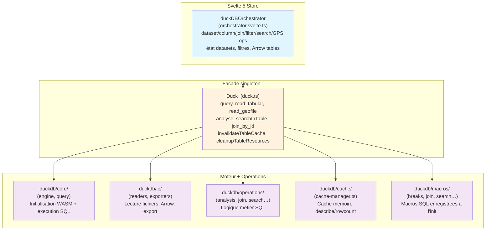
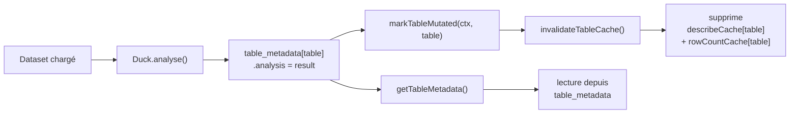
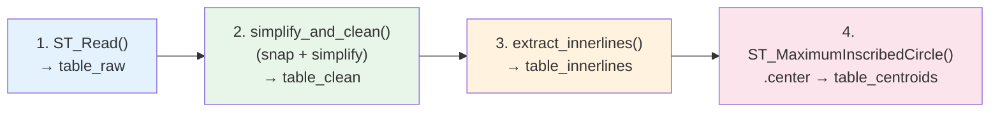

# DuckDB — Guide du développeur

> Comment le système DuckDB WASM fonctionne dans Khartis v3.

**Prérequis** : lire [ARCHITECTURE.md](./ARCHITECTURE.md) et [PIPELINE_DONNEES.md](./PIPELINE_DONNEES.md) d'abord.

---

## Architecture en 3 couches



**Règle** : tout code applicatif appelle `duckDBOrchestrator`, jamais `Duck` directement. `Duck` est reservé au code de plus bas niveau.

---

## Initialisation (`initDuckDB`)

```typescript
// duck.ts
await initDuckDB();

// Ce qui se passe :
// 1. initEngine()        — charge DuckDB WASM, ouvre connexion
// 2. loadMacros()        — enregistre les 5 macros SQL (breaks, analyse, join, search, simplification)
// 3. Configure extension repo local (/duckdb-extensions)
```

L'init est **idempotente et dédoublonnée** : les appels concurrents avant la première résolution réutilisent la même Promise. Après un échec, le promise est réinitialisée pour permettre un retry.

---

## Duck — API publique

```typescript
import { Duck } from '$lib/features/duckdb/duck';

// Lecture
await Duck.query('SELECT * FROM table', { format: 'array' | 'arrow' });
await Duck.read_tabular(file); // CSV/TSV → DuckDB table
await Duck.read_geofile(file); // GeoJSON/SHP/GPX → table avec géométrie
await Duck.read_link(url); // Fichier distant → table

// Analyse
await Duck.analyse(tableName); // Stats colonnes (min/max/nulls/patterns…)
await Duck.describeColumns(tableName); // Type + null_count par colonne

// Cache
Duck.invalidateTableCache(tableName); // Invalide describeCache + rowCountCache
Duck.get_table_metadata(tableName); // → { analysis, join, filters }
Duck.cleanupTableResources(tableName); // Supprime loaded_files + registered_files + metadata
```

**Attention** : `Duck.cleanupTableResources()` ne supprime la table DuckDB que si le préfixe est `tmp_` (fichiers éphémères importés). Les tables permanentes ne sont jamais supprimées par cleanup.

---

## Macros SQL

Enregistrées une seule fois dans `loadMacros()`. Chaque macro définit des fonctions ou procédures SQL réutilisées dans tout le pipeline.

### `simplification_macros`

```sql
snap_topology_normalized(table, geom_col, tolerance)
  -- Snap des vertex proches (tolérance) pour corriger les micro-bords

extract_innerlines(table)
  -- Extrait les limites partagées entre polygones adjacents

simplify_and_clean(table, geom_col, tolerance)
  -- Pipeline complet : snap → simplify → prune_triangles

simplify_topology_normalized(table, geom_col, tolerance)
  -- Douglas-Peucker après normalisation topologique

prune_triangles(table)
  -- Supprime les triangles artefacts de simplification
```

Utilisées dans `simplifyGeometryTable()` (operations/simplification.ts) :

- `createView: false` → crée une table `tableName_simplified`
- `createView: true` → crée une vue `vw_tableName_simplified`
- `geometryColumn` optionnel (défaut : `geom`)

### `join_macros`

```sql
normalize_text_join(text)
  -- Normalisation pour matching insensible casse/accents : lower, strip accents, collapse spaces

get_similarity(text1, text2)
  -- Score Jaro-Winkler (0-1) entre deux chaînes normalisées
```

Utilisées dans `join_by_id` et `finalizeJoin` pour le matching approximatif des entités géographiques.

### `breaks_macros`

```sql
headtail(column, n)
headtail2(column, n)
  -- Méthode head-tail pour classification (head + tail de la distribution)

quantile(column, n)         -- Quantiles
equi_width(column, n)       -- Intervalles égaux
nested_means(column, n)     -- Moyennes emboîtées
```

Ces macros sont **des MACROs DuckDB** (pas des fonctions) pour que `colname` soit substitué dynamiquement. Les tests vérifient qu'on n'utilise PAS `FUNCTION` (qui ne permet pas cette substitution).

### `analyse_macros`

Stats par colonne : min, max, null_count, unique_count, avg, median, std_dev, top_values, patterns.

### `search_macros`

Recherche textuelle full-text avec scoring de pertinence.

---

## Cache Manager (`cache-manager.ts`)

Trois caches en mémoire, tous indexés par **nom de table** :

```typescript
// describeCache   Map<tableName, DescribeResult>
// rowCountCache   Map<tableName, number>
// table_metadata  Map<tableName, { analysis, join, filters }>
```

### Cycle de vie



### Callback de mutation

```typescript
registerTableMutationCallback((tableName: string) => {
  Duck.invalidateTableCache(tableName);
});
```

Ce callback est enregistré **une seule fois** au démarrage du Duck facade. Chaque mutation (DROP ROWS, ALTER COLUMN, etc.) appelle `markTable()` qui notifie le callback.

---

## Orchestrateur (`orchestrator.svelte.ts`)

Le point d'entrée unique pour toute opération de données. Délègue à des sous-modules spécialisés.

### Datasets

```typescript
await duckDBOrchestrator.processFile(fileDescriptor); // import + analyse
await duckDBOrchestrator.registerExistingTable(table, fileId, name); // re-register
await duckDBOrchestrator.updateDatasetTableName(sourceFileId, newName);
await duckDBOrchestrator.updateDatasetJoinInfo(datasetId, joinInfo);
await duckDBOrchestrator.updateDatasetColumns(datasetId, columns);
await duckDBOrchestrator.dropTable(tableName);
await duckDBOrchestrator.clear(); // drop all tables + reset state
```

### Arrow tables (lecture haut niveau)

```typescript
await duckDBOrchestrator.getArrowTable(tableName); // avec cache WeakMap
await duckDBOrchestrator.getArrowTableDirect(tableName, { column, value }); // filtre année
await duckDBOrchestrator.getJoinedArrowTable(tableName, basemap);
await duckDBOrchestrator.getGPSArrowTable(datasetId);
await duckDBOrchestrator.createArrowTableWithMetadata(dataset);
```

**WeakMap caching** : `getArrowTableWithCache` retourne la **même référence ArrowTable** si ni les filtres ni la table n'ont changé. Cela préserve toute la chaîne de cache en aval (GeoArrow binaire, bounds, centroids de texte).

### Colonnes

```typescript
await duckDBOrchestrator.renameColumn(table, old, new, { skipAnalysis? })
await duckDBOrchestrator.changeColumnType(table, col, sqlType)
await duckDBOrchestrator.dropColumn(table, col)
await duckDBOrchestrator.dropRows(table, rowIds)
await duckDBOrchestrator.refineColumn(table, col, operation, { skipAnalysis? })
await duckDBOrchestrator.replaceInColumn(table, col, old, new)
await duckDBOrchestrator.addCalculatedColumn(table, name, expression)
await duckDBOrchestrator.testExpression(table, expression)  // → valeur ou null
```

### Sécurité SQL

`validateExpression()` dans `column-ops.ts` **rejette** :

- Requêtes multi-statements (`;`)
- Sous-requêtes (`(SELECT…)`)
- Appels de fonction dangereux (`read_csv('/tmp/…')`)
- Projections non agrégées sur plusieurs colonnes

```typescript
validateExpression("coalesce(name, 'PARIS') || ' / ' || city"); // OK
validateExpression('a + 1; DROP TABLE x'); // → DuckDBError
```

### Filtres

```typescript
await duckDBOrchestrator.addFilter(tableName, { column, operator, value });
await duckDBOrchestrator.removeFilter(tableName, filterId);
await duckDBOrchestrator.deleteFilteredRows(tableName); // supprime les lignes exclues
```

Les filtres sont stockés dans `state.svelte.ts` (Svelte 5 `$state`) sous `filtersByTable`. Chaque filtre a un `id` auto-incrémenté.

### Jointures (join-ops)

```typescript
await duckDBOrchestrator.computeJoinStats(datasetId, basemap, geoColumn);
await duckDBOrchestrator.applyJoinCorrections(
  datasetId,
  geoColumn,
  corrections
);
// corrections = { 'Armenia': 'Armenie' }  — mapping des entités à corriger

await duckDBOrchestrator.finalizeJoin(datasetId, basemap, geoColumn);
// → { joinedBasemap, geoColumn, gpsMode, gpsColumns }
```

**`finalizeJoin`** utilise le cache de similarité (table `__similarity_cache__`) quand le dataset a déjà été joint. N'appelle `join_by_id()` (legacy) que si le cache n'existe pas.

### GPS

```typescript
await duckDBOrchestrator.getGPSArrowTable(datasetId);
// → { table: ArrowTable, latColumn, lonColumn }
await duckDBOrchestrator.getGPSBounds(datasetId);
// → { minLon, minLat, maxLon, maxLat } | null
```

### Recherche

```typescript
await duckDBOrchestrator.searchInTable(tableName, query);
// → { totalRows, matches: [{ row, column, snippet }] }
```

### État interne

```typescript
await duckDBOrchestrator.waitForInitialization(); // init DuckDB si pas fait
await duckDBOrchestrator.getRowCount(tableName);
await duckDBOrchestrator.getRowPosition(tableName, rowId);
await duckDBOrchestrator.getRowStats(tableName);
await duckDBOrchestrator.analyzeTable(tableName); // Duck.analyse() + cache
await duckDBOrchestrator.getBasicColumnInfo(tableName);
await duckDBOrchestrator.getFullAnalysis(tableName);
```

---

## GPS Mode

Un dataset est en **GPS mode** quand il possède `gpsMode: true` et `gpsColumns: { lat, lon }`.

### Validation (`validateGPSColumns`)

```typescript
validateGPSColumns(table, latCol, lonCol, duckClient);
// → { isValid, possibleInversion, latStats, lonStats, warning? }
```

Détecte :

- **Inversion lat/lon** — les coordonnées ressemble à des coordonnées inversées
- **Valeurs hors plage** — lat hors `[-90, 90]`, lon hors `[-180, 180]`
- **NULLs** — aucune coordonnée valide

### Détection automatique (`detectGPSColumns`)

```typescript
detectGPSColumns(columns: AnalysisResult[])
// → { lat: string, lon: string } | null
```

Patterns détectés (insensible à la casse) :

- `lat`/`lon`, `latitude`/`longitude`
- `y_coord`/`x_coord`
- `lat_gps`/`lon_gps`, etc.

### Création de la vue GPS

```sql
CREATE OR REPLACE VIEW "gps_tableName" AS
SELECT *,
  ST_Point(TRY_CAST("lon" AS DOUBLE), TRY_CAST("lat" AS DOUBLE)) AS geom
FROM "tableName"
```

Puis `getArrowTableDirect('gps_tableName')` pour obtenir l'Arrow table avec colonne géométrique.

### Bounds GPS

```sql
SELECT
  MIN(TRY_CAST("lon" AS DOUBLE)) AS min_lon,
  MAX(TRY_CAST("lon" AS DOUBLE)) AS max_lon,
  MIN(TRY_CAST("lat" AS DOUBLE)) AS min_lat,
  MAX(TRY_CAST("lat" AS DOUBLE)) AS max_lat,
  COUNT(*) FILTER (WHERE "lon" IS NOT NULL AND "lat" IS NOT NULL) AS valid_count
FROM "tableName"
```

---

## Import de fond de carte (`basemap-import.utils.ts`)

```typescript
processBasemapImport(file: File)
// → { basemap: BasemapMetadata, geometryTable: ArrowTable }
```

### Pipeline polygones



Résultat : 3 couches dans le basemap :

- `POLYGON` — géométries nettoyées
- `LIMIT` — innerlines (limites administratives)
- `CENTROID` — centroids (pour labels)

### Pipeline lignes

Pour `LINESTRING`/`POINT` : aucune simplification ni extraction de centroids (skip pipeline polygones).

### GeoParquet

Si la géométrie est dans une colonne non-`geom` (ex: `geometry`), le pipeline normalise vers `geom` avant simplification.

---

## Tests DuckDB (`tests/duckdb/`)

| Fichier                        | Type        | API réelle ?   | Ce qui est testé                                                |
| ------------------------------ | ----------- | -------------- | --------------------------------------------------------------- |
| `engine.test.ts`               | Unit        | Non (mocks)    | Init WASM, bundle eh/mvp, extension repo                        |
| `duck.test.ts`                 | Unit        | Non (mocks)    | Façade, init dédoublonné, macros, cache invalidation            |
| `orchestrator.svelte.test.ts`  | Unit        | Non (mocks)    | Toutes les ops de l'orchestrateur                               |
| `dataset-ops.test.ts`          | Integration | Oui (Node API) | Jointures : stats, corrections, finalizeJoin (nouveau pipeline) |
| `join.test.ts`                 | Unit        | Non (mocks)    | Jointures SQL legacy (joinById, applyJoinAssociation)           |
| `column-ops.test.ts`           | Unit        | Non (mocks)    | Sécurité SQL, mutations colonnes                                |
| `breaks.test.ts`               | Unit        | Non (mocks)    | Structure macros classification                                 |
| `gps-ops.test.ts`              | Integration | Oui (Node API) | Validation GPS, bounds                                          |
| `simplification.test.ts`       | Unit        | Non (mocks)    | Tolérance, vertex reduction                                     |
| `cache-manager.test.ts`        | Unit        | Non (mocks)    | Cache invalidation, callbacks                                   |
| `basemap-import.utils.test.ts` | Unit        | Non (mocks)    | Import polygon/ligne/geoparquet                                 |

**Règle** : les tests d'intégration (`dataset-ops`, `gps-ops`) utilisent `@duckdb/node-api` avec des données réelles dans `tests-datasets/`. Les tests unitaires mockent complètement DuckDB via `vi.mock`.

**Pourquoi `vi.fn()` plutôt que des mocks manuels ?** Chaque module exposé par `duckdb/` est mocké individuellement avec `vi.mock` pour que le test reste isolé même si l'implémentation interne change.

---

## Pièges courants

1. **Utiliser `Duck` au lieu de `duckDBOrchestrator`** — `Duck` est bas niveau ; `duckDBOrchestrator` gère l'état, le cache et la coordination.

2. **Modifier une table sans appeler `markTableMutated`** — le cache garde les anciennes métadonnées. Toujours passer par `Duck.invalidateTableCache()` ou `duckDBOrchestrator` qui le fait automatiquement.

3. **Oublier `skipAnalysis: true`** sur les opérations en batch — chaque `refineColumn`/`renameColumn` déclenche un `Duck.analyse()` qui peut être coûteux. Grouper les opérations sans analyze, puis appeler `analyzeTable()` une fois à la fin.

4. **Mocker `Duck` dans un test sans mimer le cycle invalidate** — le callback de mutation doit être enregistré dans `beforeEach` et nettoyé dans `afterEach`.

5. **Confondre `getArrowTableDirect` et `getArrowTable`** — `Direct` ignore le cache WeakMap (utilisé pour le prefetching). `getArrowTable` utilise le cache (utilisé en rendu).
