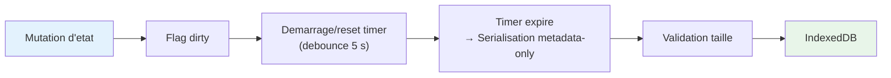

# Gestion de l'etat

> Stores Svelte 5, persistance, undo/redo et patterns de features

**Voir aussi** : [Architecture](./ARCHITECTURE.md) | [Pipeline de donnees](./PIPELINE_DONNEES.md) | [Visualisation](./VISUALISATIONS.md)

---

## Les 4 couches d'etat

| Couche              | Role                               | Duree de vie      | Stockage                                                                                             |
| ------------------- | ---------------------------------- | ----------------- | ---------------------------------------------------------------------------------------------------- |
| **Composant local** | Etat UI ephemere (inputs, modales) | Montage composant | `$state` dans le `.svelte`                                                                           |
| **Store feature**   | Modele domaine + actions           | Session           | `$state` dans le store `.svelte.ts`                                                                  |
| **Store global**    | Coordination cross-feature         | Session           | Singleton `ProjectStore`                                                                             |
| **IndexedDB**       | Projets, metadonnees et assets     | Persistant        | Object stores `projects`, `metadata`, `project_assets`, `project_asset_chunks`, `project_asset_refs` |

**Flux** : Composant --> Store feature --> Store global --> IndexedDB (debounce 5 s sur les metadonnees projet, persistence immediate des nouveaux assets binaires)

## Pattern de store Svelte 5 Runes

Chaque store est un **singleton fonctionnel** (function factory, pas de classe) avec `$state` prive, getters publics et methodes de mutation explicites.

```ts
export function createFeatureStore() {
  const state = $state({
    enabled: false,
    data: null as MyData | null
  });

  // Etat derive -- declare au top level, PAS dans un getter
  const isValid = $derived(state.data !== null);

  return {
    // Getters publics (lecture seule)
    get enabled() {
      return state.enabled;
    },
    get data() {
      return state.data;
    },

    // Getter pour etat derive (renvoie la valeur, ne cree pas le $derived)
    get isValid() {
      return isValid;
    },

    // Actions (mutations explicites)
    enable() {
      state.enabled = true;
    },
    disable() {
      state.enabled = false;
    },
    setData(data: MyData) {
      state.data = data;
    }
  };
}

// Export singleton
export const featureStore = createFeatureStore();
```

**Regles** :

- Pas d'affectation directe (toujours via methode), sauf pour les mutations UI ephemeres (`set settingPanel()`, etc.)
- `$derived` est optionnel pour les valeurs derivees simples. Dans la pratique, le code utilise rarement `$derived` -- les getters qui recalculent (ex: `hasConsented`, `isMapMode`) sont acceptables pour des operations peu coteuses. Utiliser `$derived` uniquement pour des calculations coteuses (filtrage, mapping, etc.)
- UI ephemere local au composant, seul l'etat domaine est persiste

## Stores principaux

### projectStore

Cycle de vie projet, fichiers, historique.

```ts
// Cycle de vie
createProject(name: string, files: UploadedFile[]): Promise<void>
loadProject(id: string): Promise<void>
duplicateProject(id: string, newName?: string): Promise<void>
deleteProject(id: string): Promise<void>

// Fichiers
addFilesToProject(files: UploadedFile[]): Promise<void>
removeFileFromProject(fileId: string): Promise<void>

// Mutations (creent un snapshot)
updateProjectName(name: string): void
updateVisualization(patch: Partial<VisualizationConfig>): void
updateLayout(patch: Partial<LayoutConfig>): void

// Historique
undo(): void
redo(): void
canUndo: boolean  // appel a canUndoFn() -- pas un $derived
canRedo: boolean  // appel a canRedoFn() -- pas un $derived

// Archive .kh
createProjectArchive(name?: string): Promise<Blob>
importProjectArchive(file: File): Promise<void>
```

### datasetsStore

Datasets charges, colonnes, statistiques.

> **Pattern avance** : `datasetsState` et `datasetsInternals` sont exportes au niveau du module (`datasets-state.svelte.ts`) et non dans le store factory. Ce pattern "etat externe partage" permet a plusieurs sous-modules du store de partager le meme `$state`.

### visualizationStore

Config visualisations. Types : `choropleth`, `proportional`, `categorical`, `bivariate`. Classifications : `equal-interval`, `quantile`, `jenks`, `stddev`, `manual`.

### globalState + globalActions

Zoom page, pan, etape active. `globalActions` est un export separe contenant les mutations coordonnees (ex: `setNavigationState`, `setToolbarState`).

Les choix de navigation et de zoom sont persistes dans le snapshot projet via `uiSettings.globalUi` :

- `selectedStep`, `selectedTool`, `toolbarState`
- `projectionFilter`, `projectionViewMode`
- `selectedSourceFileId`
- `pageZoomLevel`, `pagePanOffset`

### projectsStore

Liste des projets, projet actif. Localise dans `projects.store.svelte.ts`.

### consentStore

Consentement utilisateur (RGPD). Utilise un getter `hasConsented` qui recalcule (pas de `$derived`).

### zoomModeStore

Mode zoom (map vs page). Utilise un getter `isMapMode` qui recalcule (pas de `$derived`).

Le mode est persiste dans le projet via `uiSettings.zoomMode` et non plus seulement en memoire de session.

## Snapshot projet

```ts
interface KhartisProject {
  id: string;
  manifest: {
    version: string; // '3.0.0'
    createdAt: Date;
    updatedAt: Date;
    name: string;
    author?: string;
    description?: string;
    format: 'kh';
  };
  data: {
    sourceFiles: UploadedFile[];
    basemap?: { type: string; id: string; data?: any };
  };
  visualization?: VisualizationConfig;
  layout?: LayoutConfig;
  resources?: Record<string, any>;
}
```

Le document projet persiste surtout des **metadonnees legeres** :

- `datasetId`
- `assetRef` / `companionAssetRefs`
- preview (`parsedData`) limite
- `statistics`, `deepAnalysis`
- transformations, suppressions de lignes, infos de jointure/geolocalisation

Les octets source ne sont plus embarques dans le JSON projet. Ils sont stockes a part dans IndexedDB, par chunks de `8 Mo`, puis rejoues dans DuckDB a la reouverture.

### Asset store binaire

| Object store           | Contenu                                        |
| ---------------------- | ---------------------------------------------- |
| `projects`             | Snapshot projet metadata-only                  |
| `metadata`             | Liste des projets + dernier projet ouvert      |
| `project_assets`       | Metadonnees d'assets (`assetId`, taille, MIME) |
| `project_asset_chunks` | Chunks binaires des fichiers source            |
| `project_asset_refs`   | References `projectId -> assetId`              |

### Couches persistees via le registre

Le serializer ne lit pas les stores un par un. Chaque store s'enregistre dans `persistenceRegistry`, puis le projet est remappe vers quatre blocs stables :

- `basemapSettings` : couches, style, labels, groupes, projection carte, vue carte
- `visualizationSettings` : visualisations, selection active
- `layoutSettings` : format, annotations, legende, geo-indications, projection
- `uiSettings` : etat UI durable cross-feature

`uiSettings` couvre actuellement :

- `globalUi`
- `zoomMode`
- `dataTab` (resume statistique, tri courant, etat geolocalisation/jointure/enrichissement)
- `dataWorkflow`
- `dataTools` (outil ouvert, recherche/remplacement, calculatrice)
- `datasetsView` (datasets visibles, colonnes masquees, simplification appliquee)
- `tableFilters`
- `colorBlindness`
- `facets`
- `search`
- `simplification`

Regle pratique : on persiste l'etat UI qui doit survivre a un rechargement de projet, mais on exclut les etats purement transitoires comme les resultats de recherche, les selections temporaires d'annotation, ou un calcul en cours.

## Auto-sauvegarde



**Sauvegarde immediate** (bypass debounce) : creation de projet, fin d'import, ajout/suppression de fichier, export explicite. Les assets binaires, eux, sont persists au moment de l'import et ne sont pas reecrits a chaque auto-save.

### Limites de stockage

| Limite produit                  | Valeur | Comportement         |
| ------------------------------- | ------ | -------------------- |
| CSV / TSV / GeoJSON / KML / GPX | 150 Mo | Erreur de validation |
| GeoPackage / GeoParquet / Arrow | 200 Mo | Erreur de validation |
| ZIP generique                   | 100 Mo | Erreur de validation |
| Nombre max projets              | 50     | Avertissement a 80 % |

## Undo / Redo

### Declencheurs de snapshot

**Cree un snapshot** : creation de projet, renommage, mise a jour metadonnees, modification visualisation/layout.

**Pas de snapshot** : changements UI transitoires (toggle panel, selection), saisie dans les inputs (avant commit debounce), ajout/suppression de fichier.

### Historique

| Parametre     | Valeur             | Comportement                            |
| ------------- | ------------------ | --------------------------------------- |
| Max snapshots | 50                 | FIFO -- le plus ancien est supprime     |
| Stockage      | Snapshots complets | Pas de diffs structurels                |
| Timeline      | Lineaire           | Tronquee apres undo + nouvelle mutation |

## Format d'archive (.kh)

- **Export** : archive `.kh` autoportante avec `manifest.json`, `project.json` et `assets/<assetId>/...`
- **Import** : restaure d'abord les assets IndexedDB, puis le projet metadata-only, puis rejoue les tables DuckDB
- **Compatibilite** : pas de support legacy pre-release ; le format cible est directement l'archive `.kh` multi-entrees

## Metadonnees et references

| Cle / store          | Type                     | Role                                        |
| -------------------- | ------------------------ | ------------------------------------------- |
| `CURRENT`            | `string`                 | Dernier projet ouvert                       |
| `metadata`           | `SavedProjectMetadata[]` | Liste des projets (id, nom, taille, dates)  |
| `project_asset_refs` | `projectId -> assetId`   | Cycle de vie des assets et GC des orphelins |

## Pattern pour ajouter un store feature

```
src/lib/features/<nom-feature>/
  <nom-feature>.svelte              # Composant d'entree
  <nom-feature>.store.svelte.ts     # Etat + actions
  <nom-feature>.types.ts            # Types
  components/                        # Sous-composants
  utils/                             # Utilitaires specifiques
  tests/                             # Tests
```

1. Creer le store avec `createFeatureStore()` (pattern ci-dessus)
2. Creer le composant UI
3. Enregistrer dans la configuration de navigation du toolbar
4. Ajouter les cles i18n : `tool_<nom>_*`
5. Ajouter les tests

## Interactions cross-features

| Declencheur              | Features impactees           | Action                     |
| ------------------------ | ---------------------------- | -------------------------- |
| Changement de projection | Annotations, Geo-indicateurs | Recalcul des positions     |
| Simplification           | Couches, Carte               | Rafraichissement geometrie |
| Edition legende          | Carte, Export                | Re-rendu legende           |
| Changement de format     | Mise en page, Export         | Ajustement d'echelle       |

## Gestion d'erreur

Expression invalide : garder la valeur precedente. Echec simplification : revert geometrie. Projection manquante : fallback Equirectangulaire. Quota depasse : purge du plus ancien projet.
