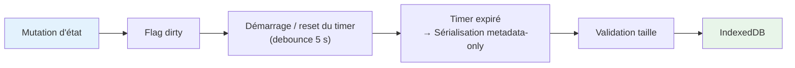

# Gestion de l'état

> Stores Svelte 5, persistance, undo/redo et patterns de features.

**Voir aussi** : [Architecture](./ARCHITECTURE.md) | [Pipeline de données](./PIPELINE_DONNEES.md) | [Visualisations](./VISUALISATIONS.md)

---

## Les 4 couches d'état

| Couche              | Rôle                               | Durée de vie      | Stockage                                                                                             |
| ------------------- | ---------------------------------- | ----------------- | ---------------------------------------------------------------------------------------------------- |
| **Composant local** | État UI éphémère (inputs, modales) | Montage composant | `$state` dans le `.svelte`                                                                           |
| **Store feature**   | Modèle de domaine + actions        | Session           | `$state` dans le store `.svelte.ts`                                                                  |
| **Store global**    | Coordination cross-feature         | Session           | Singleton `ProjectStore`                                                                             |
| **IndexedDB**       | Projets, métadonnées et assets     | Persistant        | Object stores `projects`, `metadata`, `project_assets`, `project_asset_chunks`, `project_asset_refs` |

**Flux** : Composant → Store feature → Store global → IndexedDB (debounce 5 s sur les métadonnées projet, persistance immédiate des nouveaux assets binaires).

---

## Pattern de store Svelte 5 Runes

Chaque store est un **singleton fonctionnel** (factory, pas de classe) avec `$state` privé, getters publics et méthodes de mutation explicites.

```ts
export function createFeatureStore() {
  const state = $state({
    enabled: false,
    data: null as MyData | null
  });

  // État dérivé — déclaré au top level, PAS dans un getter
  const isValid = $derived(state.data !== null);

  return {
    // Getters publics (lecture seule)
    get enabled() {
      return state.enabled;
    },
    get data() {
      return state.data;
    },

    // Getter pour état dérivé (renvoie la valeur, ne recrée pas le $derived)
    get isValid() {
      return isValid;
    },

    // Actions (mutations explicites)
    enable() {
      state.enabled = true;
    },
    disable() {
      state.enabled = false;
    },
    setData(data: MyData) {
      state.data = data;
    }
  };
}

// Export singleton
export const featureStore = createFeatureStore();
```

**Règles** :

- Pas d'affectation directe (toujours via méthode), sauf pour les mutations UI éphémères (`set settingPanel()`, etc.).
- `$derived` est optionnel pour les valeurs dérivées simples. Dans la pratique, le code utilise rarement `$derived` — les getters qui recalculent (par exemple `hasConsented`, `isMapMode`) sont acceptables pour des opérations peu coûteuses. Réserver `$derived` aux calculs coûteux (filtrage, mapping, etc.).
- L'état UI éphémère reste local au composant ; seul l'état de domaine est persisté.

---

## Stores principaux

### `projectStore`

Cycle de vie projet, fichiers, historique.

```ts
// Cycle de vie
createProject(name: string, files: UploadedFile[]): Promise<void>
loadProject(id: string): Promise<void>
duplicateProject(id: string, newName?: string): Promise<void>
deleteProject(id: string): Promise<void>

// Fichiers
addFilesToProject(files: UploadedFile[]): Promise<void>
removeFileFromProject(fileId: string): Promise<void>

// Mutations (créent un snapshot)
updateProjectName(name: string): void
updateVisualization(patch: Partial<VisualizationConfig>): void
updateLayout(patch: Partial<LayoutConfig>): void

// Historique
undo(): void
redo(): void
canUndo: boolean  // appel à canUndoFn() — pas un $derived
canRedo: boolean  // appel à canRedoFn() — pas un $derived

// Archive .kh
createProjectArchive(name?: string): Promise<Blob>
importProjectArchive(file: File): Promise<void>
```

### `datasetsStore`

Datasets chargés, colonnes, statistiques.

> **Pattern avancé** : `datasetsState` et `datasetsInternals` sont exportés au niveau du module (`datasets-state.svelte.ts`) et non dans la factory du store. Ce pattern « état externe partagé » permet à plusieurs sous-modules du store de partager le même `$state`.

### `visualizationStore`

Configurations de visualisations. Types : `choropleth`, `proportional`, `categorical`, `bivariate`. Classifications : `kmeans`, `quantiles`, `equal_interval`, `q6`, `nested_means`, `head_tail`, `manual`.

### `globalState` + `globalActions`

Zoom page, pan, étape active. `globalActions` est un export séparé contenant les mutations coordonnées (par exemple `setNavigationState`, `setToolbarState`).

Les choix de navigation et de zoom sont persistés dans le snapshot projet via `uiSettings.globalUi` :

- `selectedStep`, `selectedTool`, `toolbarState`
- `projectionFilter`, `projectionViewMode`
- `selectedSourceFileId`
- `pageZoomLevel`, `pagePanOffset`

### `projectsStore`

Liste des projets, projet actif. Implémenté dans `projects.store.svelte.ts`.

### `consentStore`

Consentement utilisateur (RGPD). Utilise un getter `hasConsented` qui recalcule (pas de `$derived`).

### `zoomModeStore`

Mode zoom (carte vs page). Utilise un getter `isMapMode` qui recalcule (pas de `$derived`).

Le mode est persisté dans le projet via `uiSettings.zoomMode`, plus seulement en mémoire de session.

---

## Snapshot projet

```ts
interface KhartisProject {
  id: string;
  manifest: {
    version: string; // '3.0.0'
    createdAt: Date;
    updatedAt: Date;
    name: string;
    author?: string;
    description?: string;
    format: 'kh';
  };
  data: {
    sourceFiles: UploadedFile[];
    basemap?: { type: string; id: string; data?: any };
  };
  visualization?: VisualizationConfig;
  layout?: LayoutConfig;
  resources?: Record<string, any>;
}
```

Le document projet persiste principalement des **métadonnées légères** :

- `datasetId`
- `assetRef` / `companionAssetRefs`
- aperçu (`parsedData`) limité
- `statistics`, `deepAnalysis`
- transformations, suppressions de lignes, informations de jointure ou de géolocalisation

Les octets source ne sont plus embarqués dans le JSON projet. Ils sont stockés à part dans IndexedDB, par chunks de 8 Mo, puis rejoués dans DuckDB à la réouverture.

### Asset store binaire

| Object store           | Contenu                                        |
| ---------------------- | ---------------------------------------------- |
| `projects`             | Snapshot projet metadata-only                  |
| `metadata`             | Liste des projets + dernier projet ouvert      |
| `project_assets`       | Métadonnées d'assets (`assetId`, taille, MIME) |
| `project_asset_chunks` | Chunks binaires des fichiers source            |
| `project_asset_refs`   | Références `projectId → assetId`               |

### Couches persistées via le registre

Le serializer ne lit pas les stores un par un. Chaque store s'enregistre dans `persistenceRegistry`, puis le projet est remappé vers quatre blocs stables :

- `basemapSettings` : couches, style, labels, groupes, projection carte, vue carte
- `visualizationSettings` : visualisations, sélection active
- `layoutSettings` : format, annotations, légende, indications géographiques, projection
- `uiSettings` : état UI durable cross-feature

`uiSettings` couvre actuellement :

- `globalUi`
- `zoomMode`
- `dataTab` (résumé statistique, tri courant, état de géolocalisation / jointure / enrichissement)
- `dataWorkflow`
- `dataTools` (outil ouvert, recherche/remplacement, calculatrice)
- `datasetsView` (datasets visibles, colonnes masquées, simplification appliquée)
- `tableFilters`
- `colorBlindness`
- `facets`
- `search`
- `simplification`

Règle pratique : on persiste l'état UI qui doit survivre à un rechargement de projet, mais on exclut les états purement transitoires comme les résultats de recherche, les sélections temporaires d'annotation ou un calcul en cours.

---

## Auto-sauvegarde



**Sauvegarde immédiate** (bypass debounce) : création de projet, fin d'import, ajout / suppression de fichier, export explicite. Les assets binaires, eux, sont persistés au moment de l'import et ne sont pas réécrits à chaque auto-save.

### Limites de stockage

| Limite produit                              | Valeur | Comportement         |
| ------------------------------------------- | ------ | -------------------- |
| CSV / TSV / GeoJSON / KML / KMZ / GPX       | 150 Mo | Erreur de validation |
| GeoPackage / GeoParquet / Arrow / Shapefile | 200 Mo | Erreur de validation |
| ZIP générique                               | 100 Mo | Erreur de validation |
| Nombre max de projets                       | 50     | Avertissement à 80 % |

---

## Undo / Redo

### Déclencheurs de snapshot

**Crée un snapshot** : création de projet, renommage, mise à jour métadonnées, modification de visualisation ou de layout.

**Pas de snapshot** : changements UI transitoires (toggle panel, sélection), saisie dans les inputs (avant commit debounce), ajout ou suppression de fichier.

### Historique

| Paramètre     | Valeur             | Comportement                            |
| ------------- | ------------------ | --------------------------------------- |
| Max snapshots | 50                 | FIFO — le plus ancien est supprimé      |
| Stockage      | Snapshots complets | Pas de diffs structurels                |
| Timeline      | Linéaire           | Tronquée après undo + nouvelle mutation |

---

## Format d'archive (.kh)

- **Export** : archive `.kh` autoportante avec `manifest.json`, `project.json` et `assets/<assetId>/...`
- **Import** : restaure d'abord les assets IndexedDB, puis le projet metadata-only, puis rejoue les tables DuckDB
- **Compatibilité** : pas de support legacy pre-release ; le format cible est directement l'archive `.kh` multi-entrées

---

## Métadonnées et références

| Clé / store          | Type                     | Rôle                                        |
| -------------------- | ------------------------ | ------------------------------------------- |
| `CURRENT`            | `string`                 | Dernier projet ouvert                       |
| `metadata`           | `SavedProjectMetadata[]` | Liste des projets (id, nom, taille, dates)  |
| `project_asset_refs` | `projectId → assetId`    | Cycle de vie des assets et GC des orphelins |

---

## Pattern pour ajouter un store feature

```
src/lib/features/<nom-feature>/
├── <nom-feature>.svelte              # Composant d'entrée
├── <nom-feature>.store.svelte.ts     # État + actions
├── <nom-feature>.types.ts            # Types
├── components/                       # Sous-composants
├── utils/                            # Utilitaires spécifiques
└── tests/                            # Tests
```

1. Créer le store avec `createFeatureStore()` (pattern ci-dessus).
2. Créer le composant UI.
3. Enregistrer dans la configuration de navigation du toolbar.
4. Ajouter les clés i18n : `tool_<nom>_*`.
5. Ajouter les tests.

---

## Interactions cross-features

| Déclencheur              | Features impactées           | Action                     |
| ------------------------ | ---------------------------- | -------------------------- |
| Changement de projection | Annotations, indications géo | Recalcul des positions     |
| Simplification           | Couches, carte               | Rafraîchissement géométrie |
| Édition légende          | Carte, export                | Re-rendu légende           |
| Changement de format     | Mise en page, export         | Ajustement d'échelle       |

---

## Gestion d'erreur

Expression invalide : conserver la valeur précédente. Échec de simplification : revert de la géométrie. Projection manquante : fallback équirectangulaire. Quota dépassé : purge du plus ancien projet.
