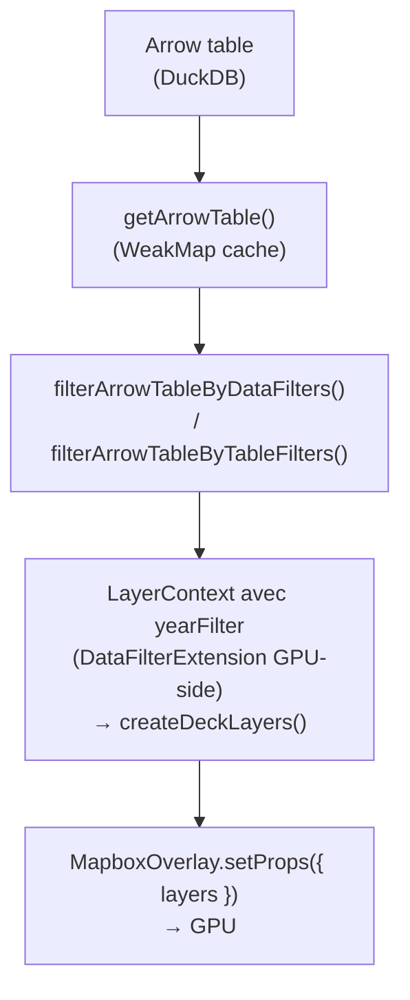

# Rendu carte — Guide développeur

> Architecture duale de rendu : MapLibre pour les fonds tuilés, Deck.gl pour les couches thématiques GPU. Lire [ARCHITECTURE.md](./ARCHITECTURE.md) d'abord pour le contexte, [FONDS_DE_CARTE.md](./FONDS_DE_CARTE.md) pour la préparation des fonds du catalogue.

**Voir aussi** : [ARCHITECTURE.md](./ARCHITECTURE.md) | [CARTOGRAPHIE.md](./CARTOGRAPHIE.md) | [FONDS_DE_CARTE.md](./FONDS_DE_CARTE.md) | [DUCKDB.md](./DUCKDB.md)

---

## Architecture de rendu



**Pipeline** : `getArrowTable()` (cache WeakMap) → `filterArrowTableByDataFilters()` → `filterArrowTableByTableFilters()` → `createDeckLayers(filteredTable, ctx)` où `ctx.yearFilter` configure `DataFilterExtension` pour le filtrage GPU-side. `MapboxOverlay.setProps({ layers })` envoie les couches au GPU.

**Deux modes de vue** :

- **Orthographique** (Deck.gl standalone) : `OrthographicView` + projections d3-geo via geoarrow-deck-stream.
- **MapLibre interleaved** : `MapboxOverlay({ interleaved: true })` + web mercator / globe.

Règles importantes de projection :

- Les fichiers géographiques importés avec un CRS projeté (par exemple `EPSG:2154`) restent dans leur CRS source en mode orthographique. Khartis garde alors un rendu `geoIdentity` et persiste le viewport dans les coordonnées du jeu de données pour éviter les cartes blanches ou renversées au rechargement.
- La reprojection vers `EPSG:4326` n'est demandée que lorsqu'un fichier projeté doit être affiché sur un fond tuilé MapLibre.
- Les suggestions de projection se basent d'abord sur l'emprise réelle des données. Pour un jeu exclusivement ponctuel ou un tableau GPS, Khartis utilise donc les bornes calculées depuis les coordonnées plutôt que l'emprise du fond monde chargé par défaut.

---

## Caches WeakMap

### `geoarrow-stream-bridge.ts` (`map/utils/`)

Six caches pour la conversion binaire GeoArrow → Deck.gl :

```typescript
// Parsing identité (lon/lat pur, sans reprojection)
const solidPolygonCache = new WeakMap<ArrowTable, BinaryPolygonData>();
const pathCache = new WeakMap<ArrowTable, BinaryPathData>();
const pointCache = new WeakMap<ArrowTable, BinaryPointData>();

// Parsing avec projection (clé composée : table → ProjectionLike → result)
// ProjectionLike est stable par basemap (mémoïsée dans use-map-layers)
const projSolidPolygonCache = new WeakMap<
  ArrowTable,
  Map<ProjectionLike, BinaryPolygonData>
>();
const projPathCache = new WeakMap<
  ArrowTable,
  Map<ProjectionLike, BinaryPathData>
>();
const projPointCache = new WeakMap<
  ArrowTable,
  Map<ProjectionLike, BinaryPointData>
>();

// Normalisation du nom de colonne géométrique
// DuckDB nomme "geom" ou "wkb_geometry", geoarrow-deck-stream attend "geometry"
const normalizedTableCache = new WeakMap<ArrowTable, ArrowTable>();
```

### `arrow-filter.utils.ts`

Trois caches pour les filtres :

```typescript
const yearFilterCache = new WeakMap<ArrowTable, Map<string, ArrowTable>>();
const dataFilterCache = new WeakMap<ArrowTable, Map<string, ArrowTable>>();
const tableFilterCache = new WeakMap<ArrowTable, Map<string, ArrowTable>>();
```

**Règle critique** : les fonctions de filtrage retournent la **même référence ArrowTable** quand les filtres n'ont pas changé. Cela préserve toute la chaîne de caches en aval.

Clé de cache pour `dataFilterCache` / `tableFilterCache` : `column:op:value|...` — triée pour être indépendante de l'ordre.

### `layer-factory.ts`

```typescript
// Conversion Arrow → GeoJSON (fallback pour données non-GeoArrow)
const geoJsonConversionCache = new WeakMap<
  ArrowTable,
  Map<string, FeatureCollection>
>();

// Labels : centroïdes + texte (stable pour même table + colonnes + projection)
const textLabelCache = new WeakMap<
  ArrowTable,
  Map<ProjectionLike | null, Map<string, TextLayerDatum[]>>
>();
```

### `bounds.ts`

```typescript
const boundsCache = new WeakMap<ArrowTable, LngLatBoundsLike | null>();
```

---

## Mémoïsation de projection

**Fichier** : `use-map-layers.svelte.ts`

```typescript
if (currentMetadata !== lastBasemapMetadataRef) {
  lastBasemapProjectionRef = buildProjectionForBasemap(
    currentMetadata,
    960,
    600,
    ...
  );
  lastBasemapMetadataRef = currentMetadata;
}
```

La projection n'est recréée que quand l'utilisateur change de fond de carte. Dimensions hardcodées 960 × 600 pour le centrage orthographique.

Le même principe s'applique aux overrides de projection utilisateur (projection prédéfinie ou code proj4 custom) : la référence `ProjectionLike` doit rester stable tant que la sélection ne change pas. Sinon, les caches aval basés sur `WeakMap` pour `parseSolidPolygonsWithProjection()`, `parsePathsWithProjection()`, `parsePointDataWithProjection()`, les centroïdes de labels et les reprojections GeoJSON retombent en cold path à chaque simple refresh de layers.

Priorité de rendu : la projection déclarée dans les métadonnées du fond de carte reste la projection par défaut, mais un choix explicite de l'utilisateur dans l'outil **Projection** doit reprendre la main immédiatement sur les couches du fond comme sur les couches thématiques.

Corollaire côté UI : un changement explicite de projection doit aussi invalider le cycle de refresh des layers, même si la surface MapLibre reste dans la même famille (`mercator` ou `globe`). Sinon l'outil peut sembler sélectionné visuellement alors que le rendu reste figé.

Pourquoi c'est critique : `projSolidPolygonCache` et consorts utilisent `ProjectionLike` comme clé de Map. Si un nouvel objet projection était créé à chaque render, le cache serait toujours vide.

`computeProjectedBboxForBasemap()` mémoïse également ses résultats par fond + dimensions + bbox dans `geoarrow-stream-bridge.ts`, pour éviter de reprojeter plusieurs fois les mêmes bornes pendant les changements de vue et de fond de référence.

---

## Chargement paresseux des fonds

Le GeoParquet principal d'un fond de carte est chargé immédiatement, mais les couches annexes metadata-driven (limites, graticules, lignes géographiques) sont chargées à la demande selon les couches visibles. Les centroïdes metadata ne sont pas préchargés comme couches visibles autonomes, mais les symboles et textes des couches thématiques s'appuient désormais sur une table de points représentatifs dérivée par DuckDB.

Le planisphère par défaut n'est pas chargé en état vierge. Il sert seulement de fallback quand le projet contient déjà des données source, ou lorsqu'un fond de référence explicite doit être affiché ou restauré.

Détail complet du format et de la préparation : [FONDS_DE_CARTE.md](./FONDS_DE_CARTE.md).

---

## Interactions tooltip

Le cahier des charges demande une infobulle fixe au-dessus de la visionneuse, disponible au survol et au toucher. Le clic ou le toucher sur une entité épingle donc uniquement le tooltip pour le rendre exploitable sur tactile ; un clic hors entité le ferme. Aucune sélection visuelle persistante n'est appliquée sur la carte.

Le chemin `GeoJSON` brut continue d'injecter un `__id` stable par feature quand la source n'en fournit pas, afin de conserver un picking cohérent pour le tooltip sur tous les jeux de données.

La mise en lumière persistante sur la carte reste réservée à l'outil **Recherche**, conformément au CDC `DATA-05d` et `VIZ-TOOLS-a`. Elle suit uniquement le résultat courant parcouru dans l'outil, pas les clics génériques sur la carte.

---

## Pipeline GeoArrow → Deck.gl

### Parsing identité (mode MapLibre)

`parseSolidPolygons(table)` → `parsePolygonsToSolid(normalizeGeomColumnName(table), { projection: geoIdentity() })`.

Appelé pour les basemaps personnalisés et le mode MapLibre (lon/lat pur).

### Parsing avec projection

`parseSolidPolygonsWithProjection(table, projection)` → utilise `projSolidPolygonCache` avec double clé.

Types de projection :

- **`identity`** : `geoIdentity()` — lon/lat direct.
- **`simple`** : une définition proj4 → `resolveSimpleProjection()` → d3-geo.
- **`composite`** : plusieurs entrées avec layout bounds (DOM-TOM) → `buildCompositeProjection()`.

### Normalisation de colonne

`normalizeGeomColumnName(table)` — DuckDB utilise `geom` ou `wkb_geometry` ; `geoarrow-deck-stream` attend `geometry`. Cette fonction renomme la colonne et met à jour les métadonnées GeoArrow `primary_column`.

---

## Layer factory

`createDeckLayers(table, ctx)` dispatche par type de géométrie :

| Géométrie                        | Fonction                | Layer Deck.gl                               |
| -------------------------------- | ----------------------- | ------------------------------------------- |
| `POINT` / `MULTIPOINT`           | `createPointLayers()`   | `ScatterplotLayer`                          |
| `LINESTRING` / `MULTILINESTRING` | `createLineLayers()`    | `PathLayer`                                 |
| `POLYGON` / `MULTIPOLYGON`       | `createPolygonLayers()` | `SolidPolygonLayer` + `PathLayer` (contour) |

Chaque fonction a deux chemins :

1. **GeoArrow natif** : parsing binaire via `geoarrow-deck-stream` + attributs binaires.
2. **Fallback GeoJSON** : conversion Arrow → GeoJSON (coûteuse, cachée) → `GeoJsonLayer`.

### Attributs binaires (Deck.gl 9)

```typescript
// Au lieu de getFillColor: d => colorForRow(d.properties.value)
// Précalculer un Float32Array / Uint8Array et passer via data.attributes
const fillColorBinAttr = pointColorAttr(
  pointData,
  rowAccessor(table, fillColorAccessor)
);
scatterBinaryData.attributes.getFillColor = fillColorBinAttr;
```

Fonctions utilitaires dans `geoarrow-stream-bridge.ts` :

- `pointColorAttr(data, colorLookup)` — RGBA8 par point.
- `pointRadiusAttr(data, radiusLookup)` — rayon par point.
- `filterValueAttr(data, table, column)` — `Float32Array` pour `DataFilterExtension`.
- `pointPositions(data)` — extraction directe des coordonnées pour les couches de points.

Les **Textes** et **Symboles** sur polygones, lignes et `MultiPoint` passent maintenant par les tables DuckDB de points représentatifs. Les anciens fallback JS `polygonCentroids()` / `pathCentroids()` ont été retirés du rendu thématique.

---

## `DataFilterExtension` (filtrage GPU-side)

Pour le filtrage par année sur les données binaires :

```typescript
// Full table passée à createDeckLayers (cache GeoArrow préservé)
const filteredTable = filterArrowTableByYear(table, yearFilter);

// Année gérée entièrement GPU-side — pas de nouvelle table Arrow
const filterAttr = filterValueAttr(binaryData, table, yearColumn);
data.attributes.getFilterValue = filterAttr;
// layer.props: filterRange: [yearValue, yearValue]
```

Pour les données GeoJSON (fallback), `getFilterValue` est un accesseur de fonction classique.

Le sélecteur d'années côté UI doit récupérer les valeurs distinctes depuis DuckDB dès qu'une `tableName` existe, avec fallback local seulement en dernier recours. Sinon, un aperçu partiel peut masquer des années valides et désynchroniser l'interface du filtre et le rendu effectif.

---

## Extensions Deck.gl (singletons)

| Extension                                | Singleton                    | Usage                    |
| ---------------------------------------- | ---------------------------- | ------------------------ |
| `DataFilterExtension({ filterSize: 1 })` | `DATA_FILTER_EXTENSION`      | Filtrage GPU-side année  |
| `PathStyleExtension({ dash: true })`     | `DASH_EXTENSION`             | Bordures en pointillés   |
| `RotatableFillStyleExtension`            | `fillStyleExtensionInstance` | Motifs hatch accessibles |

`RotatableFillStyleExtension` est une extension custom de l'Atelier, basée sur `FillStyleExtension` avec rotation de motif via atlas texture.

---

## Picking et tooltip

```typescript
// hoverHandler  → mapTooltipStore.showAtHover(x, y, entries, layerId, rowIndex)
// clickHandler  → épingle le tooltip à la position fixe du viewer
// clic vide     → décroche
// clic même objet → conserve l'épinglage
// autres attributs → accordéon affiché replié, ouvrable une fois épinglé
```

Extraction tooltip : `extractTooltipEntries()` lit depuis Arrow (`table.get(rowIndex)`) ou GeoJSON (`feature.properties`).

Pour les polygones et lignes binaires issus de `geoarrow-deck-stream`, le mapping pick → ligne source s'appuie d'abord sur `featureIds`, y compris quand `PickingInfo.index` reste inférieur à `table.numRows`. Cela évite les tooltips faux sur les géométries multipart ou éclatées, où `startIndices` ne correspond pas à une simple relation 1 objet Deck.gl = 1 ligne DuckDB.

Les factories de couches binaires recopient donc explicitement `featureIds` dans `layer.props.data` en plus de `khartisSourceTable`, afin que le service de tooltip retrouve toujours la bonne ligne source au runtime.

L'infobulle est affichée à un emplacement fixe au-dessus de la visionneuse quand l'espace le permet. Si l'écran est trop contraint, elle se replie dans la partie haute de la visionneuse plutôt que de suivre le curseur.

Un léger délai au hover évite le flicker pendant les mouvements rapides du pointeur. Les layers Deck.gl restent pickables, mais le surlignage GPU natif n'est pas utilisé dans le parcours CDC.

---

## Calcul des bounds (`core/bounds.ts`)

Tente dans l'ordre :

1. **Métadonnée GeoArrow bbox** — ignorée si `[-180,-90,180,90]` (world bounds DuckDB).
2. **Colonne géométrique primaire** — scannée, max 10 000 lignes, `parseGeoJsonGeometry()` par ligne.
3. **Découverte automatique** — cherche une colonne de nom géo (`lat`, `lon`, `geom`, etc.).
4. **Brute-force** — toutes les colonnes.

---

## Couches de basemap (`layers/basemap-layers.ts`)

9 couches : `background` (terre, mers, lacs, relief) + `foreground` (frontières, rivières, équateur, méridiens, villes).

Les sections **Lacs et rivières** et **Villes** sont désactivées explicitement quand le fond de carte actif ne fournit pas les données géométriques nécessaires. Cela évite un faux positif UX où un clic changeait des réglages sans aucun effet visuel sur la carte.

Quand le fond actif expose des couches metadata génériques `polygon`, `line` ou `point` (fonds importés ou enrichis), elles alimentent respectivement les contrôles **Lacs**, **Rivières** et **Villes**. Ces groupes suivent aussi l'ordre UI du panneau **Calques** à l'intérieur de leur domaine de rendu (`background` ou `foreground`).

Les couches metadata linéaires (`limit`, `graticule`, `geographic-lines`) restent pilotables par les contrôles **Pointillés**. Quand la source est en GeoArrow natif, Khartis conserve le rendu binaire `PathLayer` afin que les tirets restent fiables visuellement. Les sources WKB/GeoJSON utilisent toujours le fallback `GeoJsonLayer`.

Chaque factory dispatche :

- **GeoArrow natif** → `parseSolidPolygons()` / `parsePaths()` (binaire).
- **WKB / GeoJSON** → `getCachedBasemapGeoJSON()` → `GeoJsonLayer`.
- Quand un fond catalogue fournit déjà des couches `limit` visibles, la couche **terre** évite de recalculer un `PathLayer` redondant sur le polygone principal.

---

## Timings de debounce

| Constante                      | Valeur | Usage                                |
| ------------------------------ | ------ | ------------------------------------ |
| `LAYER_UPDATE_DEBOUNCE_MS`     | 16 ms  | `scheduleLayerUpdate()` via RAF      |
| `FITBOUNDS_DEBOUNCE_MS`        | 300 ms | `fitBounds`                          |
| `RESIZE_DEBOUNCE_MS`           | 150 ms | Resize                               |
| `SEARCH_HIGHLIGHT_DEBOUNCE_MS` | 800 ms | Recherche DuckDB → highlight Deck.gl |

---

## Convention d'identifiants de layer

```typescript
createLayerId(DeckLayerId.POINT_LAYER, datasetId, projectionSuffix);
// → "point-layer-ds_abc123-webmercator"
```

IDs stables — changer un ID force un re-upload GPU complet au lieu d'un prop diff.

---

## Les deux modes de vue en détail

### Orthographique (Deck.gl standalone)

- `OrthographicView` + `Deck`.
- Projections d3-geo appliquées via geoarrow-deck-stream.
- `projectionStore.modelMatrix` pour le centrage.

### MapLibre (interleaved)

- `MapboxOverlay({ interleaved: true })`.
- Le basemap gère la projection (web mercator / globe).
- `mapProjectionStore` permet de basculer Mercator ↔ Globe.
- Les styles tuilés `France` verrouillent la projection sur `mercator` : l'option **Globe 3D** n'est affichée que pour `Monde`, et tout état persistant `globe` est normalisé automatiquement au retour sur `France`.

---

## Cartographie thématique

4 types de visualisation (`visualization.store.svelte.ts`) :

| Type           | Variable            | Layer Deck.gl                               |
| -------------- | ------------------- | ------------------------------------------- |
| `CHOROPLETH`   | QTR (ratio, 0–100%) | `SolidPolygonLayer` — couleur par classe    |
| `PROPORTIONAL` | QTA (absolu)        | `ScatterplotLayer` — taille proportionnelle |
| `CATEGORICAL`  | QL / QLO            | Geometry layer — couleur par catégorie      |
| `BIVARIATE`    | 2 variables         | `ScatterplotLayer` — taille + couleur       |

Classification : 8 méthodes via macros SQL DuckDB (`classification.service.ts`). Détails dans [CARTOGRAPHIE.md](./CARTOGRAPHIE.md).

---

## Overlay d'annotations

SVG overlay (`annotation-overlay.svelte`) avec 4 types : `SHAPE` (flèche, cercle, rectangle, ligne), `TEXT`, `IMAGE`, `DRAWING` (Bézier freehand). Ancrées à la page, non géolocalisées. Stockées dans `annotations.store.svelte.ts`.

---

## Collections / facettes

Chaque facette = **ThematicMap complète** (MapLibre + Deck.gl). 9 facettes = 9 contextes WebGL2 (limite navigateur : 8–16). Synchronisation du view state via `FacetSyncViewState`.

---

## Nettoyage GPU

```typescript
// Avant map.remove() ou changement de vue :
overlay.setProps({ layers: [] }); // libère les buffers GPU
map.removeControl(overlay);
```

---

**Voir aussi :** [ARCHITECTURE.md](./ARCHITECTURE.md) — [CARTOGRAPHIE.md](./CARTOGRAPHIE.md) — [FONDS_DE_CARTE.md](./FONDS_DE_CARTE.md) — [DUCKDB.md](./DUCKDB.md) — [VISUALISATIONS.md](./VISUALISATIONS.md)
