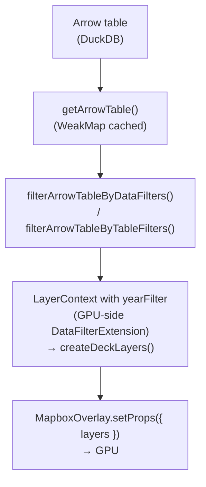

# Map Rendering -- Guide du développeur

> Comment le rendu cartographique fonctionne. Architecture duale : MapLibre (fonds) + Deck.gl (couches thématiques). Lire ARCHITECTURE.md d'abord.

---

## Architecture de rendu



**Pipeline** : `getArrowTable()` (WeakMap cache) → `filterArrowTableByDataFilters()` → `filterArrowTableByTableFilters()` → `createDeckLayers(filteredTable, ctx)` avec `ctx.yearFilter` configure `DataFilterExtension` pour filtrage GPU-side. `MapboxOverlay.setProps({ layers })` envoie les couches au GPU.

**Deux modes de vue** :

- **Orthographique** (Deck.gl standalone) : `OrthographicView` + projections d3-geo via geoarrow-deck-stream
- **MapLibre** (interleaved) : `MapboxOverlay({ interleaved: true })` + web mercator/globe

---

## WeakMap Cache Architecture

### geoarrow-stream-bridge.ts (`map/utils/`)

6 caches pour la conversion binaire GeoArrow → Deck.gl :

```typescript
// Parsing identité (lon/lat pur, sans reprojection)
const solidPolygonCache = new WeakMap<ArrowTable, BinaryPolygonData>();
const pathCache = new WeakMap<ArrowTable, BinaryPathData>();
const pointCache = new WeakMap<ArrowTable, BinaryPointData>();

// Parsing avec projection (2-key: table → ProjectionLike → result)
// ProjectionLike stable par basemap (memoized in use-map-layers)
const projSolidPolygonCache = new WeakMap<
  ArrowTable,
  Map<ProjectionLike, BinaryPolygonData>
>();
const projPathCache = new WeakMap<
  ArrowTable,
  Map<ProjectionLike, BinaryPathData>
>();
const projPointCache = WeakMap<
  ArrowTable,
  Map<ProjectionLike, BinaryPointData>
>();

// Normalisation du nom de colonne géométrique
// DuckDB nomme "geom" ou "wkb_geometry", geoarrow-deck-stream attend "geometry"
const normalizedTableCache = new WeakMap<ArrowTable, ArrowTable>();
```

### arrow-filter.utils.ts

3 caches pour les filtres :

```typescript
const yearFilterCache = new WeakMap<ArrowTable, Map<string, ArrowTable>>();
const dataFilterCache = new WeakMap<ArrowTable, Map<string, ArrowTable>>();
const tableFilterCache = new WeakMap<ArrowTable, Map<string, ArrowTable>>();
```

**Règle critique** : les fonctions de filtrage retournent la **même référence ArrowTable** quand les filtres n'ont pas changé. Cela préserve toute la chaîne WeakMap en aval.

Clé de cache pour `dataFilterCache` / `tableFilterCache` : `column:op:value|...` — triée pour être order-independent.

### layer-factory.ts

```typescript
// Conversion Arrow → GeoJSON (fallback pour données non-GeoArrow)
const geoJsonConversionCache = new WeakMap<
  ArrowTable,
  Map<string, FeatureCollection>
>();

// Labels : centroids + texte (stable pour même table + colonnes + projection)
const textLabelCache = new WeakMap<
  ArrowTable,
  Map<ProjectionLike | null, Map<string, TextLayerDatum[]>>
>();
```

### bounds.ts

```typescript
const boundsCache = new WeakMap<ArrowTable, LngLatBoundsLike | null>();
```

---

## Projection Memoization

**Fichier** : `use-map-layers.svelte.ts`

```typescript
if (currentMetadata !== lastBasemapMetadataRef) {
  lastBasemapProjectionRef = buildProjectionForBasemap(currentMetadata, 960, 600, ...);
  lastBasemapMetadataRef = currentMetadata;
}
```

La projection n'est recréée que quand l'utilisateur change de fond de carte. Dimensions hardcodées 960×600 pour le centrage orthographique.

Pourquoi c'est critique : `projSolidPolygonCache` etc. utilisent `ProjectionLike` comme clé de Map. Si un nouvel objet projection était créé à chaque render, le cache serait toujours vide.

`computeProjectedBboxForBasemap()` memoize aussi ses resultats par fond + dimensions + bbox dans `geoarrow-stream-bridge.ts`, pour eviter de reprojeter plusieurs fois les memes bornes pendant les changements de vue et de fond de reference.

## Chargement paresseux des fonds

Le GeoParquet principal d'un fond de carte est charge immediatement, mais les couches annexes metadata-driven (limites, graticules, lignes geographiques) sont chargees a la demande selon les couches visibles. Les centroides metadata ne sont pas precharges, car le rendu courant des labels utilise les centroides calcules depuis la geometrie binaire.

---

## Pipeline GeoArrow → Deck.gl

### Parsing identité (MapLibre mode)

`parseSolidPolygons(table)` → `parsePolygonsToSolid(normalizeGeomColumnName(table), { projection: geoIdentity() })`

Appelé pour les basemaps personnalisés et le mode MapLibre (lon/lat pur).

### Parsing avec projection

`parseSolidPolygonsWithProjection(table, projection)` → utilise `projSolidPolygonCache` avec double clé.

Types de projection :

- **`identity`** : `geoIdentity()` — lon/lat direct
- **`simple`** : une définition proj4 → `resolveSimpleProjection()` → d3-geo
- **`composite`** : plusieurs entrées avec layout bounds (DOM-TOM) → `buildCompositeProjection()`

### Normalisation de colonne

`normalizeGeomColumnName(table)` — DuckDB utilise `geom` ou `wkb_geometry` ; `geoarrow-deck-stream` attend `geometry`. Cette fonction renomme la colonne + met à jour les métadonnées GeoArrow `primary_column`.

---

## Couche Layer Factory

`createDeckLayers(table, ctx)` dispatche par type de géométrie :

| Géométrie                        | Fonction                | Layer                                      |
| -------------------------------- | ----------------------- | ------------------------------------------ |
| `POINT` / `MULTIPOINT`           | `createPointLayers()`   | `ScatterplotLayer`                         |
| `LINESTRING` / `MULTILINESTRING` | `createLineLayers()`    | `PathLayer`                                |
| `POLYGON` / `MULTIPOLYGON`       | `createPolygonLayers()` | `SolidPolygonLayer` + `PathLayer` (stroke) |

Chaque fonction a deux chemins :

1. **GeoArrow natif** : parsing binaire via `geoarrow-deck-stream` + attributs binaires
2. **Fallback GeoJSON** : conversion Arrow → GeoJSON (coûteux, caché) → `GeoJsonLayer`

### Attributs binaires (deck.gl 9)

```typescript
// Au lieu de getFillColor: d => colorForRow(d.properties.value)
// Précalculer un Float32Array / Uint8Array et passer via data.attributes
const fillColorBinAttr = pointColorAttr(
  pointData,
  rowAccessor(table, fillColorAccessor)
);
scatterBinaryData.attributes.getFillColor = fillColorBinAttr;
```

Fonctions utilitaires dans `geoarrow-stream-bridge.ts` :

- `pointColorAttr(data, colorLookup)` — RGBA8 par point
- `pointRadiusAttr(data, radiusLookup)` — rayon par point
- `filterValueAttr(data, table, column)` — Float32Array pour `DataFilterExtension`
- `polygonCentroids(data)` / `pathCentroids(data)` / `pointPositions(data)` — centroïdes pour `TextLayer`

---

## DataFilterExtension (filtrage GPU-side)

Pour le filtrage par année sur les données binaires :

```typescript
// Full table passée à createDeckLayers (cache GeoArrow préservé)
const filteredTable = filterArrowTableByYear(table, yearFilter);

// Année gérée entirely GPU-side — pas de nouvelle table Arrow
const filterAttr = filterValueAttr(binaryData, table, yearColumn);
data.attributes.getFilterValue = filterAttr;
// layer.props: filterRange: [yearValue, yearValue]
```

Pour les données GeoJSON (fallback) : `getFilterValue` est un accesseur de fonction classique.

---

## Extensions Deck.gl (singletons)

| Extension                                | Singleton                    | Usage                    |
| ---------------------------------------- | ---------------------------- | ------------------------ |
| `DataFilterExtension({ filterSize: 1 })` | `DATA_FILTER_EXTENSION`      | Filtrage GPU-side année  |
| `PathStyleExtension({ dash: true })`     | `DASH_EXTENSION`             | Bordures en pointillés   |
| `RotatableFillStyleExtension`            | `fillStyleExtensionInstance` | Motifs hatch-accessibles |

`RotatableFillStyleExtension` est une extension custom de l'Atelier, basée sur `FillStyleExtension` avec rotation de motif via atlas texture.

---

## Highlight sur la carte

**Highlight row** : `mapHighlightStore` ( `Set<number>` d'IDs de ligne). L'ID de ligne DuckDB est 1-based (`nextval`), `info.index` Deck.gl est 0-based.

```typescript
// O(1) lookup via Set — pas de tableau
if (highlightedRowIds.has(featureId - 1)) { ... }

// highlightVersion scalar dans updateTriggers (évite recréation d'accesseur)
updateTriggers: { getFillColor: [..., hlVersion] }
```

**Highlight accessor** (`layer-helpers.ts`) :

- `withRowHighlight(color, opacity, dimFactor, Set<rowId>)` — constante
- `withRowHighlightAccessor(fn, opacity, dimFactor, Set<rowId>)` — fonction

Dimming factor = `0.3` (30% d'opacité sur les non-highlightés).

---

## Picking & Tooltip

```typescript
// hoverHandler → mapTooltipStore.showAtHover(x, y, entries, layerId, rowIndex)
// clickHandler → pins tooltip + mapHighlightStore.setHighlightedRows([rowId])
// click vide → unpin + clearHighlights
// click même objet → toggle off
```

Extraction tooltip : `extractTooltipEntries()` lit depuis Arrow (`table.get(rowIndex)`) ou GeoJSON (`feature.properties`).

---

## Calcul des bounds (`core/bounds.ts`)

Tente dans l'ordre :

1. **GeoArrow metadata bbox** — sauté si `[-180,-90,180,90]` (world bounds DuckDB)
2. **Colonne géométrique primaire** — scanné, max 10k lignes, `parseGeoJsonGeometry()` par ligne
3. **Découverte auto** — cherche colonne de nom geo (lat/lon/geom/etc.)
4. **Brute-force** — toutes les colonnes

---

## Basemap Layers (`layers/basemap-layers.ts`)

9 couches : `background` (terre, mers, lacs, relief) + `foreground` (frontières, rivières, équateur, méridiens, villes).

Chaque factory dispatch :

- **GeoArrow natif** → `parseSolidPolygons()` / `parsePaths()` (binaire)
- **WKB/GeoJSON** → `getCachedBasemapGeoJSON()` → `GeoJsonLayer`
- Quand un fond catalogue fournit déjà des couches `limit` visibles, la couche `terre`
  évite de recalculer un `PathLayer` redondant sur le polygone principal.

---

## Débounce timings

| Constante                      | Valeur | Usage                             |
| ------------------------------ | ------ | --------------------------------- |
| `LAYER_UPDATE_DEBOUNCE_MS`     | 16ms   | `scheduleLayerUpdate()` via RAF   |
| `FITBOUNDS_DEBOUNCE_MS`        | 300ms  | fitBounds                         |
| `RESIZE_DEBOUNCE_MS`           | 150ms  | resize                            |
| `SEARCH_HIGHLIGHT_DEBOUNCE_MS` | 800ms  | DuckDB search → Deck.gl highlight |

---

## Layer ID convention

```typescript
createLayerId(DeckLayerId.POINT_LAYER, datasetId, projectionSuffix);
// → "point-layer-ds_abc123-webmercator"
```

IDs stables — changer un ID force un re-upload GPU complet au lieu d'un prop diff.

---

## two view modes

### Orthographic (Deck.gl standalone)

- `OrthographicView` + `Deck`
- Projections d3-geo appliquées via geoarrow-deck-stream
- `projectionStore.modelMatrix` pour centrage

### MapLibre (interleaved)

- `MapboxOverlay({ interleaved: true })`
- Basemap gère la projection (web mercator/globe)
- `mapProjectionStore` toggle Mercator ↔ Globe

---

## Cartographie thématique

4 types de viz (`visualization.store.svelte.ts`) :

| Type           | Variable            | Layer                                       |
| -------------- | ------------------- | ------------------------------------------- |
| `CHOROPLETH`   | QTR (ratio, 0-100%) | `SolidPolygonLayer` — couleur par classe    |
| `PROPORTIONAL` | QTA (absolu)        | `ScatterplotLayer` — taille proportionnelle |
| `CATEGORICAL`  | QL/QLO              | Geometry layer — couleur par catégorie      |
| `BIVARIATE`    | 2 variables         | `ScatterplotLayer` — taille + couleur       |

Classification : 8 méthodes via macros SQL DuckDB (`classification.service.ts`).

---

## Annotation overlay

SVG overlay (`annotation-overlay.svelte`) avec 4 types : `SHAPE` (arrow, circle, rect, line), `TEXT`, `IMAGE`, `DRAWING` (Bezier freehand). Ancrées page, pas géolocalisées. Stockées dans `annotations.store.svelte.ts`.

---

## Collections / Facettes

Chaque facette = **full ThematicMap** (MapLibre + Deck.gl instance). 9 facettes = 9 contexts WebGL2 (limite browser : 8-16). Sync view state via `FacetSyncViewState`.

---

## Cleanup GPU

```typescript
// Avant map.remove() ou changement de vue :
overlay.setProps({ layers: [] }); // libère les buffers GPU
map.removeControl(overlay);
```
