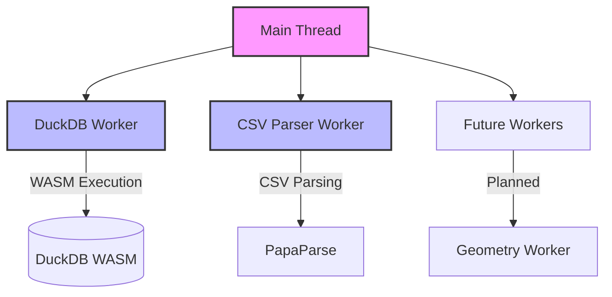

# Multithreading and Web Workers

This document describes the multithreading architecture and Web Worker usage in Khartis v3.

## Overview

Khartis leverages Web Workers to offload computationally intensive tasks from the main thread, ensuring the UI remains responsive during heavy data processing operations. The application uses both dedicated workers and DuckDB's internal worker architecture.

## Architecture

### Threading Model



### Current Workers

#### 1. DuckDB Worker
- **Location**: Managed internally by DuckDB WASM
- **Purpose**: Execute SQL queries and data analysis without blocking UI
- **Communication**: Binary data transfer via ArrayBuffer
- **Thread Support**: Experimental multi-threading (SharedArrayBuffer when available)

#### 2. CSV Parser Worker (Planned)
- **Location**: `src/lib/features/workers/csv-parser-simple.worker.ts`
- **Purpose**: Parse large CSV files without freezing the UI
- **Communication**: Structured cloning with Transferable objects
- **Status**: Implementation ready but not currently active

## DuckDB Worker Configuration

### Initialization

```typescript
// src/lib/features/duckdb/services/duckdb/duckdb.ts

private async init(): Promise<void> {
  // Select bundle based on thread support
  const bundle = await duckdb.selectBundle({
    mvp: {
      mainModule: DUCKDB_BUNDLES.mvp.mainModule,
      mainWorker: DUCKDB_BUNDLES.mvp.mainWorker
    },
    eh: {
      mainModule: DUCKDB_BUNDLES.eh.mainModule,
      mainWorker: DUCKDB_BUNDLES.eh.mainWorker,
      pthreadWorker: DUCKDB_BUNDLES.eh.pthreadWorker
    }
  });

  // Create worker instance
  const worker = new Worker(bundle.mainWorker!);

  // Initialize AsyncDuckDB with worker
  this.db = new duckdb.AsyncDuckDB(duckdbLogger, worker);
  await this.db.instantiate(bundle.mainModule, bundle.pthreadWorker);
}
```

### Thread Configuration

```typescript
// Configure number of threads based on hardware
if (this.threadsSupported) {
  const desiredThreads = Math.max(1, Math.min(navigator.hardwareConcurrency, 8));
  pragmas.unshift(`PRAGMA threads=${desiredThreads};`);
}
```

**Thread Detection**:
- Uses `navigator.hardwareConcurrency` to detect CPU cores
- Caps at 8 threads maximum for stability
- Falls back to single-threaded if SharedArrayBuffer unavailable

## CSV Worker Architecture (Future)

### Worker Implementation

```typescript
// src/lib/features/workers/csv-parser-simple.worker.ts

import Papa from 'papaparse';

self.onmessage = async (event) => {
  const { id, data } = event.data;

  try {
    const result = Papa.parse(data.content, {
      header: true,
      dynamicTyping: true,
      skipEmptyLines: 'greedy'
    });

    // Transfer data back efficiently
    self.postMessage({
      id,
      success: true,
      result: result.data
    });
  } catch (error) {
    self.postMessage({
      id,
      success: false,
      error: error.message
    });
  }
};
```

### Service Wrapper

```typescript
// src/lib/features/workers/csv-worker.service.ts

export class CSVWorkerService {
  private worker: Worker | null = null;

  async parseCSV(content: string): Promise<ParsedData> {
    if (!this.worker) {
      this.worker = new CSVWorker();
    }

    return new Promise((resolve, reject) => {
      const id = crypto.randomUUID();

      const handler = (event: MessageEvent) => {
        if (event.data.id === id) {
          this.worker!.removeEventListener('message', handler);

          if (event.data.success) {
            resolve(event.data.result);
          } else {
            reject(new Error(event.data.error));
          }
        }
      };

      this.worker.addEventListener('message', handler);
      this.worker.postMessage({ id, data: { content } });
    });
  }

  terminate(): void {
    this.worker?.terminate();
    this.worker = null;
  }
}
```

## Performance Optimizations

### 1. Memory Management

**Dynamic Allocation**:
```typescript
private calculateOptimalMemory(): string {
  if (typeof navigator !== 'undefined' && 'deviceMemory' in navigator) {
    const deviceMemory = (navigator as Navigator & { deviceMemory?: number }).deviceMemory || 4;
    // Use 50% of device memory, capped at 3GB (WASM limit)
    const optimalMemory = Math.min(Math.floor(deviceMemory * 0.5 * 1024), 3072);
    return `${optimalMemory}MB`;
  }
  return '2048MB'; // Default fallback
}
```

### 2. Data Transfer Optimization

**Transferable Objects**:
```typescript
// Efficient data transfer without copying
const buffer = new ArrayBuffer(data.length);
const view = new Uint8Array(buffer);
view.set(data);

worker.postMessage({ buffer }, [buffer]); // Transfer ownership
```

**Arrow IPC Format**:
```typescript
// Zero-copy serialization for large datasets
const result = await Duck.query(sql, {
  format: DUCK_CONST.QUERY_FORMAT.ARROW_IPC
}) as Uint8Array;
```

### 3. Thread Pool Management

**Prepared Statements**:
```typescript
private preparedStatements: {
  describe: duckdb.AsyncPreparedStatement | null;
  rowCount: duckdb.AsyncPreparedStatement | null;
} = { describe: null, rowCount: null };

// Reuse prepared statements across worker calls
private async getRowCountStatement(): Promise<duckdb.AsyncPreparedStatement> {
  if (!this.preparedStatements.rowCount) {
    this.preparedStatements.rowCount = await this.connection.prepare(
      `SELECT COUNT(*) AS num_rows FROM query_table(?)`
    );
  }
  return this.preparedStatements.rowCount;
}
```

## Browser Compatibility

### SharedArrayBuffer Requirements

For multi-threaded DuckDB:
1. **HTTPS Required**: Site must be served over HTTPS
2. **CORS Headers**: Required for cross-origin isolation
   ```
   Cross-Origin-Opener-Policy: same-origin
   Cross-Origin-Embedder-Policy: require-corp
   ```
3. **Browser Support**: Chrome 68+, Firefox 79+, Safari 15.2+

### Fallback Strategy

```typescript
// Check for threading support
const THREADS = await duckdb.getWorkerBundles().then(
  () => true,
  () => false
);

// Use appropriate bundle
const bundle = THREADS ? 'eh' : 'mvp';
```

## Future Worker Plans

### 1. Geometry Processing Worker

**Purpose**: Handle WKB to GeoArrow conversions
```typescript
// Planned: geometry-worker.ts
class GeometryWorker {
  convertWKBToGeoArrow(wkbData: Uint8Array): GeoArrowData {
    // Heavy geometry processing off main thread
  }
}
```

### 2. Statistics Calculation Worker

**Purpose**: Complex statistical computations
```typescript
// Planned: stats-worker.ts
class StatsWorker {
  calculateJenksBreaks(values: number[], classes: number): number[] {
    // Compute natural breaks optimization
  }
}
```

### 3. Export Worker

**Purpose**: Generate export files (GeoJSON, CSV, etc.)
```typescript
// Planned: export-worker.ts
class ExportWorker {
  generateGeoJSON(data: TableData): string {
    // Build large GeoJSON files
  }
}
```

## Best Practices

### 1. Worker Lifecycle

```typescript
class WorkerManager {
  private workers = new Map<string, Worker>();

  getWorker(type: WorkerType): Worker {
    if (!this.workers.has(type)) {
      this.workers.set(type, this.createWorker(type));
    }
    return this.workers.get(type)!;
  }

  terminateAll(): void {
    this.workers.forEach(worker => worker.terminate());
    this.workers.clear();
  }
}
```

### 2. Error Handling

```typescript
worker.onerror = (error) => {
  logger.error('Worker error', LogCategory.SYSTEM, error);
  // Fallback to main thread processing
  return this.processInMainThread(data);
};

worker.onmessageerror = (error) => {
  logger.error('Worker message error', LogCategory.SYSTEM, error);
};
```

### 3. Memory Monitoring

```typescript
// Monitor worker memory usage
if ('memory' in performance) {
  const memory = (performance as any).memory;
  logger.debug('Worker memory', {
    usedJSHeapSize: memory.usedJSHeapSize,
    totalJSHeapSize: memory.totalJSHeapSize,
    jsHeapSizeLimit: memory.jsHeapSizeLimit
  });
}
```

## Performance Metrics

### Current Performance

| Operation | Main Thread | With Workers | Improvement |
|-----------|------------|--------------|-------------|
| DuckDB Query (1M rows) | Blocks UI | Non-blocking | ∞ |
| CSV Parse (10MB) | 2s (blocks) | 2s (non-blocking) | UX++ |
| Geometry Conversion | 12.7s (blocks) | Planned | TBD |

### Threading Impact

| Hardware | Threads Used | Query Performance | Notes |
|----------|-------------|-------------------|-------|
| Desktop (8 cores) | 8 | Baseline | Optimal |
| Laptop (4 cores) | 4 | ~70% of 8-thread | Good |
| Mobile (2 cores) | 2 | ~40% of 8-thread | Acceptable |
| No SharedArrayBuffer | 1 | ~20% of 8-thread | Fallback |

## Debugging

### Worker DevTools

1. **Chrome**: DevTools > Sources > Threads
2. **Firefox**: about:debugging > Workers
3. **Safari**: Develop > Service Workers

### Performance Profiling

```typescript
// Measure worker communication overhead
const start = performance.now();
await worker.postMessage(data);
const overhead = performance.now() - start;
logger.debug('Worker communication overhead', { ms: overhead });
```

### Common Issues

1. **SharedArrayBuffer not available**
   - Solution: Check CORS headers, use HTTPS

2. **Worker memory exhaustion**
   - Solution: Implement chunking for large datasets

3. **Message serialization overhead**
   - Solution: Use Transferable objects or SharedArrayBuffer

## Testing

### Unit Tests

```typescript
// Test worker functionality
describe('CSVWorker', () => {
  it('should parse CSV in worker', async () => {
    const service = new CSVWorkerService();
    const result = await service.parseCSV('a,b,c\n1,2,3');
    expect(result).toEqual([{ a: 1, b: 2, c: 3 }]);
    service.terminate();
  });
});
```

### Integration Tests

```typescript
// Test DuckDB worker integration
describe('DuckDB Worker', () => {
  it('should execute queries without blocking', async () => {
    const promise = Duck.query('SELECT COUNT(*) FROM large_table');

    // UI should remain responsive
    const uiResponsive = await checkUIResponsiveness();
    expect(uiResponsive).toBe(true);

    const result = await promise;
    expect(result).toBeDefined();
  });
});
```

## Related Documentation

- [ARCHITECTURE.md](./ARCHITECTURE.md) - Overall system architecture
- [DATA_PIPELINE.md](./DATA_PIPELINE.md) - Data processing pipeline
- [PERFORMANCE.md](./PERFORMANCE.md) - Performance optimization strategies
- [STATE_AND_FEATURES.md](./STATE_AND_FEATURES.md) - State management patterns

## References

- [MDN Web Workers](https://developer.mozilla.org/en-US/docs/Web/API/Web_Workers_API)
- [DuckDB WASM Threading](https://duckdb.org/docs/api/wasm/overview#threading)
- [SharedArrayBuffer](https://developer.mozilla.org/en-US/docs/Web/JavaScript/Reference/Global_Objects/SharedArrayBuffer)
- [Transferable Objects](https://developer.mozilla.org/en-US/docs/Web/API/Web_Workers_API/Transferable_objects)