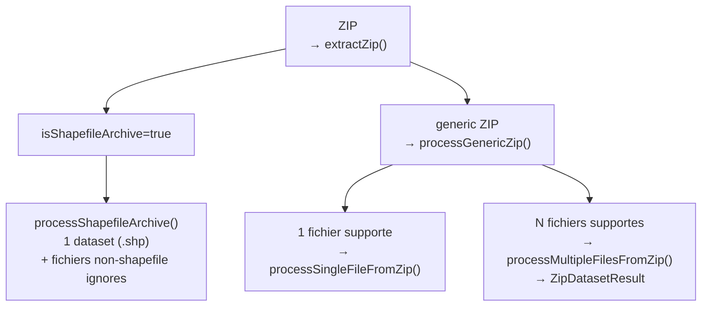

# Data Pipeline -- Guide du développeur

> Comment le pipeline d'ingestion fonctionne. Lire PIPELINE_DONNEES.md d'abord pour le contexte global.

---

## Processor Registry

Tous les processeurs sont enregistrés via `registerProcessor()` dans `processors/processor-registry.ts`. L'enregistrement est **priority-based** (priorité la plus haute d'abord). Chaque processeur implémente l'interface `FileProcessor` :

```typescript
interface FileProcessor {
  supportedFileTypes: FileType[];
  canHandle(file: UploadedFile): boolean;
  process(ctx: ProcessContext, file: UploadedFile): Promise<ProcessorDataset>;
}
```

Les 6 processeurs enregistrés à priorité 10 :

| Processor             | FileTypes  | DuckDB reader            |
| --------------------- | ---------- | ------------------------ |
| `csvProcessor`        | CSV, TSV   | `read_csv()`             |
| `geojsonProcessor`    | GEOJSON    | `ST_Read()`              |
| `shapefileProcessor`  | SHP        | `ST_Read()` + companions |
| `geopackageProcessor` | GPKG       | `ST_Read()`              |
| `geoparquetProcessor` | GEOPARQUET | `read_parquet()`         |
| `gpxProcessor`        | GPX        | `ST_Read()`              |

`getProcessor(file)` retourne le premier processeur dont `canHandle()` renvoie `true`. `hasProcessor(file)` vérifie juste l'existence.

---

## CSV Auto-Detection

Le pipeline CSV détecte automatiquement 4 paramètres avant l'appel à `read_csv()`.

### 1. Séparateur de champ

`detectFieldDelimiter()` dans `decimal-detector.ts` compte les occurrences de chaque candidat (`;`, `,`, `\t`, `|`) sur la première ligne. Le gagnant est celui avec le plus d'occurrences.

### 2. Séparateur décimal + milliers

`detectDecimalSeparator()` scanne les 20 premières lignes :

- **Format européen** (`1.234,56`) : point comme séparateur de milliers, virgule comme décimal
- **Format standard** (`1,234.56`) : virgule comme milliers, point comme décimal
- Détection par regex sur les patterns `X.XXX,XX` vs `X,XXX.XX`

Si ratio européen > standard ET > 30% des valeurs → format européen. Sinon standard.

Les séparateurs de milliers détectés sont passés à `read_csv()` (`thousands_separator`).

### 3. Header CSV

`detectCsvHeader()` compare la première et deuxième ligne :

1. Parse les deux lignes avec le délimiteur détecté
2. Classifie chaque cellule en `numeric` / `text` / `empty`
3. Calcule la similarité de catégorie entre les deux lignes

**Règle** : si la 1ère ligne est 100% numérique/vide → pas de header (confidence élevée dans ce cas = 0). Si mix text+numeric OU similarité < 80% → header détecté.

### 4. CSV Retry

Si `read_csv()` retourne 0 lignes → retry avec `ignore_errors=true, all_varchar=true`.

**File head partagé** : `readFileHead()` lit les 20 premières lignes une seule fois. Ce résultat est passé simultanément à `detectDecimalSeparator` et `detectCsvHeader` pour éviter de lire le fichier deux fois.

---

## Processor Strategies

### CSV (`csv-processor.ts`)

Deux chemins d'ingestion avec **Arrow en priorité** :

1. **Arrow path** : `convertTabularDataToArrow()` → `vectorFromArray()` par colonne → `tableToIPC()` → `insertArrowFromIPCStream()` → DuckDB
2. **Legacy path** : `convertToCSV()` → `Duck.read_tabular()` (convertit le tableau JS en CSV string, puis DuckDB re-parse)

Si Arrow échoue → fallback sur legacy. Jamais de retry Arrow → legacy automatique en cas d'erreur.

### GeoJSON (`geojson-processor.ts`)

Trois chemins avec **env vars de debug** :

```typescript
const USE_ST_READ = import.meta.env.VITE_USE_ST_READ !== 'false'; // default: true
const USE_ARROW = import.meta.env.VITE_USE_ARROW_GEOJSON === 'true'; // default: false
```

1. **ST_Read** (par défaut) : `register_files()` → `read_geofile()` → `Duck.analyse()`
2. **Arrow** (opt-in via env var) : `convertGeoJSONToArrow()` → `insertArrowTableIntoDuckDB()` → `ST_GeomFromGeoJSON()` en SQL → `CREATE SEQUENCE` pour `__id`
3. **Legacy** (fallback final) : `read_geofile()` sans optimisations

### Shapefile (`shapefile-processor.ts`)

- **Companions obligatoires** : `.shp` + `.shx` + `.dbf` minimum. Si manquants → `ParseError`.
- `register_files({ shapefile: true })` pour enregistrer le bundle.
- `read_geofile({ shapefile: true })` pour la lecture.

### GeoPackage / GPX / GeoParquet

Tous via `read_geofile()` → `ST_Read()` en DuckDB. GeoParquet utilise `read_parquet()` directement. `__id` est ajouté via `CREATE SEQUENCE` après ingestion Arrow.

### Format Detection (`core/format-detector.ts`)

**Extension-based**, case-insensitive, priority order :

```
geoparquet (.parquet/.geoparquet/.gpq) → csv (.csv/.tsv/.txt) → geo (geojson/shp/gpkg/kml/kmz/gpx)
```

Multi-dot filenames : `fichier.tar.gz` → extension = `.gz`. `my.data.csv` → extension = `.csv`.

---

## Quality Warnings (`operations/quality.ts`)

`computeQualityWarnings()` génère des avertissements depuis les stats de colonnes :

| Condition                | Avertissement                                              |
| ------------------------ | ---------------------------------------------------------- |
| `rowCount === 0`         | `pipeline_warning_no_data_rows`                            |
| `rowCount === 1`         | `pipeline_warning_single_row`                              |
| `rowCount < 5`           | `pipeline_warning_small_dataset`                           |
| `nullRatio > 0.5`        | `pipeline_warning_high_nulls` (colonne + %)                |
| `uniquenessRatio < 0.01` | `pipeline_warning_low_cardinality` (colonne + count/total) |

Seuils configurables via `PIPELINE_CONST.QUALITY`.

---

## ZIP Handling (`utils/zip-handler.ts`)

### Extraction

- `unzip()` de `fflate` (pas de dépendances node)
- Limite décompression : **500 Mo** (protège contre zip bombs)
- Fichiers ignorés : préfixes macOS (`__MACOSX/`, `._`) + entrées directory (`path.endsWith('/')`)

### Détection Shapefile

Un ZIP est un **shapefile archive** si :

- Exactement 1 fichier `.shp` trouvé
- ET ce `.shp` a des companions (`.dbf`, `.shx`, `.prj`...) du même basename

Sinon → **generic ZIP** (peut contenir plusieurs datasets CSV/GeoJSON).

### Routing



Chaque fichier CSV/geo dans un ZIP multi-dataset est traité individuellement via `processFileInternal()` avec son propre `sourceFileId` (nom du ZIP parent).

---

## Remote Processing (`processors/remote-processor.ts`)

### URL

- `fetch()` → `response.arrayBuffer()` → `Duck.read_link()` avec le `tablename` généré
- `decimal_separator` optionnel (détection automatique si omitted)
- Standalone `.shp` rejeté (`.shp` sans companions → erreur)

### ZIP URL

- `fetch()` → `new File([arrayBuffer], name, { type: MIME.ZIP })` → `processZipFile()`
- 404 → `Error` avec `pipeline_error_fetch_failed`

---

## Validation (`core/validators.ts`)

`validateFile()` vérifie dans l'ordre :

1. **Extension** : Doit être dans `PIPELINE_CONST.EXTENSIONS.ALL` (`.csv`, `.tsv`, `.parquet`, `.geojson`, `.shp`, `.gpkg`, `.kml`, `.kmz`, `.gpx`, `.zip`, etc.)
2. **Taille nulle** : `file.size === 0` → rejected
3. **Taille max** : `> 100 Mo` → rejected
4. **Avertissement taille** : `> 50 Mo` → warning (n'arrête pas le traitement)

---

## Serialization Safety (`tests/pipeline/serialization-safety.test.ts`)

Les fichiers uploadés sont sérialisés pour persistence (IndexedDB). Règles de sécurité :

| Type                         | Conversion                                                                                       |
| ---------------------------- | ------------------------------------------------------------------------------------------------ |
| `BigInt`                     | → `Number` via `deepCloneForStorage()` (perte de précision au-delà de `Number.MAX_SAFE_INTEGER`) |
| `Uint8Array` / `ArrayBuffer` | Round-trip préservé (slices avec `byteOffset` + `byteLength`)                                    |
| `Map` / `Set`                | Sérialisés en objets `Array.from()`                                                              |
| Binary data (`ArrayBuffer`)  | `preserveBinary: true` via `rawDatasetUtils`                                                     |

Tailles estimées ajoutées aux métadonnées pour éviter la sérialisation de très gros fichiers.

---

## GeoArrow Metadata (`io/geoarrow-metadata.ts`)

`extractGeoArrowMetadata(table)` extrait les métadonnées CRS + bounds depuis les colonnes GeoArrow. `tableHasGeoArrowMetadata(table)` détecte la présence d'une colonne GeoArrow. Ces infos sont stockées dans `DatasetResult.geoArrowMetadata` et utilisées en rendu pour éviter la reprojection.

---

## Constants (`constants.ts`)

```typescript
PIPELINE_CONST.LIMITS.MAX_FILE_SIZE    = 100 MB
PIPELINE_CONST.LIMITS.WARNING_FILE_SIZE = 50 MB
PIPELINE_CONST.LIMITS.SAMPLE_ROWS       = 100
PIPELINE_CONST.LIMITS.TYPE_THRESHOLD    = 0.8
PIPELINE_CONST.QUALITY.HIGH_NULL_RATIO_THRESHOLD  = 0.5
PIPELINE_CONST.QUALITY.LOW_CARDINALITY_THRESHOLD   = 0.01
```

---

## Tests (`tests/pipeline/`)

| Fichier                                 | API réelle ?   | Ce qui est testé                                              |
| --------------------------------------- | -------------- | ------------------------------------------------------------- |
| `pipeline-integration.test.ts`          | Oui (Node API) | Ingestion réelle de tous les formats dans `tests-datasets/`   |
| `pipeline-orchestrator.test.ts`         | Non (mocks)    | Init once, zip routing, remote processing, failures           |
| `file-processor.test.ts`                | Non (mocks)    | CSV options detection, companion files, parquet path          |
| `format-detector.test.ts`               | Non (mocks)    | Extension priority, case-insensitive, multi-dot               |
| `validators.test.ts`                    | Non (mocks)    | Extension, empty file, size limits                            |
| `csv-header-detector.test.ts`           | Non (mocks)    | Header-only low confidence, mixed types = header, all-numeric |
| `decimal-detector.test.ts`              | Non (mocks)    | European format, mixed decimals, thousands separator          |
| `zip-handler.test.ts`                   | Non (mocks)    | isZipFile, macOS filtering, shapefile detection, limits       |
| `geometry.test.ts`                      | Non (mocks)    | No geometry, bounds query, null bounds fallback               |
| `quality.test.ts`                       | Non (mocks)    | Small dataset, null ratio, low cardinality                    |
| `classification.service.test.ts`        | Non (mocks)    | Quantile macro, std_dev → nested_means                        |
| `processor-utils.test.ts`               | Non (mocks)    | isTabularData, convertToCSV, getFileForDuckDB                 |
| `serialization-safety.test.ts`          | Non (mocks)    | BigInt round-trip, binary preserve, size estimation           |
| `csv-processor.strategy.test.ts`        | Non (mocks)    | Arrow ingestion path, fallback on failure                     |
| `geojson-processor.strategy.test.ts`    | Non (mocks)    | ST_Read path, fallback, Arrow opt-in                          |
| `geoparquet-processor.strategy.test.ts` | Non (mocks)    | read_parquet, \_\_id sequence                                 |
| `shapefile-processor.strategy.test.ts`  | Non (mocks)    | ParseError sans companions, processing avec companions        |
| `geopackage-processor.strategy.test.ts` | Non (mocks)    | read_geofile, createArrowTableWithMetadata                    |
| `gpx-processor.strategy.test.ts`        | Non (mocks)    | GPX format support                                            |
| `register-processors.test.ts`           | Non (mocks)    | 6 processors registered at priority 10                        |
| `zip-processor.test.ts`                 | Non (mocks)    | Shapefile archive, multi-dataset, no-supported-files          |
| `remote-processor.test.ts`              | Non (mocks)    | read_link, standalone shp rejection, zip routing              |
| `analysis.test.ts`                      | Non (mocks)    | enrichColumns, buildDatasetFromDuckTable                      |

**Règle** : les tests d'intégration (`pipeline-integration.test.ts`) utilisent `@duckdb/node-api` avec des fichiers réels. Les tests unitaires mockent `Duck` via `vi.mock`.
