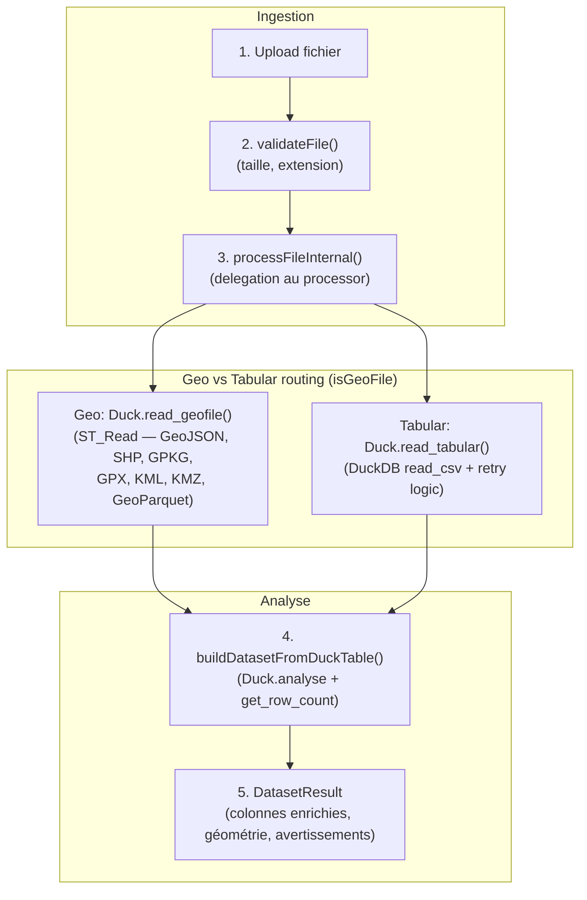
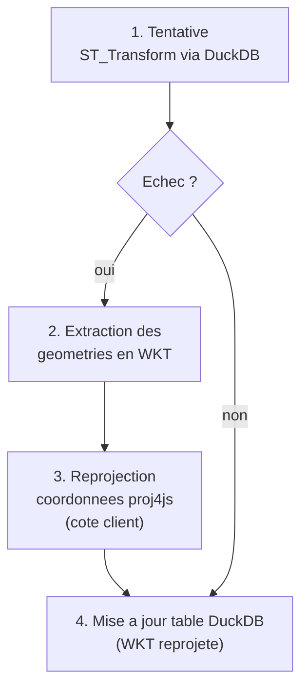

# Pipeline de donnees

> Architecture d'ingestion basee sur DuckDB WASM.

**Voir aussi** : [Architecture](ARCHITECTURE.md) | [Gestion de l'etat](GESTION_ETAT.md) | [Visualisation](VISUALISATIONS.md)

---

## Formats supportes

| Format               | Extensions                        | Methode                         | Notes                                          |
| -------------------- | --------------------------------- | ------------------------------- | ---------------------------------------------- |
| CSV / TSV            | `.csv`, `.tsv`, `.txt`            | DuckDB `read_csv()`             | Detection automatique du separateur decimal    |
| GeoJSON              | `.geojson`, `.json`               | `geojsonProcessor`              | Detection CRS via `ST_Read_Meta()`             |
| Shapefile            | `.shp` (+ `.dbf`, `.shx`)         | `shapefileProcessor`            | Bundle de fichiers requis                      |
| GeoPackage           | `.gpkg`                           | `geopackageProcessor`           | Support spatial natif                          |
| GeoParquet / Parquet | `.geoparquet`, `.parquet`, `.gpq` | `geoparquetProcessor`           | DuckDB 1.33 geoarrow.wkb natif                 |
| GPX                  | `.gpx`                            | `gpxProcessor`                  | Format supporte                                |
| KML / KMZ            | `.kml`, `.kmz`                    | `Duck.read_geofile()` (ST_Read) | Support natif GDAL — pas de conversion GeoJSON |

## Flux de traitement



Le pipeline principal route via `isGeospatialFile()` : fichiers geo → `Duck.read_geofile()` (ST_Read, supporte nativement GeoJSON, SHP, GPKG, GPX, KML, KMZ, GeoParquet), fichiers tabulaires → `Duck.read_tabular()` (read_csv avec retry). Les 6 processeurs enregistres via `registerAllProcessors()` dans `processors/register-processors.ts` ne sont utilisés que pour le traitement des fichiers ZIP imbriqués.

## API publique

```ts
import { dataPipeline } from '$lib/features/data-pipeline';

// Initialisation (une fois au demarrage)
await dataPipeline.initialize();

// Traitement de fichiers
const result = await dataPipeline.processFile(file);
const result = await dataPipeline.processUploadedFile(
  uploadedFile,
  originalFile
);
const result = await dataPipeline.processRemoteFile(url, {
  tableName: 'remote_data'
});
const result = await dataPipeline.processPastedData(csvContent, 'pasted');

// Jointures
await dataPipeline.joinDatasetById(tableName, idColumn, {
  basemapTable,
  basemapId,
  basemapOthersId
});
await dataPipeline.applyJoinAssociation(tableName, basemap);

// Validation
const validation = await dataPipeline.validateFile(file);
```

## Interface DatasetResult

```ts
// src/lib/features/data-pipeline/types.ts
interface DatasetResult {
  id: string;
  name: string;
  sourceFileId: string;
  tableName: string;
  columns: EnrichedColumn[];
  rowCount: number;
  geometry?: GeometryInfo;
  metadata: DatasetMetadata; // { processedAt, fileType, parserUsed, ... }
  data?: Record<string, unknown>[];
  format?: FileFormat;
  analysis?: AnalysisResult; // { columns, hasGeoData, geoColumns, rowCount, warnings }
  geoDetection?: GeoDetectionResult;
  bounds?: { minLat; maxLat; minLon; maxLon };
  joinedBasemap?: string;
  geoColumn?: string;
}
```

## Moteur DuckDB (`src/lib/features/duckdb/`)

```
duckdb/
  duck.ts                 # Facade singleton Duck
  core/
    engine.ts             # Init WASM, extensions
    query.ts              # Execution SQL + conversion Arrow
    transaction.ts        # TransactionMutex
  io/
    readers.ts            # read_tabular, read_geofile, read_link
    reprojection.ts       # Fallback proj4js
    exporters.ts          # CSV, GeoParquet
    arrow-converter.ts    # Insertion Arrow table dans DuckDB
  cache/
    cache-manager.ts      # Cache describe, rowcount, geoparquet
  operations/
    analysis.ts           # analyse, describeColumns
    search.ts             # searchInTable (2 phases + cache)
    join.ts               # join_by_id, apply_join_association
    simplification.ts     # Simplification geometrie
    table-ops.ts         # Operations sur les tables
  macros/                 # Macros SQL (analyse, breaks, join, search, simplification)
  orchestrator/           # Service reactif Svelte 5
    orchestrator.svelte.ts
    dataset-state.ts
```

### Transactions

Les operations d'ingestion (`read_tabular`, `read_geofile`, `read_link`) sont encapsulees dans `runInTransaction`. Un `TransactionMutex` empeche les executions concurrentes.

### Cache

Cache memoire LRU (~100 Mo) pour les buffers GeoParquet, les descriptions de table et les comptages de lignes. Les mutations invalidant automatiquement les entrees concernees via `invalidateTableCache()`.

## Reprojection (fallback proj4js)

`ST_Transform` de DuckDB WASM ne supporte pas toutes les projections (le build WASM n'a pas acces a la base PROJ complete). Concernant notamment **Lambert-93 (EPSG:2154)**, frequent dans les datasets francais.



**Projections supportees par le fallback** :

- EPSG:2154 -- Lambert-93 (France metropolitaine)
- EPSG:27572 -- Lambert II etendu
- EPSG:32631 / 32632 -- UTM zones 31N / 32N

proj4js est utilise **uniquement** pour la transformation de coordonnees. Les donnees restent dans DuckDB pour toutes les autres operations.

## Optimisations

| Defi                     | Solution                                                     |
| ------------------------ | ------------------------------------------------------------ |
| Imports volumineux       | Parsing natif DuckDB (`read_csv`, `read_parquet`, `ST_Read`) |
| Conversions multiples    | Pipeline en une seule passe                                  |
| Preservation metadonnees | GeoParquet avec encodage GeoArrow                            |
| Concurrence              | `TransactionMutex` serialise les operations d'ingestion      |
| Fichiers ephemeres       | Cleanup via `dropRegisteredFile` apres creation de la table  |
| CSV malformes            | Retry avec `ignore_errors=true, all_varchar=true`            |

**Cible** : < 3 s de chargement pour un dataset standard, ~60 fps en pan/zoom.

## Points d'extension

Pour ajouter un nouveau format de fichier au pipeline :

1. Ajouter `FileType` dans `commons/store/create-project.types.ts`
2. Ajouter l'extension dans `data-pipeline/constants.ts` (`DUCK_CONST.REGEX`)
3. Mettre a jour `detectFileFormat()` dans `core/format-detector.ts`
4. Creer le processeur dans `processors/strategies/<nom>-processor.ts`
5. Exporter depuis `processors/strategies/index.ts`
6. Enregistrer dans `processors/register-processors.ts`
7. Ajouter des fichiers de test dans `tests-datasets/<format>/`

Types (`DatasetResult`, `EnrichedColumn`, `ColumnType`) definis dans `src/lib/features/data-pipeline/types.ts`.
Pour les géofichiers multi-couches comme certains GeoPackage, Khartis sélectionne automatiquement une couche spatiale par défaut. L'heuristique privilégie les polygones, puis les lignes, puis les points, et retient au sein de cette famille la couche la plus riche en entités.
