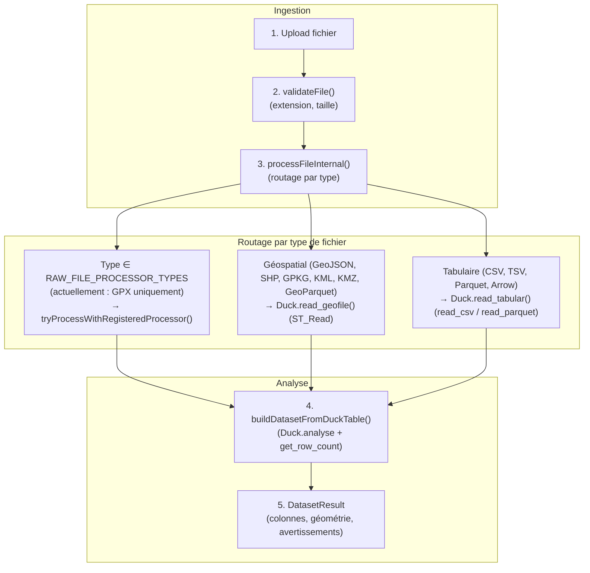
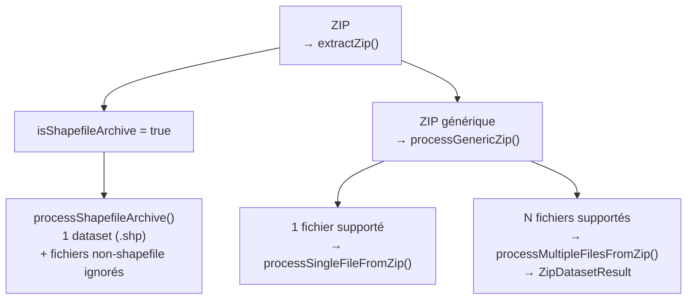
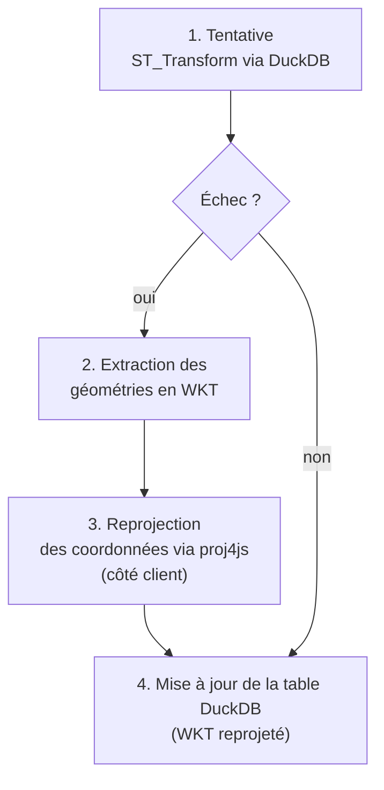

# Pipeline de données

> Architecture d'ingestion basée sur DuckDB WASM : import, validation, traitement, export.

**Voir aussi** : [Architecture](./ARCHITECTURE.md) | [Gestion de l'état](./GESTION_ETAT.md) | [DuckDB](./DUCKDB.md) | [Visualisations](./VISUALISATIONS.md)

---

## Formats supportés

| Format               | Extensions                        | Méthode                          | Notes                                          |
| -------------------- | --------------------------------- | -------------------------------- | ---------------------------------------------- |
| CSV / TSV            | `.csv`, `.tsv`, `.txt`            | `csvProcessor` → `read_csv()`    | Détection automatique séparateur + décimal     |
| GeoJSON              | `.geojson`, `.json`               | `geojsonProcessor` → `ST_Read()` | Détection CRS via `ST_Read_Meta()`             |
| Shapefile            | `.shp` (+ `.dbf`, `.shx`, `.prj`) | `shapefileProcessor`             | Bundle de fichiers requis                      |
| GeoPackage           | `.gpkg`                           | `geopackageProcessor`            | Support spatial natif                          |
| GeoParquet / Parquet | `.geoparquet`, `.parquet`, `.gpq` | `geoparquetProcessor`            | DuckDB 1.33 geoarrow.wkb natif                 |
| GPX                  | `.gpx`                            | `gpxProcessor`                   | Parse XML + extraction de points/lignes        |
| KML / KMZ            | `.kml`, `.kmz`                    | `Duck.read_geofile()` (ST_Read)  | Support natif GDAL — pas de conversion GeoJSON |
| ZIP                  | `.zip`                            | `zip-handler.ts`                 | Shapefile archive ou bundle multi-datasets     |

---

## Flux de traitement



Le routage de `processFileInternal()` se fait en trois branches :

1. **Processeur enregistré** — activé uniquement pour les types listés dans `RAW_FILE_PROCESSOR_TYPES` (aujourd'hui : `GPX`). `tryProcessWithRegisteredProcessor()` retourne `null` pour tout autre type, forçant le fallback.
2. **Fallback géospatial** — tout fichier détecté par `isGeospatialFile()` (GeoJSON, Shapefile, GeoPackage, KML, KMZ, GeoParquet détecté comme géo) passe par `Duck.read_geofile()` (ST_Read).
3. **Fallback tabulaire** — sinon `readTabularFile()` appelle `Duck.read_tabular()` avec la détection CSV (auto-délimiteur, auto-décimal, auto-header) ou `format: 'parquet'` pour Parquet / Arrow.

Le handler ZIP (`zip-processor.ts`) relance `processFileInternal()` pour chaque fichier extrait, qui applique le même routage.

Les processeurs CSV / GeoJSON / Shapefile / GeoPackage / GeoParquet sont **enregistrés** dans `processors/register-processors.ts` (priorité 10) mais ne sont pas activés dans le flux principal : le filtre `RAW_FILE_PROCESSOR_TYPES` les court-circuite. Ils restent en place comme point d'extension explicite si l'on veut basculer un format sur un processeur dédié (ajouter le `FileType` à `RAW_FILE_PROCESSOR_TYPES`).

---

## Registre de processeurs

Les processeurs sont enregistrés via `registerProcessor()` dans `processors/processor-registry.ts`. L'enregistrement est **priority-based** (priorité la plus haute d'abord). Chaque processeur implémente l'interface `FileProcessor` :

```typescript
interface FileProcessor {
  supportedFileTypes: FileType[];
  canHandle(file: UploadedFile): boolean;
  process(ctx: ProcessContext, file: UploadedFile): Promise<ProcessorDataset>;
}
```

Les 6 processeurs enregistrés par `registerAllProcessors()` (priorité 10) :

| Processeur            | FileTypes  | DuckDB reader            | Actuellement actif ?                                |
| --------------------- | ---------- | ------------------------ | --------------------------------------------------- |
| `csvProcessor`        | CSV, TSV   | `read_csv()`             | Non — fallback tabulaire                            |
| `geojsonProcessor`    | GEOJSON    | `ST_Read()`              | Non — fallback géo                                  |
| `shapefileProcessor`  | SHP        | `ST_Read()` + companions | Non — fallback géo                                  |
| `geopackageProcessor` | GPKG       | `ST_Read()`              | Non — fallback géo                                  |
| `geoparquetProcessor` | GEOPARQUET | `read_parquet()`         | Non — fallback tabulaire                            |
| `gpxProcessor`        | GPX        | `ST_Read()` + parse XML  | **Oui** — seul type dans `RAW_FILE_PROCESSOR_TYPES` |

`getProcessor(file)` retourne le premier processeur dont `canHandle()` renvoie `true`. `hasProcessor(file)` vérifie uniquement l'existence. KML / KMZ ne disposent pas de processeur dédié et passent directement par le fallback `Duck.read_geofile()`.

Pour activer un processeur enregistré sur un autre type de fichier, ajouter le `FileType` correspondant à `RAW_FILE_PROCESSOR_TYPES` dans `file-processor.ts`.

---

## Détection automatique CSV

Le pipeline CSV détecte 4 paramètres avant l'appel à `read_csv()`.

### 1. Séparateur de champ

`detectFieldDelimiter()` (`decimal-detector.ts`) compte les occurrences de chaque candidat (`;`, `,`, `\t`, `|`) sur la première ligne. Le plus fréquent est retenu.

### 2. Séparateur décimal et séparateur de milliers

`detectDecimalSeparator()` scanne les 20 premières lignes :

- **Format européen** (`1.234,56`) : point comme séparateur de milliers, virgule comme décimal
- **Format standard** (`1,234.56`) : virgule comme milliers, point comme décimal
- Détection par regex sur les patterns `X.XXX,XX` vs `X,XXX.XX`

Si le ratio européen dépasse le standard ET couvre plus de 30 % des valeurs → format européen. Sinon format standard. Les séparateurs de milliers détectés sont transmis à `read_csv()` via `thousands_separator`.

### 3. Post-normalisation numérique

Après l'import CSV, le pipeline rescanne les colonnes restées en texte. Si une colonne contient uniquement des valeurs numériques formatées et qu'au moins une valeur utilise des séparateurs (`2,148,000`, `789,50`, `18.5`), Khartis la promeut automatiquement en `BIGINT` ou `DOUBLE` via une conversion DuckDB sans perte. Cette étape est volontairement conservatrice : la colonne n'est convertie que si toutes les valeurs non vides sont convertibles.

### 4. Détection d'en-tête

`detectCsvHeader()` compare la première et la deuxième ligne :

1. Parse les deux lignes avec le délimiteur détecté.
2. Classe chaque cellule en `numeric` / `text` / `empty`.
3. Calcule la similarité de catégorie entre les deux lignes.

**Règle** : si la première ligne est 100 % numérique ou vide → pas d'en-tête. Si mix text + numeric OU similarité inférieure à 80 % → en-tête détecté.

### 5. Retry CSV

Si `read_csv()` retourne 0 ligne → retry avec `ignore_errors=true, all_varchar=true` pour tolérer les fichiers malformés.

**File head partagé** : `readFileHead()` lit les 20 premières lignes une seule fois. Le résultat est partagé entre `detectDecimalSeparator` et `detectCsvHeader` pour éviter une double lecture.

---

## Stratégies de processeur

### CSV (`csv-processor.ts`)

Deux chemins d'ingestion avec **Arrow en priorité** :

1. **Chemin Arrow** : `convertTabularDataToArrow()` → `vectorFromArray()` par colonne → `tableToIPC()` → `insertArrowFromIPCStream()` → DuckDB.
2. **Chemin legacy** : `convertToCSV()` → `Duck.read_tabular()` (le tableau JS est re-sérialisé en CSV string puis re-parsé par DuckDB).

Si Arrow échoue → fallback sur legacy. Pas de retry automatique Arrow → legacy en cas d'erreur.

### GeoJSON (`geojson-processor.ts`)

Trois chemins pilotés par variables d'environnement pour le debug :

```typescript
const USE_ST_READ = import.meta.env.VITE_USE_ST_READ !== 'false'; // défaut : true
const USE_ARROW = import.meta.env.VITE_USE_ARROW_GEOJSON === 'true'; // défaut : false
```

1. **ST_Read** (par défaut) : `register_files()` → `read_geofile()` → `Duck.analyse()`.
2. **Arrow** (opt-in) : `convertGeoJSONToArrow()` → `insertArrowTableIntoDuckDB()` → `ST_GeomFromGeoJSON()` en SQL → `CREATE SEQUENCE` pour `__id`.
3. **Legacy** (fallback final) : `read_geofile()` sans optimisations.

### Shapefile (`shapefile-processor.ts`)

- **Companions obligatoires** : `.shp` + `.shx` + `.dbf` minimum. Sinon → `ParseError`.
- `register_files({ shapefile: true })` pour enregistrer le bundle.
- `read_geofile({ shapefile: true })` pour la lecture.

### GeoPackage / GPX / GeoParquet

Tous via `read_geofile()` → `ST_Read()` en DuckDB. GeoParquet utilise `read_parquet()` directement. `__id` est ajouté via `CREATE SEQUENCE` après ingestion Arrow.

Pour les géofichiers multi-couches comme certains GeoPackage, Khartis sélectionne automatiquement une couche spatiale par défaut. L'heuristique privilégie les polygones, puis les lignes, puis les points, et retient au sein de cette famille la couche la plus riche en entités.

### Détection de format (`core/format-detector.ts`)

**Extension-based**, insensible à la casse, priorité descendante :

```
geoparquet (.parquet / .geoparquet / .gpq)
  → csv (.csv / .tsv / .txt)
    → geo (.geojson / .shp / .gpkg / .kml / .kmz / .gpx)
```

Noms de fichiers multi-extensions : `fichier.tar.gz` → extension `.gz`. `mon.dataset.csv` → extension `.csv`.

---

## Validation (`core/validators.ts`)

`validateFile()` vérifie dans l'ordre :

1. **Extension** : doit appartenir à `PIPELINE_CONST.EXTENSIONS.ALL` (`.csv`, `.tsv`, `.parquet`, `.geojson`, `.shp`, `.gpkg`, `.kml`, `.kmz`, `.gpx`, `.zip`, etc.).
2. **Taille nulle** : `file.size === 0` → rejeté.
3. **Taille maximale par format** :

| Format                                       | Limite |
| -------------------------------------------- | ------ |
| CSV / TSV / GeoJSON / JSON / KML / KMZ / GPX | 150 Mo |
| GeoPackage / GeoParquet / Arrow / Shapefile  | 200 Mo |
| ZIP générique                                | 100 Mo |

4. **Avertissement de taille** : à partir de 80 % de la limite → warning (ne bloque pas le traitement).

---

## Avertissements de qualité (`operations/quality.ts`)

`computeQualityWarnings()` génère des avertissements à partir des statistiques de colonnes :

| Condition                | Avertissement                                              |
| ------------------------ | ---------------------------------------------------------- |
| `rowCount === 0`         | `pipeline_warning_no_data_rows`                            |
| `rowCount === 1`         | `pipeline_warning_single_row`                              |
| `rowCount < 5`           | `pipeline_warning_small_dataset`                           |
| `nullRatio > 0.5`        | `pipeline_warning_high_nulls` (colonne + %)                |
| `uniquenessRatio < 0.01` | `pipeline_warning_low_cardinality` (colonne + count/total) |

Seuils configurables via `PIPELINE_CONST.QUALITY`.

---

## Gestion des archives ZIP (`utils/zip-handler.ts`)

### Extraction

- `unzip()` issu de `fflate` (pas de dépendance Node).
- Limite de décompression : **500 Mo** (protection contre les zip bombs).
- Fichiers ignorés : préfixes macOS (`__MACOSX/`, `._`) et entrées répertoires (`path.endsWith('/')`).

### Détection d'une archive Shapefile

Un ZIP est considéré comme **archive Shapefile** si :

- Il contient exactement un fichier `.shp`.
- ET ce `.shp` possède ses companions (`.dbf`, `.shx`, `.prj`, etc.) partageant le même basename.

Sinon, il est traité comme **ZIP générique** (pouvant contenir plusieurs datasets CSV/GeoJSON).

### Routage



Chaque fichier CSV ou géo d'un ZIP multi-dataset est traité individuellement via `processFileInternal()` avec son propre `sourceFileId` (le nom du ZIP parent).

---

## Traitement distant (`processors/remote-processor.ts`)

### URL directe

- `fetch()` → `response.arrayBuffer()` → `Duck.read_link()` avec le `tablename` généré.
- `decimal_separator` optionnel (détection automatique si omis).
- `.shp` standalone rejeté (fichier Shapefile sans companions → erreur).

### URL ZIP

- `fetch()` → `new File([arrayBuffer], name, { type: MIME.ZIP })` → `processZipFile()`.
- 404 → `Error` avec code `pipeline_error_fetch_failed`.

---

## API publique

```ts
import { dataPipeline } from '$lib/features/data-pipeline';

await dataPipeline.initialize();

// Traitement de fichiers
const result = await dataPipeline.processFile(file);
const result = await dataPipeline.processUploadedFile(
  uploadedFile,
  originalFile
);
const result = await dataPipeline.processRemoteFile(url, {
  tableName: 'remote_data'
});
const result = await dataPipeline.processPastedData(csvContent, 'pasted');

// Jointures
await dataPipeline.joinDatasetById(tableName, idColumn, {
  basemapTable,
  basemapId,
  basemapOthersId
});
await dataPipeline.applyJoinAssociation(tableName, basemap);

// Validation
const validation = await dataPipeline.validateFile(file);
```

---

## Interface `DatasetResult`

```ts
// src/lib/features/data-pipeline/types.ts
interface DatasetResult {
  id: string;
  name: string;
  sourceFileId: string;
  tableName: string;
  columns: EnrichedColumn[];
  rowCount: number;
  geometry?: GeometryInfo;
  metadata: DatasetMetadata; // { processedAt, fileType, parserUsed, ... }
  data?: Record<string, unknown>[];
  format?: FileFormat;
  analysis?: AnalysisResult; // { columns, hasGeoData, geoColumns, rowCount, warnings }
  geoDetection?: GeoDetectionResult;
  bounds?: { minLat; maxLat; minLon; maxLon };
  joinedBasemap?: string;
  geoColumn?: string;
}
```

---

## Moteur DuckDB (`src/lib/features/duckdb/`)

```
duckdb/
├── duck.ts                 # Façade singleton Duck
├── core/
│   ├── engine.ts           # Init WASM, extensions
│   ├── query.ts            # Exécution SQL + conversion Arrow
│   └── transaction.ts      # TransactionMutex
├── io/
│   ├── readers.ts          # read_tabular, read_geofile, read_link
│   ├── reprojection.ts     # Fallback proj4js
│   ├── exporters.ts        # CSV, GeoParquet
│   └── arrow-converter.ts  # Insertion Arrow table dans DuckDB
├── cache/
│   └── cache-manager.ts    # Cache describe, rowcount, geoparquet
├── operations/
│   ├── analysis.ts         # analyse, describeColumns
│   ├── search.ts           # searchInTable (2 phases + cache)
│   ├── join.ts             # join_by_id, apply_join_association
│   ├── simplification.ts   # Simplification géométrie
│   └── table-ops.ts        # Opérations sur les tables
├── macros/                 # Macros SQL (analyse, breaks, join, search, simplification)
└── orchestrator/           # Service réactif Svelte 5
    ├── orchestrator.svelte.ts
    └── dataset-state.ts
```

Détails complets : [DUCKDB.md](./DUCKDB.md).

### Transactions

Les opérations d'ingestion (`read_tabular`, `read_geofile`, `read_link`) sont encapsulées dans `runInTransaction`. Un `TransactionMutex` empêche les exécutions concurrentes.

### Cache

Cache mémoire LRU (~100 Mo) pour les buffers GeoParquet, les descriptions de table et les comptages de lignes. Les mutations invalident automatiquement les entrées concernées via `invalidateTableCache()`.

---

## Reprojection (fallback proj4js)

`ST_Transform` dans DuckDB WASM ne supporte pas toutes les projections — le build WASM n'embarque pas la base PROJ complète. C'est notamment le cas de **Lambert-93 (EPSG:2154)**, fréquent dans les jeux de données français.



**Projections couvertes par le fallback** :

- EPSG:2154 — Lambert-93 (France métropolitaine)
- EPSG:27572 — Lambert II étendu
- EPSG:32631 / 32632 — UTM zones 31N / 32N

proj4js est utilisé **uniquement** pour la transformation de coordonnées. Les données restent dans DuckDB pour toutes les autres opérations.

---

## Persistance et relecture

Le pipeline ne persiste plus les octets bruts dans `project.json`. Stratégie :

- Le projet conserve des **métadonnées** (`assetRef`, aperçu, stats, analyse, transformations).
- Les fichiers source vivent dans IndexedDB sous forme d'assets **chunkés** (8 Mo).
- À la réouverture, `createFileFromUpload()` reconstruit un `File` depuis `assetRef`.
- `addFile()` rejoue ensuite le pipeline DuckDB au lieu d'exposer une table obsolète.

| Type                         | Conversion                                                                                       |
| ---------------------------- | ------------------------------------------------------------------------------------------------ |
| `BigInt`                     | → `Number` via `deepCloneForStorage()` (perte de précision au-delà de `Number.MAX_SAFE_INTEGER`) |
| `Uint8Array` / `ArrayBuffer` | Round-trip préservé (slices avec `byteOffset` + `byteLength`)                                    |
| `Map` / `Set`                | Sérialisés via `Array.from()`                                                                    |
| Données binaires             | Retirées du JSON projet ; stockées dans `project_asset_chunks`                                   |

Les tailles estimées sont ajoutées aux métadonnées pour éviter la sérialisation de très gros fichiers. Le format `.kh` exporte ensuite `manifest.json`, `project.json` et `assets/...` dans une archive unique. Tests associés : `tests/pipeline/project-serialization.test.ts`, `tests/pipeline/project-archive.test.ts`, `tests/pipeline/storage-clone.test.ts`.

---

## Métadonnées GeoArrow (`io/geoarrow-metadata.ts`)

- `extractGeoArrowMetadata(table)` — extrait CRS et bounds depuis les colonnes GeoArrow.
- `tableHasGeoArrowMetadata(table)` — détecte la présence d'une colonne GeoArrow.

Ces informations sont stockées dans `DatasetResult.geoArrowMetadata` et utilisées au rendu pour éviter toute reprojection inutile.

---

## Optimisations

| Défi                     | Solution                                                      |
| ------------------------ | ------------------------------------------------------------- |
| Imports volumineux       | Parsing natif DuckDB (`read_csv`, `read_parquet`, `ST_Read`)  |
| Conversions multiples    | Pipeline en une seule passe                                   |
| Préservation métadonnées | GeoParquet avec encodage GeoArrow                             |
| Concurrence              | `TransactionMutex` sérialise les opérations d'ingestion       |
| Fichiers éphémères       | Nettoyage via `dropRegisteredFile` après création de la table |
| CSV malformés            | Retry avec `ignore_errors=true, all_varchar=true`             |

**Cible** : moins de 3 s de chargement pour un dataset standard, environ 60 fps en pan/zoom.

---

## Constantes (`constants.ts`)

```typescript
PIPELINE_CONST.LIMITS.MAX_FILE_SIZE = 200 * 1024 * 1024; // 200 Mo
PIPELINE_CONST.LIMITS.WARNING_FILE_SIZE = 120 * 1024 * 1024; // 120 Mo
PIPELINE_CONST.LIMITS.SAMPLE_ROWS = 100;
PIPELINE_CONST.LIMITS.TYPE_THRESHOLD = 0.8;
PIPELINE_CONST.QUALITY.HIGH_NULL_RATIO_THRESHOLD = 0.5;
PIPELINE_CONST.QUALITY.LOW_CARDINALITY_THRESHOLD = 0.01;
```

---

## Points d'extension

Pour ajouter un nouveau format de fichier :

1. Ajouter le `FileType` dans `commons/store/create-project.types.ts`.
2. Déclarer l'extension dans `data-pipeline/constants.ts` (`DUCK_CONST.REGEX`).
3. Mettre à jour `detectFileFormat()` dans `core/format-detector.ts`.
4. Créer le processeur dans `processors/strategies/<nom>-processor.ts`.
5. Exporter depuis `processors/strategies/index.ts`.
6. Enregistrer dans `processors/register-processors.ts`.
7. Ajouter des tests unitaires co-localisés dans `src/lib/features/data-pipeline/`.

Les types (`DatasetResult`, `EnrichedColumn`, `ColumnType`) sont définis dans `src/lib/features/data-pipeline/types.ts`.

---

**Voir aussi :** [ARCHITECTURE.md](./ARCHITECTURE.md) — [DUCKDB.md](./DUCKDB.md) — [GESTION_ETAT.md](./GESTION_ETAT.md) — [VISUALISATIONS.md](./VISUALISATIONS.md)
